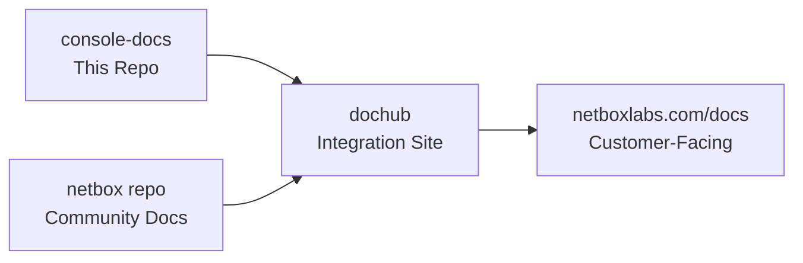

# NetBox Enterprise Documentation Repository

This repository contains the commercial/enterprise documentation for NetBox Labs products. The documentation is automatically integrated with the [netboxlabs-website-dochub](https://github.com/netboxlabs/netboxlabs-website-dochub) repository to create a unified documentation experience at **https://netboxlabs.com/docs**.

## 🎯 For Documentation Team: Quick Start

### Understanding Our Workflow

**This repository feeds into the main NetBox Labs documentation site**, but content visibility is controlled by **version branches**. This allows us to:

- ✅ **Write documentation before features are released**
- ✅ **Keep unreleased features hidden from customers**
- ✅ **Maintain stable documentation for current customers**
- ✅ **Seamlessly activate new versions when ready**

### 🏷️ Product Tagging System (New!)

We've migrated from HTML pills to a **frontmatter-based tagging system** for better DocHub integration:

#### **Before (Deprecated HTML Pills):**
```html
<span class="pill pill-cloud">NetBox Cloud</span>
<span class="pill pill-enterprise">NetBox Enterprise</span>
<span class="pill pill-community">NetBox Community</span>
```

#### **After (New Frontmatter Tags):**
```yaml
---
title: Document Title
description: Brief description for SEO
tags:
  - cloud
  - enterprise
  - community
---
```

**Benefits of the new system:**
- ✅ **Better SEO**: Search engines understand product categories
- ✅ **Automatic tag pages**: Generated browse pages for each product
- ✅ **Enhanced search**: Product filtering in search results
- ✅ **DocHub integration**: Easier for upstream site to categorize content
- ✅ **Consistent styling**: Maintains visual design with better functionality

### Where Your Content Goes Live



**Key Point**: Only content from specific version branches appears on the live site. Development content stays hidden until activated.

## 🚀 Local Development Setup

### 1. Clone and Setup
```bash
git clone https://github.com/netboxlabs/console-docs
cd console-docs
```

### 2. Install Dependencies
```bash
# Using Python virtual environment (recommended)
python3 -m venv venv
source venv/bin/activate
pip install -r requirements.txt
```

### 3. Start Local Preview
```bash
mkdocs serve
# Visit: http://127.0.0.1:8000
```

### 🔄 Quick Migration Guide

**To migrate existing documents:**

1. **Streamlined Semantic Tagging (Recommended):**
   ```bash
   # Install dependencies
   npm install
   
   # Preview what tags would be applied (optional)
   npm run preview-tags
   
   # Apply streamlined semantic tags
   npm run enhanced-tag
   
   # Review changes
   git diff
   ```

2. **HTML Pills Migration:**
   ```bash
   # Convert existing HTML pills to frontmatter tags
   npm run migrate-pills
   
   # Review changes
   git diff
   ```

**Available Tags (Streamlined System):**

**Edition Tags (Top Pills):**
| Tag | Display | Color |
|-----|---------|-------|
| `cloud` | Cloud | 🟢 Teal |
| `enterprise` | Enterprise | 🟠 Orange |
| `community` | Community | 🔵 Blue |
| `airgap` | Air-Gap | 🔴 Pink |

**Semantic Tags (Bottom References - 16 total):**
- **Product**: `netbox`, `discovery`, `assurance`, `operator`
- **Platform**: `kubernetes`, `helm`
- **Technical**: `api`, `authentication`, `administration`, `operations`
- **Content**: `installation`, `configuration`, `troubleshooting`, `getting-started`
- **Features**: `automation`, `networking`, `integration`, `ai`

## 📝 Documentation Team Workflow Guide

### Understanding Version Control Strategy

We use **branch-based versioning** to control what customers see on the live documentation site:

#### **Current State (Transition Period)**
| Version | Status | Branch | Customer Visibility | Purpose |
|---------|--------|--------|-------------------|---------|
| **v1.9** | 🟢 **LIVE** | `main` | ✅ **Visible** | Current customer documentation |
| **v1.10** | 🟡 **Beta** | *not created yet* | ❌ **Hidden** | Enterprise + Assurance & Discovery |
| **v1.11** | 🔴 **Alpha** | *future* | ❌ **Hidden** | Enterprise + High Availability (HA) |
| **v1.12** | 🔴 **Future** | *future* | ❌ **Hidden** | Next major release (NetBox v4.3) |

### Where to Add New Documentation

#### ✅ **For Current Customer Issues/Fixes (v1.9) - CURRENT WORKFLOW**
```bash
git checkout main  # Currently contains v1.9 content
# Edit documentation for current features
git add docs/path/to/file.md
git commit -m "Fix SSL certificate installation steps"
git push origin main
git tag v1.9.1  # Automatically deploys to live site
git push origin v1.9.1
```
**Result**: ✅ Changes appear immediately on https://netboxlabs.com/docs

#### 🔄 **For Enterprise Features (v1.10+ Beta) - PREPARE FOR FUTURE**
```bash
# Branches don't exist yet - will be created when development starts
# For now, document in feature branches and merge when ready

# For v1.10: Assurance & Discovery Enterprise features
git checkout -b feature/assurance-enterprise
git add docs/netbox-assurance/enterprise-features.md
git commit -m "Add Enterprise Assurance documentation"

# For v1.11: High Availability Enterprise features  
git checkout -b feature/ha-enterprise
git add docs/netbox-enterprise/high-availability.md
git commit -m "Add Enterprise HA documentation"

git push origin feature/assurance-enterprise
git push origin feature/ha-enterprise
# DON'T merge to main yet - wait for version branch creation
```
**Result**: ❌ Content prepared but not visible to customers until version branches exist

## ⚠️ Important Guidelines for Documentation Team

### 🚨 **Critical Rules**

#### **DO:**
- ✅ **Always work on the correct branch** for your content type
- ✅ **Tag main branch changes immediately** (they go live as v1.9 instantly)  
- ✅ **Test your changes locally** before committing
- ✅ **Use clear commit messages** describing what changed
- ✅ **Check if your update applies to multiple versions**

#### **DON'T:**
- ❌ **Never tag future version branches** until release is approved
- ❌ **Don't merge unreleased features into main** (currently v1.9 live content)
- ❌ **Don't assume all versions need the same content**
- ❌ **Don't commit untested changes** to main branch (goes live immediately)

### 🎯 **Quick Decision Guide**

**Ask yourself**: *"Should customers see this immediately?"*

#### **FOR TODAY (Current Workflow):**
- **YES** → Work on `main` branch and tag when ready (deploys v1.9 immediately)
- **NO, it's for Enterprise Assurance/Discovery** → Work on feature branch (wait for v1.10 branch)
- **NO, it's for Enterprise High Availability** → Work on feature branch (wait for v1.11 branch)
- **NO, it's for NetBox v4.3 features** → Work on feature branch (wait for v1.12 branch)

## 📚 AI Reference Materials

For comprehensive documentation guides, templates, and integration specifications, see the **`ai-reference/`** directory:

### 📋 Templates & Style Guides
- **Document Templates**: `ai-reference/templates/` - Standard templates for features, landing pages, quickstarts
- **Style Guides**: `ai-reference/style-guides/` - Writing standards, product tagging guide, AI prompting best practices

### 🔧 Integration & Strategy
- **Content Strategy**: `ai-reference/content-strategy/` - Navigation strategy, version management, DocHub integration
- **Reference Docs**: `ai-reference/reference-docs/` - Technical specifications, coordination docs, analysis reports

### 🤖 AI-Assisted Writing
- **Enhanced Frontmatter**: Complete metadata system with version tracking
- **Product Tagging**: Structured categorization for better integration
- **Content Patterns**: Examples and best practices for AI tools

**Note**: The `ai-reference/` directory is not published to DocHub and is for internal development use only.

## 🔗 Integration with netboxlabs-website-dochub

The new product tagging system provides multiple integration points for the upstream DocHub repository:

### **Migration Status**
- ✅ **Product tagging system** - Complete
- ✅ **Enhanced frontmatter** - Complete  
- ✅ **DocHub metadata** - Complete
- ✅ **Simplified navigation** - Complete

### **For DocHub Team**
See `ai-reference/content-strategy/dochub-integration-strategy.md` for quick reference and detailed implementation guides in `ai-reference/reference-docs/`.

### **Integration Benefits**
- 🚀 **Performance**: Faster categorization using structured metadata
- 🔍 **Search**: Enhanced search with product filtering
- 📱 **UX**: Better user experience with clickable product categories
- 🤖 **SEO**: Improved search engine optimization

## 🛠️ For DevOps/Maintainers

<details>
<summary>Click to expand technical workflow information</summary>

### Automated Deployment Process

The repository uses GitHub Actions to automatically deploy documentation when version tags are pushed:

```bash
# Tagging triggers automatic deployment
git tag v1.9.1
git push origin v1.9.1
# → Triggers GitHub Actions → Deploys to live site
```

### Version Configuration Management

Version visibility is controlled by `versions.json` and automated deployment workflows.

### Integration with DocHub

The repository sends webhook notifications to `netboxlabs-website-dochub` when versions are deployed, triggering updates to the unified documentation site.

</details>

## :warning: Troubleshooting

If you see errors like this...

> ERROR   -  Config value 'theme': Unrecognised theme name: 'material'. The available installed themes are: mkdocs, readthedocs
> ERROR   -  Config value 'markdown_extensions': Failed to load extension 'pymdownx.tabbed'.
>            ModuleNotFoundError: No module named 'pymdownx'

Try uninstalling `mkdocs` from your package manager, (e.g. `brew uninstall mkdocs`) and just using the version installed by `pip`. It seems that `mkdocs` doesn't like it when you've installed it using different methods.