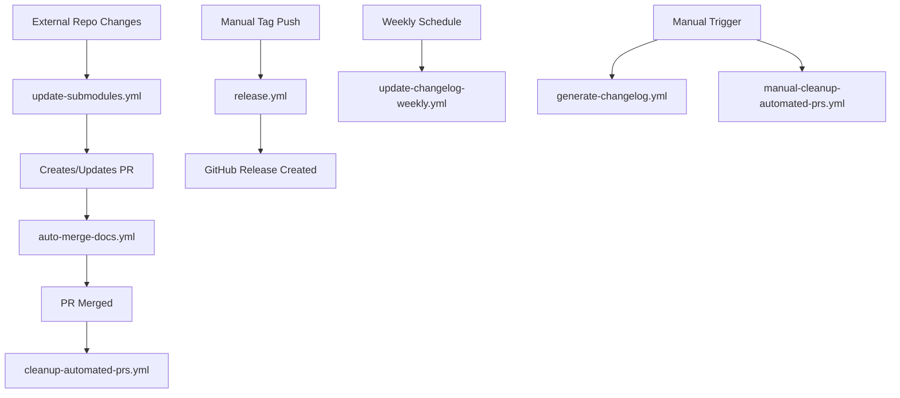

# NetBox Labs Documentation Hub

This repository creates a unified documentation site for NetBox Labs products, accessible at [https://netboxlabs.com/docs/](https://netboxlabs.com/docs/). It consolidates documentation from multiple repositories into a single, cohesive Docusaurus-powered site.

## 🏗️ Architecture Overview

This project implements a **unified documentation architecture** that brings together documentation from two primary sources:

### Documentation Sources

1. **NetBox Community Documentation**
   - **Source**: [`netbox-community/netbox`](https://github.com/netbox-community/netbox) repository (`docs/` directory)
   - **Local Path**: `external-repos/netbox/docs/`
   - **Output**: Transformed to `docs/netbox/`
   - **Format**: MkDocs → Docusaurus MDX

2. **NetBox Enterprise Documentation** 
   - **Source**: [`netboxlabs/console-docs`](https://github.com/netboxlabs/console-docs) repository
   - **Local Path**: `external-repos/console-docs/docs/`
   - **Output**: Transformed to `docs/console/`
   - **Format**: MkDocs → Docusaurus MDX

### Integration Flow

```
External Repos (MkDocs) → Git Submodules → Transformation Script → Docusaurus → Next.js Rewrites → netboxlabs.com/docs
```

## 🚀 Quick Start

### Prerequisites
- Node.js 18+ 
- Yarn (preferred package manager)
- Git

### Local Development Setup

1. **Clone with submodules**:
   ```bash
   git clone --recurse-submodules https://github.com/netboxlabs/netboxlabs-website-dochub.git
   cd netboxlabs-website-dochub
   ```

2. **Install dependencies**:
   ```bash
   yarn install
   ```
   *Note: The `postinstall` script automatically initializes and updates git submodules*

3. **Start development server**:
   ```bash
   yarn dev
   ```
   This will:
   - Transform documentation from submodules
   - Start Docusaurus dev server on `http://localhost:3001`
   - Enable hot reloading for local changes

### Production Build

```bash
yarn build    # Creates static build in build/ directory
```

## 🔄 How the Transformation Works

The heart of this system is the **transformation pipeline** that converts MkDocs documentation to Docusaurus-compatible format:

### 1. Git Submodules
- `external-repos/console-docs` and `external-repos/netbox` are Git submodules
- Automatically updated via `postinstall` script
- Point to specific commits/branches of external repositories

### 2. Transformation Script (`scripts/transformDocs.ts`)

This TypeScript script performs several critical functions:

**Content Processing:**
- Converts MkDocs-specific markdown syntax to MDX
- Transforms Material for MkDocs admonitions (notes, warnings, etc.)
- Handles image references and file paths
- Escapes special characters for React/MDX compatibility
- Processes internal links and cross-references

**File Operations:**
- Recursively processes all markdown files
- Copies static assets (images, etc.) preserving directory structure
- Generates clean file structures in `docs/netbox/` and `docs/console/`

**Sidebar Generation:**
- Parses `mkdocs.yml` navigation structure
- Converts to Docusaurus sidebar format
- Outputs `sidebars/netbox.json` and `sidebars/console.json`
- Maintains hierarchical navigation structure

### 3. Docusaurus Integration
- Uses transformed MDX files from `docs/` directory
- Applies custom theme and styling from `src/theme/`
- Leverages generated sidebars for navigation
- Builds static site optimized for production

### 4. Next.js Integration
- Main NetBox Labs website (`netboxlabs.com`) uses URL rewrites
- Documentation served seamlessly under `/docs/*` path
- Provides unified user experience across all NetBox Labs properties

## 📁 Project Structure

```
netboxlabs-website-dochub/
├── docs/                          # 🎯 Transformed documentation (Docusaurus input)
│   ├── console/                   # Transformed NetBox Enterprise docs
│   └── netbox/                    # Transformed NetBox Community docs
├── external-repos/                # 📚 Git submodules (source documentation)
│   ├── console-docs/              # NetBox Enterprise docs submodule
│   │   └── docs/                  # Original MkDocs source
│   └── netbox/                    # NetBox Community docs submodule
│       └── docs/                  # Original MkDocs source
├── scripts/
│   └── transformDocs.ts           # 🔄 Core transformation logic
├── sidebars/                      # 🧭 Generated navigation
│   ├── console.json               # Console documentation sidebar
│   └── netbox.json                # NetBox documentation sidebar
├── src/
│   ├── css/                       # 🎨 Custom styles
│   ├── pages/                     # Custom Docusaurus pages
│   └── theme/                     # Theme customizations
├── static/                        # Static assets
├── docusaurus.config.ts           # ⚙️ Docusaurus configuration
├── sidebars.ts                    # Sidebar imports and setup
└── package.json                   # Dependencies and scripts
```

## 👥 For Contributors

### Contributing to External Documentation

If you're contributing to the **NetBox** or **Console Documentation** repositories:

#### NetBox Community Contributors
- **Repository**: [`netbox-community/netbox`](https://github.com/netbox-community/netbox)
- **Documentation Path**: `docs/` directory in the NetBox repo
- **Format**: Standard MkDocs markdown
- **Preview**: Changes appear in this unified site after submodule updates

#### NetBox Enterprise Contributors  
- **Repository**: [`netboxlabs/console-docs`](https://github.com/netboxlabs/console-docs)
- **Documentation Path**: Root `docs/` directory
- **Format**: MkDocs with Material theme extensions
- **Preview**: Changes appear in this unified site after submodule updates

#### Documentation Guidelines

**Supported MkDocs Features:**
- Standard markdown syntax
- Material for MkDocs admonitions (`!!! note`, `!!! warning`, etc.)
- Code blocks with syntax highlighting
- Images and static assets
- Internal linking
- Navigation via `mkdocs.yml`

**Limitations & Considerations:**
- Complex MkDocs plugins may not translate perfectly
- Custom HTML should be minimal and MDX-compatible
- Image paths are preserved but copied to unified structure
- Cross-references between NetBox/Console docs require careful path handling

### Testing Documentation Changes

#### For External Repo Contributors:
1. Make changes in your respective repository
2. Test locally in that repository first
3. Submit PR to the external repository

#### For Documentation Hub Maintainers:
1. **Update submodules** to pull latest changes:
   ```bash
   git submodule update --remote
   ```

2. **Test transformation**:
   ```bash
   yarn transform-docs  # Run transformation only
   yarn dev             # Full development workflow
   ```

3. **Review output** in `docs/netbox/` or `docs/console/`

4. **Commit submodule updates**:
   ```bash
   git add external-repos/
   git commit -m "Update documentation submodules"
   ```

## 🛠️ Development Workflows

### Daily Development

```bash
# Start development with fresh transformation
yarn dev

# Transform docs only (after external changes)
yarn transform-docs

# Build for production testing
yarn build
```

### Updating External Documentation

```bash
# Update all submodules to latest
git submodule update --remote

# Update specific submodule
cd external-repos/netbox
git pull origin main
cd ../..

# Commit submodule updates
git add external-repos/
git commit -m "Update NetBox docs to latest"
```

### Troubleshooting

**Common Issues:**

1. **Submodules not initialized**: Run `git submodule update --init --recursive`
2. **Transformation errors**: Check `scripts/transformDocs.ts` output for specific file issues
3. **Missing images**: Ensure image paths in source docs are relative and correct
4. **Sidebar not updating**: Delete and regenerate with `yarn transform-docs`

**GitHub Actions Issues:**

5. **Workflow not creating PRs**: 
   - Check if external repos have new commits: `git submodule update --remote && git status`
   - Verify workflow permissions in repository settings
   - Look for "No changes detected" in workflow logs
   - Try manual trigger with `force_update: true`

6. **PRs created but builds fail**:
   - Check if `yarn build` works locally after `yarn transform-docs`
   - Look for submodule restoration errors in workflow logs
   - Verify Node.js version compatibility (requires >=22.0.0)

7. **Submodule conflicts in CI**:
   - The workflow includes protection against `postinstall` script conflicts
   - Check "Submodule Protection Strategy" logs for restoration failures
   - Ensure submodule URLs are accessible from GitHub Actions

**Debug Mode:**
```bash
# Enable verbose transformation logging
DEBUG=true yarn transform-docs

# Test workflow components locally
git submodule update --remote
yarn install --frozen-lockfile
yarn transform-docs
yarn build

# Check submodule status
git submodule status
git diff --name-only
```

## 🚀 Deployment

### Production Deployment
- Hosted via Vercel (or similar platform)  
- Automatic deployments on main branch changes
- Submodule updates trigger rebuilds
- Served under `netboxlabs.com/docs/` via Next.js rewrites

### Manual Deployment
```bash
yarn build
# Deploy contents of build/ directory to your hosting provider
```

## 🤖 GitHub Actions Workflows

This repository uses several GitHub Actions workflows for automation. Here's a comprehensive overview:

### 🔄 Documentation Automation

#### `update-submodules.yml` - **Automated Documentation Updates**

**🎯 Purpose**: Automatically detects when NetBox or Console documentation is updated and creates PRs with transformed content.

**⏰ Schedule**: 
- **Business hours**: Every hour (7 AM - 6 PM EST, Mon-Fri)
- **Off hours**: Every 6 hours (nights/weekends)
- **Manual trigger**: Available via GitHub Actions UI

**🔍 How It Works**:

1. **Submodule Check**: Compares current submodule commits vs latest remote commits
2. **Change Detection**: Only proceeds if actual changes are detected
3. **Dependency Installation**: Installs yarn dependencies with submodule protection
4. **Documentation Transformation**: Runs `yarn transform-docs` to convert MkDocs → Docusaurus
5. **PR Management**: Creates new PR or updates existing automated PR
6. **File Analysis**: Provides detailed breakdown of added/modified/removed files

**🛡️ Submodule Protection Strategy**:
The workflow solves a critical issue where `yarn install` triggers a `postinstall` script that resets submodules:
```bash
# Problem: postinstall runs "git submodule update --init --recursive" 
# This resets submodules to committed state, undoing remote updates

# Solution: Save commits → Install → Restore commits
NETBOX_COMMIT="abc123..."     # Save updated commit
yarn install --frozen-lockfile # Install (may reset submodules)  
git checkout $NETBOX_COMMIT   # Restore to updated commit
```

**🚨 Common Failure Points**:
- **Submodule conflicts**: Fixed by commit protection strategy above
- **Missing GitHub permissions**: Requires `contents: write` and `pull-requests: write`
- **Network timeouts**: Workflow includes retry logic for external API calls
- **Change detection edge cases**: Extensive debugging output helps identify issues

**🔧 Troubleshooting**:
- **No PR created**: Check workflow logs for "No changes detected" or permission errors
- **PR created but empty**: Look for submodule restoration failures in logs
- **Build failures**: Check if transformation script errors are breaking the workflow
- **Manual override**: Use workflow dispatch with `force_update: true`

#### `auto-merge-docs.yml` - **Automated PR Merging**
- **Trigger**: When automated documentation PRs are opened
- **Purpose**: Safely auto-merges documentation updates after validation
- **What it does**:
  - Waits for Vercel deployment checks to pass
  - Auto-approves PRs from `github-actions[bot]`
  - Enables GitHub's auto-merge feature
  - Provides clear status comments on PRs
- **Safety**: Only merges if all deployment checks pass

#### `cleanup-automated-prs.yml` - **PR Cleanup**
- **Trigger**: When any PR is merged to master
- **Purpose**: Cleans up redundant automated PRs after manual merges
- **What it does**:
  - Detects if merged PR contains submodule updates
  - Compares automated PRs against new submodule versions
  - Closes outdated automated PRs with explanatory comments
  - Prevents accumulation of obsolete automation PRs

#### `manual-cleanup-automated-prs.yml` - **Manual PR Management**
- **Trigger**: Manual workflow dispatch only
- **Purpose**: Provides manual control over automated PR cleanup
- **What it does**:
  - Lists all open automated documentation PRs
  - Option to close all or just outdated PRs
  - Configurable age-based cleanup (default: 7 days)
  - Detailed cleanup summary and reporting

### 📋 Release Management

#### `release.yml` - **Automated Releases**
- **Trigger**: When version tags (`v*.*.*`) are pushed
- **Purpose**: Creates GitHub releases with auto-generated release notes
- **What it does**:
  - Extracts version info from git tags
  - Generates release notes from commits since last version
  - Creates GitHub release with proper categorization
  - Supports both release and pre-release versions

#### `generate-changelog.yml` - **Changelog Generation**
- **Trigger**: Manual workflow dispatch
- **Purpose**: Generates comprehensive changelogs following Keep a Changelog format
- **What it does**:
  - Analyzes commits between versions using conventional commit patterns
  - Categorizes changes (Added, Changed, Fixed, etc.)
  - Generates markdown changelog with links to commits
  - Supports both full releases and unreleased sections

#### `update-changelog-weekly.yml` - **Weekly Changelog Updates**
- **Trigger**: Weekly schedule (Mondays at 9 AM UTC)
- **Purpose**: Automatically updates unreleased changelog section
- **What it does**:
  - Tracks recent commits since last update
  - Updates "Unreleased" section in CHANGELOG.md
  - Creates PR with weekly documentation activity summary
  - Helps maintain current changelog without manual effort

### 🔧 Workflow Optimization & Best Practices

#### **Redundancy Elimination**
- ✅ **Removed**: `protected-branch-merge.yml` (superseded by `auto-merge-docs.yml`)
- ✅ **Optimized**: Single auto-merge workflow prevents conflicts
- ✅ **Smart Triggers**: Workflows only run when necessary

#### **Performance Optimizations**
- **Efficient Scheduling**: Business hours optimization for documentation updates
- **Smart Caching**: Workflows use appropriate `fetch-depth` settings
- **Conditional Execution**: Workflows skip unnecessary work when no changes detected

#### **Error Handling & Recovery**
- **Comprehensive Validation**: All `$GITHUB_OUTPUT` variables validated before use
- **Graceful Fallbacks**: Branch protection compatibility with manual review options
- **Debug Support**: Built-in debugging steps for troubleshooting

#### **Security & Permissions**
- **Minimal Permissions**: Each workflow requests only necessary permissions
- **Bot Account Safety**: Automated actions clearly identified and scoped
- **Safe Defaults**: Conservative auto-merge conditions with multiple validation checks

### 📊 Workflow Dependencies



### 🚨 When to Use Manual Workflows

- **`manual-cleanup-automated-prs.yml`**: When automated PRs accumulate or need bulk cleanup
- **`generate-changelog.yml`**: Before major releases or when updating project documentation
- **`update-changelog-weekly.yml`**: Can be triggered manually if weekly run fails

### 🔧 Critical Workflow Design Details

#### **The Submodule vs Postinstall Conflict**

The biggest challenge in this workflow is handling a fundamental conflict:

1. **Workflow Goal**: Update submodules to latest remote commits (`git submodule update --remote`)
2. **Postinstall Script**: Resets submodules to committed state (`git submodule update --init --recursive`)
3. **The Problem**: `yarn install` triggers postinstall, undoing the remote updates

#### **Solution: Commit Protection Strategy**

```bash
# Step 1: Update submodules to latest
git submodule update --remote
NETBOX_COMMIT=$(cd external-repos/netbox && git rev-parse HEAD)

# Step 2: Install dependencies (this WILL reset submodules)
yarn install --frozen-lockfile
# ↑ Triggers postinstall: git submodule update --init --recursive
# ↑ Resets NetBox to committed state (e.g., 334b45f)

# Step 3: Restore to updated commits
cd external-repos/netbox && git checkout $NETBOX_COMMIT
# ↑ Restores NetBox to latest state (e.g., c660f1c)
```

#### **Why This Works for Vercel**

- **Vercel Build Process**: Runs `yarn build` which includes `yarn update-submodules`
- **Submodule Handling**: Vercel gets submodules at the committed state (expected behavior)
- **No Conflicts**: Vercel doesn't need the `--remote` updates; it uses committed versions
- **CI/CD Separation**: Workflow updates commits, Vercel builds from those commits

#### **Workflow Reliability Features**

1. **Comprehensive Verification**: Each step validates submodule states
2. **Build Testing**: Tests full `yarn build` to ensure Vercel compatibility  
3. **Error Handling**: Explicit failure modes with clear error messages
4. **Debug Logging**: Tracks git status and submodule states throughout

#### **PR Management Strategy**

The workflow implements intelligent PR management:

1. **Single Active PR**: Only one automated documentation PR exists at a time
2. **PR Updates**: If changes occur during the run window, the existing PR is updated rather than creating new ones
3. **Detailed Descriptions**: PRs include comprehensive file change analysis and commit details
4. **Auto-Merge Ready**: PRs are structured for safe automatic merging with proper validation

**PR Update Process**:
```bash
# If existing automated PR found:
git checkout existing-pr-branch
git rebase master  # Bring up to date
# Apply new changes
git commit --amend  # Update existing commit
git push --force-with-lease  # Update PR

# If no existing PR:
git checkout -b automated-docs-update-YYYYMMDD
# Apply changes and create new PR
```

### 🧪 Testing Workflow Changes

**Before modifying workflows**, test the core functionality locally:

```bash
# 1. Test submodule updates
git submodule update --remote
git status  # Should show changes in external-repos/

# 2. Test the postinstall conflict
cd external-repos/netbox && BEFORE=$(git rev-parse HEAD) && cd ../..
yarn install --frozen-lockfile  # This will reset submodules
cd external-repos/netbox && AFTER=$(git rev-parse HEAD) && cd ../..
echo "Before: $BEFORE, After: $AFTER"  # Should be different

# 3. Test restoration
cd external-repos/netbox && git checkout $BEFORE && cd ../..
# Should restore to updated commit

# 4. Test full pipeline
yarn transform-docs
yarn build

# 5. Test change detection logic
git diff --name-only  # Should show docs/ changes
git add . && git commit -m "test: workflow changes"

# 6. Force trigger workflow (if needed)
# Go to Actions → Update Documentation Submodules → Run workflow
# Set force_update: true
```

**Workflow Testing Checklist**:
- [ ] Submodules update correctly with `--remote`
- [ ] Postinstall resets submodules (expected behavior)
- [ ] Restoration brings submodules back to updated commits
- [ ] Transformation completes without errors  
- [ ] Build succeeds after transformation
- [ ] Change detection identifies modified files
- [ ] Local git operations work as expected

## 📋 Key Commands Reference

| Command | Description |
|---------|-------------|
| `yarn dev` | Start development server with transformation |
| `yarn build` | Build production site |
| `yarn transform-docs` | Run documentation transformation only |
| `yarn start` | Serve built site locally |
| `git submodule update --remote` | Update all submodules |
| `git submodule update --init --recursive` | Initialize submodules |

## 🤝 Contributing to This Repository

### Development Preferences
- **Package Manager**: Use Yarn (not npm) - no `package-lock.json` files
- **Language**: Prefer TypeScript over JavaScript for new code
- **Code Style**: Follow existing patterns in the codebase

### Making Changes
1. Fork this repository
2. Create feature branch: `git checkout -b feature/description`
3. Test changes locally: `yarn dev`
4. Update documentation if needed
5. Submit pull request

## 📞 Support

- **NetBox Community**: [NetBox Discussions](https://github.com/netbox-community/netbox/discussions)
- **NetBox Enterprise**: [NetBox Labs Support](https://netboxlabs.com/support/)
- **Documentation Issues**: Open issues in respective repositories
- **Site Issues**: Open issues in this repository

---

This unified documentation system ensures that all NetBox-related documentation is easily discoverable and accessible from a single location while maintaining the flexibility for teams to work in their preferred repositories and formats.
