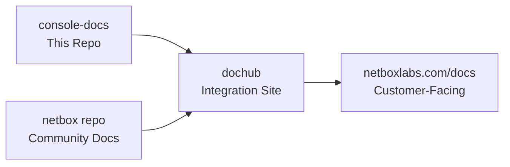
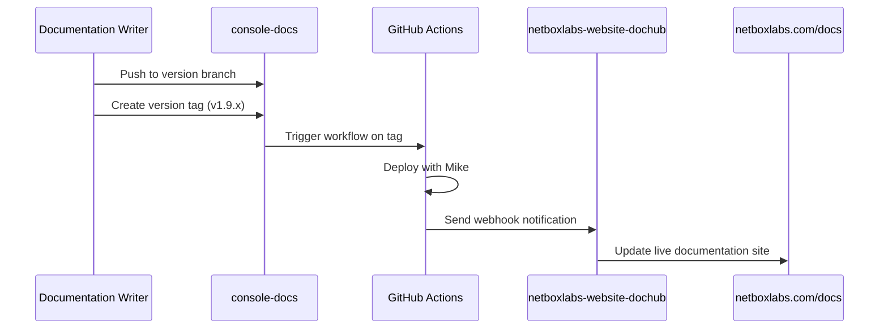

# NetBox Enterprise Documentation Repository

This repository contains the commercial/enterprise documentation for NetBox Labs products. The documentation is automatically integrated with the [netboxlabs-website-dochub](https://github.com/netboxlabs/netboxlabs-website-dochub) repository to create a unified documentation experience at **https://netboxlabs.com/docs**.

## 🎯 For Documentation Team: Quick Start

### Understanding Our Workflow

**This repository feeds into the main NetBox Labs documentation site**, but content visibility is controlled by **version branches**. This allows us to:

- ✅ **Write documentation before features are released**
- ✅ **Keep unreleased features hidden from customers**
- ✅ **Maintain stable documentation for current customers**
- ✅ **Seamlessly activate new versions when ready**

### 🏷️ Product Tagging System (New!)

We've migrated from HTML pills to a **frontmatter-based tagging system** for better Docusaurus integration:

#### **Before (Deprecated HTML Pills):**
```html
<span class="pill pill-cloud">NetBox Cloud</span>
<span class="pill pill-enterprise">NetBox Enterprise</span>
<span class="pill pill-community">NetBox Community</span>
```

#### **After (New Frontmatter Tags):**
```yaml
---
title: Document Title
description: Brief description for SEO
tags:
  - netbox-cloud
  - netbox-enterprise
  - netbox-community
---
```

**Benefits of the new system:**
- ✅ **Better SEO**: Search engines understand product categories
- ✅ **Automatic tag pages**: Generated browse pages for each product
- ✅ **Enhanced search**: Product filtering in search results
- ✅ **Dochub integration**: Easier for upstream site to categorize content
- ✅ **Consistent styling**: Maintains visual design with better functionality

### Where Your Content Goes Live



**Key Point**: Only content from specific version branches appears on the live site. Development content stays hidden until activated.

## 🚀 Local Development Setup

### 1. Clone and Setup
```bash
git clone https://github.com/netboxlabs/console-docs
cd console-docs
```

### 2. Install Dependencies
```bash
# Using Python virtual environment (recommended)
python3 -m venv venv
source venv/bin/activate
pip install -r requirements.txt

# Or using global Python (if you have permission issues)
/Users/[username]/Library/Python/3.9/bin/mkdocs serve
```

### 3. Start Local Preview
```bash
mkdocs serve
# Visit: http://127.0.0.1:8000
```

### 🔄 Quick Migration Guide

**To migrate existing documents:**

1. **Smart Auto-Tagging (Recommended):**
   ```bash
   # Install dependencies
   npm install
   
   # Preview what tags would be applied
   npm run preview-tags
   
   # Apply tags automatically based on file location
   npm run auto-tag
   
   # Review changes
   git diff
   ```

2. **HTML Pills Migration:**
   ```bash
   # Convert existing HTML pills to frontmatter tags
   npm run migrate-pills
   
   # Review changes
   git diff
   ```

3. **Manual Migration:**
   - Remove HTML `<span>` pills from top of document
   - Add frontmatter with appropriate tags
   - Use tag names: `netbox-cloud`, `netbox-enterprise`, `netbox-community`, `netbox-airgap`

**Available Product Tags:**
| Tag | Display | Color |
|-----|---------|-------|
| `netbox-cloud` | NetBox Cloud | 🟢 Teal |
| `netbox-enterprise` | NetBox Enterprise | 🟠 Orange |
| `netbox-community` | NetBox Community | 🔵 Blue |
| `netbox-airgap` | NetBox Air-Gap | 🔴 Pink |

### 🤖 Smart Auto-Tagging Logic

The auto-tagging system analyzes files based on:

**📁 Directory Location:**
- `Administration Console/` → `netbox-cloud`
- `netbox-enterprise/` → `netbox-enterprise`
- `netbox-discovery/` → `netbox-cloud, netbox-enterprise, netbox-community`
- `cloud-connectivity/` → `netbox-cloud`
- `netbox-extensions/` → `netbox-community, netbox-enterprise`

**📝 Content Analysis:**
- Mentions of "NetBox Cloud", "console.netboxlabs.com" → `netbox-cloud`
- Mentions of "NetBox Enterprise", "nbe-", "installer" → `netbox-enterprise`
- Mentions of "community edition", "open source" → `netbox-community`
- Mentions of "air-gap", "offline" → `netbox-airgap`

**🔧 Smart Refinements:**
- Free plan features → Cloud only
- SSO in Administration Console → Cloud
- Enterprise installer content → Enterprise only
- Discovery/Assurance → All products (unless content suggests otherwise)

See `PRODUCT_TAGGING_GUIDE.md` for complete documentation.

## 📝 Documentation Team Workflow Guide

### Understanding Version Control Strategy

We use **branch-based versioning** to control what customers see on the live documentation site:

#### **Current State (Transition Period)**
| Version | Status | Branch | Customer Visibility | Purpose |
|---------|--------|--------|-------------------|---------|
| **v1.9** | 🟢 **LIVE** | `main` | ✅ **Visible** | Current customer documentation |
| **v1.10** | 🟡 **Beta** | *not created yet* | ❌ **Hidden** | NetBox Enterprise + Assurance features |
| **v1.11** | 🔴 **Alpha** | *future* | ❌ **Hidden** | NetBox Enterprise + Helm features |

#### **Future State (After Transition)**
| Version | Status | Branch | Customer Visibility | Purpose |
|---------|--------|--------|-------------------|---------|
| **v1.9** | 🟢 **STABLE** | `v1.9` | ✅ **Visible** | Maintenance updates for current customers |
| **v1.10** | 🟡 **Beta** | `v1.10` | ❌ **Hidden** | NetBox Enterprise + Assurance features |
| **v1.11** | 🔴 **Alpha** | `main` | ❌ **Hidden** | NetBox Enterprise + Helm features |

**🔄 Transition Note**: Currently, `main` branch contains v1.9 content. We will create dedicated version branches as we prepare for v1.10 and v1.11 releases.

### Where to Add New Documentation

#### ✅ **For Current Customer Issues/Fixes (v1.9) - CURRENT WORKFLOW**
```bash
git checkout main  # Currently contains v1.9 content
# Edit documentation for current features
git add docs/path/to/file.md
git commit -m "Fix SSL certificate installation steps"
git push origin main
git tag v1.9.1  # Automatically deploys to live site
git push origin v1.9.1
```
**Result**: ✅ Changes appear immediately on https://netboxlabs.com/docs

#### 🔄 **For NetBox Enterprise + Assurance Features (v1.10 Beta) - PREPARE FOR FUTURE**
```bash
# Branch doesn't exist yet - will be created when v1.10 development starts
# For now, document in feature branches and merge when ready

git checkout -b feature/assurance-monitoring
# Add documentation for Assurance features
git add docs/netbox-assurance/new-feature.md
git commit -m "Add documentation for network monitoring workflows"
git push origin feature/assurance-monitoring
# DON'T merge to main yet - wait for v1.10 branch creation
```
**Result**: ❌ Content prepared but not visible to customers until v1.10 branch exists

#### 🚀 **For NetBox Enterprise + Helm Features (v1.11 Alpha) - FUTURE WORKFLOW**
```bash
# After v1.9 branch is created, main will be used for v1.11 development
# For now, use feature branches

git checkout -b feature/helm-deployment
# Add documentation for Helm deployment features
git add docs/netbox-enterprise/helm-installation.md
git commit -m "Add Helm deployment guide"
git push origin feature/helm-deployment
# DON'T merge to main yet - wait for branch strategy transition
```
**Result**: ❌ Content prepared but not visible to customers until workflow transition

### How Integration with Dochub Works



**Key Points:**
- 🏷️ **Only tagged versions appear on live site**
- 🔒 **Untagged branches remain hidden**
- ⚡ **Tagging triggers automatic deployment**
- 🌐 **Dochub combines with community docs**

### Release Workflow for New Versions

#### When v1.10 (Assurance) is Ready for Customers:

1. **Activate the version** (DevOps/Maintainers):
   ```bash
   # Edit versions.json - move v1.10 from future_versions to versions
   # Update mkdocs.yml - add v1.10 to available versions
   git commit -m "Activate v1.10 for customer access"
   git push origin main
   ```

2. **Deploy the version**:
   ```bash
   git checkout v1.10
   git tag v1.10.0
   git push origin v1.10.0
   ```

3. **Result**: ✅ v1.10 documentation becomes visible to customers

#### When v1.11 (Helm) is Ready for Customers:

Same process - move from `future_versions` to `versions` and tag the release.

### Common Scenarios

#### 📝 **Scenario 1: Fix Current Documentation Error**
**Goal**: Customer reports error in v1.9 installation guide
```bash
git checkout v1.9
# Fix the error in docs/
git commit -m "Fix typo in SSL certificate steps"
git push origin v1.9
git tag v1.9.2
git push origin v1.9.2
# ✅ Fix goes live immediately
```

#### 📝 **Scenario 2: Document Upcoming Assurance Feature**
**Goal**: Engineering added monitoring feature for v1.10
```bash
git checkout v1.10  # (or create branch if it doesn't exist)
# Add docs/netbox-assurance/monitoring-alerts.md
git commit -m "Add monitoring alerts documentation"
git push origin v1.10
# ❌ Stays hidden until v1.10 is released
```

#### 📝 **Scenario 3: Document Future Helm Feature**
**Goal**: Engineering working on Helm charts for v1.11
```bash
git checkout main
# Add docs/netbox-enterprise/helm-charts.md
git commit -m "Add Helm charts configuration guide"
git push origin main
# ❌ Stays hidden until v1.11 is released
```

#### 📝 **Scenario 4: Cross-Version Update**
**Goal**: Security update applies to all versions
```bash
# Update current version first
git checkout v1.9
# Make security update
git commit -m "Add security best practices"
git tag v1.9.3
git push origin v1.9 v1.9.3

# Apply to future versions
git checkout main
git cherry-pick <commit-hash>
git push origin main

git checkout v1.10
git cherry-pick <commit-hash>
git push origin v1.10
```

## ⚠️ Important Guidelines for Documentation Team

### 🚨 **Critical Rules**

#### **DO:**
- ✅ **Always work on the correct branch** for your content type
- ✅ **Tag main branch changes immediately** (they go live as v1.9 instantly)  
- ✅ **Test your changes locally** before committing
- ✅ **Use clear commit messages** describing what changed
- ✅ **Check if your update applies to multiple versions**

#### **DON'T:**
- ❌ **Never tag future version branches** until release is approved
- ❌ **Don't merge unreleased features into main** (currently v1.9 live content)
- ❌ **Don't assume all versions need the same content**
- ❌ **Don't commit untested changes** to main branch (goes live immediately)

### 🎯 **Quick Decision Guide**

**Ask yourself**: *"Should customers see this immediately?"*

#### **FOR TODAY (Current Workflow):**
- **YES** → Work on `main` branch and tag when ready (deploys v1.9 immediately)
- **NO, it's for Assurance features** → Work on feature branch (wait for v1.10 branch)
- **NO, it's for Helm features** → Work on feature branch (wait for transition)

#### **FOR FUTURE (After Transition):**
- **YES** → Work on `v1.9` branch and tag when ready  
- **NO, it's for Assurance features** → Work on `v1.10` branch (don't tag)
- **NO, it's for Helm features** → Work on `main` branch (don't tag)

### 📋 **Before You Start Writing**

#### **Today's Checklist:**
1. **Is this for current customers?** → Use `main` branch and tag when ready
2. **Is this for future features?** → Use feature branch, don't merge yet
3. **Use new tagging system** → Add `tags:` to frontmatter instead of HTML pills
4. **Test locally** before committing to `main`
5. **Ask DevOps if unsure** about version targeting or transition timing

#### **Future Checklist (After Transition):**
1. **Check which NetBox Enterprise version** the feature is targeting
2. **Confirm the correct version branch** to work on (v1.9, v1.10, or main)
3. **Understand if it's customer-ready** or still in development
4. **Ask DevOps if unsure** about version targeting

### 🔧 **Technical Reference**

#### Branch Structure

**Current State:**
```
main              # v1.9 current (Live customer docs) - VISIBLE to customers
├── feature/*     # Feature branches for future content preparation
└── versioning/*  # Infrastructure branches (like feature/versioning-system)
```

**Future State (After Transition):**
```
main              # v1.11 alpha (Helm capabilities) - HIDDEN from customers
├── v1.10         # v1.10 beta (Assurance capabilities) - HIDDEN from customers  
├── v1.9          # v1.9 stable (Maintenance for current customers) - VISIBLE to customers
└── feature/*     # Feature branches for new content
```

#### Configuration Files
- `versions.json` - Controls which versions are visible to customers
- `mkdocs.yml` - Local development configuration  
- `.github/workflows/version-deploy.yml` - Automated deployment system
- `docs/tags.yml` - Product tag definitions for the new tagging system
- `package.json` - npm scripts for migration and development

### 🔄 **Transition Plan**

#### **Phase 1: Current State (Today)**
- `main` branch contains v1.9 documentation (customer-facing)
- Tagging `main` deploys v1.9 updates to live site
- Future feature development uses feature branches

#### **Phase 2: Branch Creation (When v1.10 Development Starts)**
1. **Create v1.9 maintenance branch**:
   ```bash
   git checkout main
   git checkout -b v1.9
   git push origin v1.9
   ```

2. **Update main for v1.10 development**:
   ```bash
   git checkout main
   # Begin v1.10 (Assurance) content development
   # DON'T tag main branch anymore
   ```

#### **Phase 3: Future State (When v1.11 Development Starts)**
1. **Create v1.10 maintenance branch**
2. **Use main for v1.11 (Helm) development**

#### **Team Communication Points**
- 📢 **Before Phase 2**: Announce transition timeline to documentation team
- 📢 **During Phase 2**: Update team workflows and training
- 📢 **After Phase 2**: Monitor and refine new branch strategy

## 🔗 Integration with netboxlabs-website-dochub

The new product tagging system provides multiple integration points for the upstream dochub repository:

### **Required Changes for Dochub**

1. **Content Ingestion**: Update to read frontmatter tags instead of parsing HTML spans
2. **API Updates**: Add product filtering endpoints using structured tag metadata  
3. **UI Components**: Update product pill components to use new tag structure
4. **Search Integration**: Enable product filtering in search results
5. **SEO Enhancement**: Generate product-specific sitemaps and metadata

### **Migration Timeline**
- **Phase 1**: Backward compatibility (read both HTML pills AND frontmatter tags)
- **Phase 2**: Switch to frontmatter tags as primary source
- **Phase 3**: Remove HTML parsing, fully leverage new tag system features

### **Integration Benefits**
- 🚀 **Performance**: Faster categorization using structured metadata
- 🔍 **Search**: Enhanced search with product filtering
- 📱 **UX**: Better user experience with clickable product categories
- 🤖 **SEO**: Improved search engine optimization
- 📊 **Analytics**: Better tracking of product-specific documentation usage

**See `DOCHUB_INTEGRATION_REQUIREMENTS.md` for complete technical specifications.**

## 🛠️ For DevOps/Maintainers: Technical Details

<details>
<summary>Click to expand technical workflow information</summary>

### Automated Deployment Process

The repository uses GitHub Actions to automatically deploy documentation when version tags are pushed:

```bash
# Tagging triggers automatic deployment
git tag v1.9.1
git push origin v1.9.1
# → Triggers GitHub Actions → Deploys to live site
```

### Version Configuration Management

Version visibility is controlled by `versions.json`:

```json
{
  "versions": [
    {
      "version": "v1.9", 
      "title": "v1.9 (Current)",
      "default": true,
      "status": "current"
    }
  ],
  "future_versions": [
    {
      "version": "v1.10",
      "title": "v1.10 (Beta) - NetBox Enterprise with Assurance",
      "status": "beta"
    },
    {
      "version": "v1.11",
      "title": "v1.11 (Alpha) - NetBox Enterprise with Helm",
      "status": "alpha"
    }
  ]
}
```

### Activating New Versions

To make a development version visible to customers:

1. Move version from `future_versions` to `versions` in `versions.json`
2. Update `mkdocs.yml` available versions list
3. Update `LATEST_VERSION` in GitHub Actions workflow
4. Tag the version branch to deploy

### Integration with Dochub

The repository sends webhook notifications to `netboxlabs-website-dochub` when versions are deployed, triggering updates to the unified documentation site.

</details>

## :warning:

If you see errors like this...

> ERROR   -  Config value 'theme': Unrecognised theme name: 'material'. The available installed themes are: mkdocs, readthedocs
> ERROR   -  Config value 'markdown_extensions': Failed to load extension 'pymdownx.tabbed'.
>            ModuleNotFoundError: No module named 'pymdownx'


 Try uninstalling `mkdocs` from your package manager, (e.g. `brew uninstall mkdocs`) and just using the version installed by `pip`. It seems that `mkdocs` doesn't like it when you've installed it using different methods.