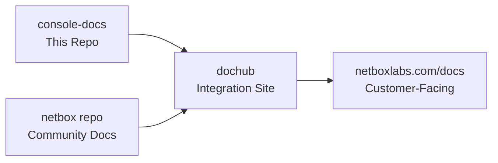
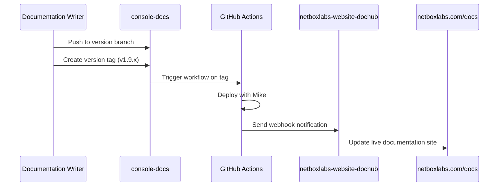

# NetBox Enterprise Documentation Repository

This repository contains the commercial/enterprise documentation for NetBox Labs products. The documentation is automatically integrated with the [netboxlabs-website-dochub](https://github.com/netboxlabs/netboxlabs-website-dochub) repository to create a unified documentation experience at **https://netboxlabs.com/docs**.

## 🎯 For Documentation Team: Quick Start

### Understanding Our Workflow

**This repository feeds into the main NetBox Labs documentation site**, but content visibility is controlled by **version branches**. This allows us to:

- ✅ **Write documentation before features are released**
- ✅ **Keep unreleased features hidden from customers**
- ✅ **Maintain stable documentation for current customers**
- ✅ **Seamlessly activate new versions when ready**

### Where Your Content Goes Live



**Key Point**: Only content from specific version branches appears on the live site. Development content stays hidden until activated.

## 🏷️ Comprehensive Semantic Tagging System

This repository uses a sophisticated semantic tagging system that enables intelligent content organization, filtering, and AI-assisted development. The system is organized into clear categories:

### Edition Tags (Prominent Pills at Top)
These determine which NetBox editions can use the feature:

```yaml
tags:
  - cloud      # NetBox Cloud features (#00d9be)
  - enterprise # NetBox Enterprise features (#ffac00)
  - community  # NetBox Community (open source) features (#00bee0)
  - airgap     # Air-gapped deployment features (#6c757d)
```

### Product Tags (Regular Tags)
Core NetBox Labs products:

```yaml
tags:
  - netbox     # Core NetBox functionality
  - discovery  # NetBox Discovery features
  - assurance  # NetBox Assurance features (premium only)
  - operator   # NetBox Operator features (premium only)
  - branching  # NetBox Branching extension (premium only)
```

### Technical Category Tags (38+ Available)

```yaml
tags:
  # Authentication & Security
  - authentication # SSO, security, access control
  - sso           # Single sign-on features
  - ldap          # LDAP integration
  - saml          # SAML authentication
  - rbac          # Role-based access control
  - security      # Security features
  - encryption    # Encryption and certificates
  
  # System Administration
  - administration # System administration
  - database      # Database management
  - backup        # Backup and restore
  - migration     # Data migration
  - upgrade       # Version upgrades
  - maintenance   # System maintenance
  
  # APIs and Integration
  - api           # REST API, GraphQL, SDKs
  - rest-api      # REST API specific
  - graphql       # GraphQL API
  - webhooks      # Webhook integrations
  - automation    # Automation and scripting
  - plugins       # Plugin development
  
  # Operations and Monitoring
  - operations    # Monitoring, backups, maintenance
  - monitoring    # System monitoring
  - notifications # Alerts and notifications
  - logging       # Logging and audit trails
  - metrics       # Performance metrics
  
  # User Experience
  - installation     # Installation and setup guides
  - configuration    # Configuration and settings
  - troubleshooting  # Problem resolution guides
  - getting-started  # Introductory guides
```

### NetBox Model Categories

```yaml
tags:
  - circuits        # Circuit providers and connectivity
  - dcim           # Data Center Infrastructure Management
  - ipam           # IP Address Management
  - tenancy        # Multi-tenancy features
  - virtualization # Virtual machines and clusters
  - vpn            # VPN tunnels and configurations
  - wireless       # Wireless networks
  - extras         # Custom fields, webhooks, templates
  - core           # Core NetBox functionality
```

### Enhanced Frontmatter Format

#### Standard Document Template

```yaml
---
tags:
  - cloud                    # Edition (prominent pill)
  - enterprise
  - discovery                # Product (regular tag)
  - authentication           # Technical category (regular tag)
  - configuration            # Content type (regular tag)
title: "Document Title"
description: "SEO-friendly description for search and social sharing"
author: "NetBox Labs Documentation Team"
last_updated: "2025-01-27"
versions:
  cloud: "v1.10"
  enterprise: "v1.10"
  community: "v4.2"
status: "current"
category: "feature"
audience: "end-users"
complexity: "beginner"
---
```

#### Premium Feature Example (Cloud/Enterprise Only)

```yaml
---
tags:
  - cloud
  - enterprise
  - assurance                # Premium product
  - monitoring
  - operations
title: "NetBox Assurance Feature"
description: "Network monitoring and compliance with NetBox Assurance"
versions:
  cloud: "v1.10"
  enterprise: "v1.10"
  # Note: community not included - premium feature only
---
```

#### Universal Feature Example (All Editions)

```yaml
---
tags:
  - cloud
  - enterprise
  - community
  - discovery                # Available everywhere
  - getting-started
title: "NetBox Discovery Getting Started"
versions:
  cloud: "v1.10"
  enterprise: "v1.10"
  community: "v4.2"
---
```

## 🤖 AI-Assisted Development Workflow

This repository includes comprehensive AI reference materials in the `ai-reference/` directory to support AI-assisted documentation development:

### AI Reference Structure
```
ai-reference/
├── README.md                           # Complete AI reference guide
├── QUICK_REFERENCE.md                  # Fast lookup for common tasks
├── SYSTEM_OVERVIEW.md                  # High-level system architecture
├── templates/                          # Document templates
│   ├── netbox-feature-doc-template.md  # Standard feature documentation template
│   ├── product-landing-page.md         # Product overview template
│   └── semantic-tagging-usage.md       # Tagging examples and usage
├── style-guides/                       # Writing and formatting guidelines
│   ├── netbox-docs-style-guide.md      # Complete style guide
│   ├── product-tagging-guide.md        # Comprehensive tagging system guide
│   └── ai-prompting-guide.md           # Best practices for AI assistance
├── content-strategy/                   # Strategy docs and planning
│   ├── navigation-strategy.md          # User-centric navigation approach
│   ├── navigation-guidelines.md        # Navigation best practices
│   └── dochub-integration-strategy.md  # DocHub integration strategy
└── reference-docs/                     # Reference materials and summaries
    ├── tag-reconciliation-summary.md   # Current comprehensive tagging system
    ├── netbox-semantic-tagging-guide.md # NetBox-specific tagging guide
    ├── edition-pill-mapping.md         # Edition pill directory mappings
    └── dochub-integration-requirements.md # Technical integration specs
```

### Using AI Reference Materials

When working with AI tools:
1. **Reference the style guide**: `ai-reference/style-guides/netbox-docs-style-guide.md`
2. **Use appropriate templates**: `ai-reference/templates/`
3. **Apply comprehensive tagging**: `ai-reference/style-guides/product-tagging-guide.md`
4. **Follow navigation strategy**: `ai-reference/content-strategy/navigation-strategy.md`

## 🚀 Local Development Setup

### 1. Clone and Setup
```bash
git clone https://github.com/netboxlabs/console-docs
cd console-docs
```

### 2. Install Dependencies
```bash
# Using Python virtual environment (recommended)
python3 -m venv venv
source venv/bin/activate
pip install -r requirements.txt

# Or using global Python (if you have permission issues)
/Users/[username]/Library/Python/3.9/bin/mkdocs serve
```

### 3. Start Local Preview
```bash
mkdocs serve
# Visit: http://127.0.0.1:8000
```

## 📦 External Documentation Sync

This repository includes documentation from external repositories while maintaining sync with authoritative sources. We use a docs-only approach to keep the repository clean and focused.

### External Documentation Sources

| Path | Repository | Purpose | Update Method |
|------|------------|---------|---------------|
| `docs/netbox-extensions/changes/` | [`netbox-changes`](https://github.com/netboxlabs/netbox-changes) | NetBox Change Management documentation | Script-based sync |

### Working with External Documentation

#### **For Contributors (Read-Only)**
```bash
# Standard clone - no special setup required
git clone https://github.com/netboxlabs/console-docs
cd console-docs
pip install -r requirements.txt
mkdocs serve
```

#### **For Maintainers (Updating Documentation)**
```bash
# Update NetBox Changes documentation from source
./scripts/update-changes-docs.sh

# Review the changes
git diff docs/netbox-extensions/changes/

# Test the build
python -m mkdocs build

# Commit and push updates
git add docs/netbox-extensions/changes/
git commit -m "Update NetBox Changes documentation"
git push
```

#### **Why We Use This Approach**
- **Clean Repository**: Only includes documentation content, not entire source repositories
- **Simple Setup**: No submodule initialization required for contributors
- **Flexible Updates**: Easy to control what content gets synced and when
- **Maintainable**: Clear separation between local and external content
- **Version Control**: Full control over when and what gets updated

#### **Update Script Details**
The `scripts/update-changes-docs.sh` script:
- ✅ Clones the source repository to a temporary location
- ✅ Copies only the `docs/` directory content
- ✅ Replaces existing documentation with latest version
- ✅ Cleans up temporary files
- ✅ Provides clear next steps for review and commit

## 📝 Documentation Team Workflow Guide

### Understanding Version Control Strategy

We use **branch-based versioning** to control what customers see on the live documentation site:

#### **Current State (Transition Period)**
| Version | Status | Branch | Customer Visibility | Purpose |
|---------|--------|--------|-------------------|---------|
| **v1.9** | 🟢 **LIVE** | `main` | ✅ **Visible** | Current customer documentation |
| **v1.10** | 🟡 **Beta** | *not created yet* | ❌ **Hidden** | NetBox Enterprise + Assurance features |
| **v1.11** | 🔴 **Alpha** | *future* | ❌ **Hidden** | NetBox Enterprise + Helm features |

#### **Future State (After Transition)**
| Version | Status | Branch | Customer Visibility | Purpose |
|---------|--------|--------|-------------------|---------|
| **v1.9** | 🟢 **STABLE** | `v1.9` | ✅ **Visible** | Maintenance updates for current customers |
| **v1.10** | 🟡 **Beta** | `v1.10` | ❌ **Hidden** | NetBox Enterprise + Assurance features |
| **v1.11** | 🔴 **Alpha** | `main` | ❌ **Hidden** | NetBox Enterprise + Helm features |

**🔄 Transition Note**: Currently, `main` branch contains v1.9 content. We will create dedicated version branches as we prepare for v1.10 and v1.11 releases.

### Content Organization Strategy

Our navigation follows a **user-centric approach** that prioritizes user intent and workflow over internal product boundaries:

#### Primary Organization: By Product Edition
- **NetBox Cloud**: Managed service features and administration
- **NetBox Enterprise**: On-premises deployment and enterprise features
- **NetBox Community**: Open source features and community tools

#### Secondary Organization: By Capability
- **Discovery**: Network discovery and data collection
- **Assurance**: Operational drift detection and remediation
- **Operator**: AI-powered network operations
- **Extensions**: Additional functionality and integrations

### Where to Add New Documentation

#### ✅ **For Current Customer Issues/Fixes (v1.9) - CURRENT WORKFLOW**
```bash
git checkout main  # Currently contains v1.9 content
# Edit documentation for current features
git add docs/path/to/file.md
git commit -m "Fix SSL certificate installation steps"
git push origin main
git tag v1.9.1  # Automatically deploys to live site
git push origin v1.9.1
```
**Result**: ✅ Changes appear immediately on https://netboxlabs.com/docs

#### 🔄 **For NetBox Enterprise + Assurance Features (v1.10 Beta) - PREPARE FOR FUTURE**
```bash
# Branch doesn't exist yet - will be created when v1.10 development starts
# For now, document in feature branches and merge when ready

git checkout -b feature/assurance-monitoring
# Add documentation for Assurance features with proper tags
---
tags:
  - cloud
  - enterprise
  - assurance
  - monitoring
  - operations
---
git add docs/netbox-assurance/new-feature.md
git commit -m "Add documentation for network monitoring workflows"
git push origin feature/assurance-monitoring
# DON'T merge to main yet - wait for v1.10 branch creation
```
**Result**: ❌ Content prepared but not visible to customers until v1.10 branch exists

#### 🚀 **For NetBox Enterprise + Helm Features (v1.11 Alpha) - FUTURE WORKFLOW**
```bash
# After v1.9 branch is created, main will be used for v1.11 development
# For now, use feature branches

git checkout -b feature/helm-deployment
# Add documentation for Helm deployment features with proper tags
---
tags:
  - cloud
  - enterprise
  - kubernetes
  - helm
  - installation
---
git add docs/netbox-enterprise/helm-installation.md
git commit -m "Add Helm deployment guide"
git push origin feature/helm-deployment
# DON'T merge to main yet - wait for branch strategy transition
```
**Result**: ❌ Content prepared but not visible to customers until workflow transition

### How Integration with Dochub Works



**Key Points:**
- 🏷️ **Only tagged versions appear on live site**
- 🔒 **Untagged branches remain hidden**
- ⚡ **Tagging triggers automatic deployment**
- 🌐 **Dochub combines with community docs**
- 🏷️ **Semantic tags enable intelligent content filtering**

### Release Workflow for New Versions

#### When v1.10 (Assurance) is Ready for Customers:

1. **Activate the version** (DevOps/Maintainers):
   ```bash
   # Edit versions.json - move v1.10 from future_versions to versions
   # Update mkdocs.yml - add v1.10 to available versions
   git commit -m "Activate v1.10 for customer access"
   git push origin main
   ```

2. **Deploy the version**:
   ```bash
   git checkout v1.10
   git tag v1.10.0
   git push origin v1.10.0
   ```

3. **Result**: ✅ v1.10 documentation becomes visible to customers

#### When v1.11 (Helm) is Ready for Customers:

Same process - move from `future_versions` to `versions` and tag the release.

### Common Scenarios

#### 📝 **Scenario 1: Fix Current Documentation Error**
**Goal**: Customer reports error in v1.9 installation guide
```bash
git checkout v1.9
# Fix the error in docs/ with proper semantic tags
git commit -m "Fix typo in SSL certificate steps"
git push origin v1.9
git tag v1.9.2
git push origin v1.9.2
# ✅ Fix goes live immediately
```

#### 📝 **Scenario 2: Document Upcoming Assurance Feature**
**Goal**: Engineering added monitoring feature for v1.10
```bash
git checkout v1.10  # (or create branch if it doesn't exist)
# Add docs/netbox-assurance/monitoring-alerts.md with proper tags
---
tags:
  - cloud
  - enterprise
  - assurance
  - monitoring
  - notifications
---
git commit -m "Add monitoring alerts documentation"
git push origin v1.10
# ❌ Stays hidden until v1.10 is released
```

#### 📝 **Scenario 3: Document Future Helm Feature**
**Goal**: Engineering working on Helm charts for v1.11
```bash
git checkout main
# Add docs/netbox-enterprise/helm-charts.md with proper tags
---
tags:
  - cloud
  - enterprise
  - kubernetes
  - helm
  - installation
  - configuration
---
git commit -m "Add Helm charts configuration guide"
git push origin main
# ❌ Stays hidden until v1.11 is released
```

#### 📝 **Scenario 4: Cross-Version Update**
**Goal**: Security update applies to all versions
```bash
# Update current version first
git checkout v1.9
# Make security update with appropriate tags
---
tags:
  - cloud
  - enterprise
  - community
  - security
  - authentication
---
git commit -m "Add security best practices"
git tag v1.9.3
git push origin v1.9 v1.9.3

# Apply to future versions
git checkout main
git cherry-pick <commit-hash>
git push origin main

git checkout v1.10
git cherry-pick <commit-hash>
git push origin v1.10
```

## ⚠️ Important Guidelines for Documentation Team

### 🚨 **Critical Rules**

#### **DO:**
- ✅ **Always work on the correct branch** for your content type
- ✅ **Use comprehensive semantic tagging** in all documents
- ✅ **Reference AI templates and style guides** when writing
- ✅ **Tag main branch changes immediately** (they go live as v1.9 instantly)  
- ✅ **Test your changes locally** before committing
- ✅ **Use clear commit messages** describing what changed
- ✅ **Check if your update applies to multiple versions**
- ✅ **Follow the navigation strategy** for user-centric organization

#### **DON'T:**
- ❌ **Never tag future version branches** until release is approved
- ❌ **Don't merge unreleased features into main** (currently v1.9 live content)
- ❌ **Don't assume all versions need the same content**
- ❌ **Don't commit untested changes** to main branch (goes live immediately)
- ❌ **Don't forget semantic tags** in frontmatter
- ❌ **Don't use old HTML pill format** - use YAML tags instead

### 🎯 **Quick Decision Guide**

**Ask yourself**: *"Should customers see this immediately?"*

#### **FOR TODAY (Current Workflow):**
- **YES** → Work on `main` branch, add proper semantic tags, and tag when ready (deploys v1.9 immediately)
- **NO, it's for Assurance features** → Work on feature branch with proper tags (wait for v1.10 branch)
- **NO, it's for Helm features** → Work on feature branch with proper tags (wait for transition)

#### **FOR FUTURE (After Transition):**
- **YES** → Work on `v1.9` branch and tag when ready  
- **NO, it's for Assurance features** → Work on `v1.10` branch (don't tag)
- **NO, it's for Helm features** → Work on `main` branch (don't tag)

### 📋 **Before You Start Writing**

#### **Today's Checklist:**
1. **Is this for current customers?** → Use `main` branch and tag when ready
2. **Is this for future features?** → Use feature branch, don't merge yet
3. **Have I chosen the right template?** → Check `ai-reference/templates/`
4. **Are my semantic tags correct?** → Reference `ai-reference/style-guides/product-tagging-guide.md`
5. **Does this follow our navigation strategy?** → Check `ai-reference/content-strategy/navigation-strategy.md`
6. **Test locally** before committing to `main`
7. **Ask DevOps if unsure** about version targeting or transition timing

#### **Future Checklist (After Transition):**
1. **Check which NetBox Enterprise version** the feature is targeting
2. **Confirm the correct version branch** to work on (v1.9, v1.10, or main)
3. **Apply comprehensive semantic tagging** based on the feature scope
4. **Understand if it's customer-ready** or still in development
5. **Ask DevOps if unsure** about version targeting

### 🔧 **Technical Reference**

#### Branch Structure

**Current State:**
```
main              # v1.9 current (Live customer docs) - VISIBLE to customers
├── feature/*     # Feature branches for future content preparation
├── ai-reference/ # AI development resources and templates
└── versioning/*  # Infrastructure branches (like feature/versioning-system)
```

**Future State (After Transition):**
```
main              # v1.11 alpha (Helm capabilities) - HIDDEN from customers
├── v1.10         # v1.10 beta (Assurance capabilities) - HIDDEN from customers  
├── v1.9          # v1.9 stable (Maintenance for current customers) - VISIBLE to customers
├── feature/*     # Feature branches for new content
└── ai-reference/ # AI development resources and templates
```

#### Configuration Files
- `versions.json` - Controls which versions are visible to customers
- `mkdocs.yml` - Local development configuration  
- `.github/workflows/version-deploy.yml` - Automated deployment system
- `ai-reference/` - AI development resources and comprehensive tagging system

### 🔄 **Transition Plan**

#### **Phase 1: Current State (Today)**
- `main` branch contains v1.9 documentation (customer-facing)
- Tagging `main` deploys v1.9 updates to live site
- Future feature development uses feature branches
- Comprehensive semantic tagging system in place
- AI reference materials available for development

#### **Phase 2: Branch Creation (When v1.10 Development Starts)**
1. **Create v1.9 maintenance branch**:
   ```bash
   git checkout main
   git checkout -b v1.9
   git push origin v1.9
   ```

2. **Update main for v1.10 development**:
   ```bash
   git checkout main
   # Begin v1.10 (Assurance) content development with proper semantic tags
   # DON'T tag main branch anymore
   ```

#### **Phase 3: Future State (When v1.11 Development Starts)**
1. **Create v1.10 maintenance branch**
2. **Use main for v1.11 (Helm) development**

#### **Team Communication Points**
- 📢 **Before Phase 2**: Announce transition timeline to documentation team
- 📢 **During Phase 2**: Update team workflows and training
- 📢 **After Phase 2**: Monitor and refine new branch strategy

## 🛠️ For DevOps/Maintainers: Technical Details

<details>
<summary>Click to expand technical workflow information</summary>

### Automated Deployment Process

The repository uses GitHub Actions to automatically deploy documentation when version tags are pushed:

```bash
# Tagging triggers automatic deployment
git tag v1.9.1
git push origin v1.9.1
# → Triggers GitHub Actions → Deploys to live site
```

### Version Configuration Management

Version visibility is controlled by `versions.json`:

```json
{
  "versions": [
    {
      "version": "v1.9", 
      "title": "v1.9 (Current)",
      "default": true,
      "status": "current"
    }
  ],
  "future_versions": [
    {
      "version": "v1.10",
      "title": "v1.10 (Beta) - NetBox Enterprise with Assurance",
      "status": "beta"
    },
    {
      "version": "v1.11",
      "title": "v1.11 (Alpha) - NetBox Enterprise with Helm",
      "status": "alpha"
    }
  ]
}
```

### Activating New Versions

To make a development version visible to customers:

1. Move version from `future_versions` to `versions` in `versions.json`
2. Update `mkdocs.yml` available versions list
3. Update `LATEST_VERSION` in GitHub Actions workflow
4. Tag the version branch to deploy

### Integration with Dochub

The repository sends webhook notifications to `netboxlabs-website-dochub` when versions are deployed, triggering updates to the unified documentation site. The comprehensive semantic tagging system enables intelligent content filtering and organization in the unified site.

### Semantic Tagging System Integration

The semantic tagging system provides multiple integration points:

- **Content Filtering**: Edition-specific content visibility
- **Navigation Generation**: Automatic sidebar generation based on tags
- **Search Enhancement**: Tag-based search and filtering
- **API Access**: Programmatic access to document metadata
- **Cross-Product Discovery**: Related content recommendations

</details>

## :warning:

If you see errors like this...

> ERROR   -  Config value 'theme': Unrecognised theme name: 'material'. The available installed themes are: mkdocs, readthedocs
> ERROR   -  Config value 'markdown_extensions': Failed to load extension 'pymdownx.tabbed'.
>            ModuleNotFoundError: No module named 'pymdownx'


 Try uninstalling `mkdocs` from your package manager, (e.g. `brew uninstall mkdocs`) and just using the version installed by `pip`. It seems that `mkdocs` doesn't like it when you've installed it using different methods.