# NetBox Enterprise Documentation Repository

This repository contains the commercial/enterprise documentation for NetBox Labs products. The documentation is integrated with the main NetBox Labs documentation site at **https://netboxlabs.com/docs**.

## 🚀 Quick Start - Writing Documentation

### 1. Clone and Setup
```bash
git clone https://github.com/netboxlabs/console-docs
cd console-docs
```

### 2. Install Dependencies
```bash
# Using Python virtual environment (recommended)
python3 -m venv venv
source venv/bin/activate
pip install -r requirements.txt
```

### 3. Start Local Preview
```bash
mkdocs serve
# Visit: http://127.0.0.1:8000
```

### 🔄 Quick Migration Guide

**To migrate existing documents:**

1. **Streamlined Semantic Tagging (Recommended):**
   ```bash
   # Install dependencies
   npm install
   
   # Preview what tags would be applied (optional)
   npm run preview-tags
   
   # Apply streamlined semantic tags
   npm run enhanced-tag
   
   # Review changes
   git diff
   ```

2. **HTML Pills Migration:**
   ```bash
   # Convert existing HTML pills to frontmatter tags
   npm run migrate-pills
   
   # Review changes
   git diff
   ```

**Available Tags (Streamlined System - 20 Total):**

**Platform Tags (Top Pills - 4):**
| Tag | Display | Color |
|-----|---------|-------|
| `cloud` | Cloud | 🟢 Teal |
| `enterprise` | Enterprise | 🟠 Orange |
| `community` | Community | 🔵 Blue |
| `airgap` | Air-Gap | 🔴 Pink |

**Semantic Tags (Bottom References - 16 total):**
- **Product** (4): `netbox`, `discovery`, `assurance`, `operator`
- **Deployment** (2): `kubernetes`, `helm`
- **Technical** (4): `api`, `authentication`, `administration`, `operations`
- **Content** (4): `installation`, `configuration`, `troubleshooting`, `getting-started`
- **Features** (4): `automation`, `networking`, `integration`, `ai`

### 4. Write Your Documentation
- Create or edit `.md` files in the `docs/` directory
- Use proper semantic tagging in frontmatter (see [Tagging Guide](#-semantic-tagging-system))
- Test locally before committing

### 5. Submit Your Changes
```bash
git checkout -b feature/your-feature-name
git add docs/your-new-file.md
git commit -m "Add documentation for your feature"
git push origin feature/your-feature-name
# Create a pull request on GitHub
```

## 🔄 How Documentation Goes Live (Two-Step Process)

**Important**: Documentation requires **two separate pull requests** to go live:

### Step 1: Content Repository (This Repo)
1. **Create PR** in this repository (`console-docs`)
2. **Get it reviewed and merged**
3. **Tag the version** (for production releases)

### Step 2: Integration Repository
1. **Create PR** in [`netboxlabs-website-dochub`](https://github.com/netboxlabs/netboxlabs-website-dochub/)
2. **Update integration configuration** to include your new content
3. **Get it reviewed and merged**

### Why Two Steps?
- **`console-docs`** (this repo) → Contains the actual documentation content
- **`netboxlabs-website-dochub`** → Combines content from multiple repos and publishes to the live site
- **Integration required** → Changes here don't automatically appear on the live site

### Repository Integration Flow

```mermaid
graph LR
    A[console-docs<br/>📝 Your Content] --> B[dochub<br/>🔧 Integration Site]
    C[netbox repo<br/>📚 Community Docs] --> B
    D[Other Repos<br/>📖 Additional Content] --> B
    B --> E[netboxlabs.com/docs<br/>🌐 Live Site]
    
    style A fill:#e1f5fe
    style B fill:#fff3e0
    style E fill:#e8f5e8
```



**Key Points:**
- 🔒 **Content stays hidden** until both PRs are merged
- 🏷️ **Version tags control** what customers see
- 🔄 **Two-repo process** ensures content quality and integration

## 📝 Documentation Standards

### Required Frontmatter
Every documentation file should include proper frontmatter with semantic tags:

```yaml
---
tags:
  - cloud                    # Edition (NetBox Cloud, Enterprise, Community)
  - enterprise
  - discovery                # Product (discovery, assurance, operator, etc.)
  - getting-started          # Content type (installation, configuration, etc.)
title: "Your Document Title"
description: "SEO-friendly description"
author: "NetBox Labs Documentation Team"
last_updated: "2025-01-27"
---
```

### Edition Tags (Choose Appropriate Ones)
```yaml
tags:
  - cloud      # NetBox Cloud features
  - enterprise # NetBox Enterprise features  
  - community  # NetBox Community (open source) features
  - airgap     # Air-gapped deployment features
```

### Product Tags
```yaml
tags:
  - netbox     # Core NetBox functionality
  - discovery  # NetBox Discovery features
  - assurance  # NetBox Assurance features (premium only)
  - operator   # NetBox Operator features (premium only)
  - branching  # NetBox Branching extension (premium only)
```

### Content Type Tags
```yaml
tags:
  - installation     # Installation and setup guides
  - configuration    # Configuration and settings
  - troubleshooting  # Problem resolution guides
  - getting-started  # Introductory guides
  - administration   # System administration
  - api             # API documentation
  - authentication  # SSO, security, access control
```

## 📁 Repository Structure

```
console-docs/
├── docs/                           # 📝 Documentation content
│   ├── administration-console/     # NetBox Cloud admin features
│   ├── cloud-connectivity/         # Cloud connectivity guides
│   ├── netbox-assurance/          # NetBox Assurance documentation
│   ├── netbox-discovery/          # NetBox Discovery documentation
│   ├── netbox-enterprise/         # NetBox Enterprise guides
│   ├── netbox-extensions/         # Extensions and add-ons
│   └── netbox-integrations/       # Third-party integrations
├── ai-reference/                   # 🤖 AI development resources
├── mkdocs.yml                      # 🔧 Local development configuration
├── versions.json                   # 📋 Version control configuration
└── README.md                       # 📖 This file
```

## 🎯 Version Management

### Current Version Structure
| Version | Status | Branch | Customer Visibility | Purpose |
|---------|--------|--------|-------------------|---------|
| **v1.10** | 🟢 **Current** | `main` | ✅ **Visible** | Current customer documentation |
| **v1.9** | 🔵 **Stable** | `v1.9` | ✅ **Visible** | Maintenance for existing customers |
| **v1.11** | 🟡 **Beta** | `v1.11` | ❌ **Hidden** | NetBox Enterprise + Helm features |
| **v1.12** | 🔴 **Alpha** | `v1.12` | ❌ **Hidden** | NetBox Enterprise + HA features |

### Where to Add Your Documentation

#### ✅ **For Current Features (Immediate Visibility)**
```bash
git checkout main  # v1.10 content - goes live immediately
# Edit documentation for current features
git add docs/path/to/file.md
git commit -m "Update SSL certificate installation steps"
git push origin main
# After PR merge + dochub integration → Live on website
```

#### 🔄 **For Future Features (Hidden Until Release)**
```bash
git checkout -b feature/new-feature
# Add documentation for future features
git add docs/netbox-assurance/new-feature.md
git commit -m "Add documentation for upcoming feature"
git push origin feature/new-feature
# Stays hidden until feature branch is merged to a live version
```

## 🏷️ Semantic Tagging System

This repository uses a comprehensive semantic tagging system for intelligent content organization:

<details>
<summary>Click to expand complete tagging reference</summary>

### Technical Category Tags (38+ Available)

```yaml
tags:
  # Authentication & Security
  - authentication # SSO, security, access control
  - sso           # Single sign-on features
  - ldap          # LDAP integration
  - saml          # SAML authentication
  - rbac          # Role-based access control
  - security      # Security features
  - encryption    # Encryption and certificates
  
  # System Administration
  - administration # System administration
  - database      # Database management
  - backup        # Backup and restore
  - migration     # Data migration
  - upgrade       # Version upgrades
  - maintenance   # System maintenance
  
  # APIs and Integration
  - api           # REST API, GraphQL, SDKs
  - rest-api      # REST API specific
  - graphql       # GraphQL API
  - webhooks      # Webhook integrations
  - automation    # Automation and scripting
  - plugins       # Plugin development
  
  # Operations and Monitoring
  - operations    # Monitoring, backups, maintenance
  - monitoring    # System monitoring
  - notifications # Alerts and notifications
  - logging       # Logging and audit trails
  - metrics       # Performance metrics
```

### NetBox Model Categories

```yaml
tags:
  - circuits        # Circuit providers and connectivity
  - dcim           # Data Center Infrastructure Management
  - ipam           # IP Address Management
  - tenancy        # Multi-tenancy features
  - virtualization # Virtual machines and clusters
  - vpn            # VPN tunnels and configurations
  - wireless       # Wireless networks
  - extras         # Custom fields, webhooks, templates
  - core           # Core NetBox functionality
```

</details>

## 🤖 AI-Assisted Development

This repository includes comprehensive AI reference materials in the `ai-reference/` directory:

### AI Reference Resources
```
ai-reference/
├── README.md                           # Complete AI reference guide
├── QUICK_REFERENCE.md                  # Fast lookup for common tasks
├── templates/                          # Document templates
│   ├── netbox-feature-doc-template.md  # Standard feature documentation
│   └── product-landing-page.md         # Product overview template
├── style-guides/                       # Writing guidelines
│   ├── netbox-docs-style-guide.md      # Complete style guide
│   └── product-tagging-guide.md        # Tagging system guide
└── content-strategy/                   # Strategy and planning
    └── navigation-strategy.md          # User-centric navigation
```

### Using AI Reference Materials
When working with AI tools:
1. **Reference the style guide**: `ai-reference/style-guides/netbox-docs-style-guide.md`
2. **Use templates**: `ai-reference/templates/`
3. **Apply proper tagging**: `ai-reference/style-guides/product-tagging-guide.md`

## 📦 External Documentation Sync

Some documentation is synced from external repositories:

| Path | Repository | Purpose | Update Method |
|------|------------|---------|---------------|
| `docs/netbox-extensions/changes/` | [`netbox-changes`](https://github.com/netboxlabs/netbox-changes) | NetBox Change Management docs | Script-based sync |

### Updating External Documentation
```bash
# For maintainers only
./scripts/update-changes-docs.sh
git add docs/netbox-extensions/changes/
git commit -m "Update NetBox Changes documentation"
git push
```

## 📋 Important Guidelines

### ✅ **DO:**
- **Use proper semantic tagging** in all documents
- **Test locally** before committing
- **Create feature branches** for new content
- **Follow the two-step process** for live deployment
- **Reference AI templates** when writing

### ❌ **DON'T:**
- **Don't commit directly to main** without review
- **Don't forget frontmatter tags** in your documents
- **Don't assume changes go live automatically** (requires dochub integration)
- **Don't merge unreleased features** into live branches

## 🛠️ Advanced Configuration

<details>
<summary>Click to expand advanced technical details</summary>

### Version Configuration Management

Version visibility is controlled by `versions.json`:

```json
{
  "versions": [
    {
      "version": "v1.10", 
      "branch": "main",
      "title": "v1.10 (Current)",
      "default": true,
      "status": "current"
    }
  ],
  "future_versions": [
    {
      "version": "v1.11",
      "branch": "v1.11",
      "title": "v1.11 (Beta) - NetBox Enterprise with Helm",
      "status": "beta"
    }
  ]
}
```

### Integration with DocHub

The repository sends webhook notifications to `netboxlabs-website-dochub` when versions are deployed. The semantic tagging system enables:

- **Content Filtering**: Edition-specific content visibility
- **Navigation Generation**: Automatic sidebar generation
- **Search Enhancement**: Tag-based search and filtering
- **Cross-Product Discovery**: Related content recommendations

### Automated Deployment Process

```bash
# Tagging triggers automatic deployment
git tag v1.10.1
git push origin v1.10.1
# → Triggers GitHub Actions → Notifies dochub → Updates live site
```

</details>

## ⚠️ Troubleshooting

If you see errors like this:

> ERROR - Config value 'theme': Unrecognised theme name: 'material'
> ERROR - ModuleNotFoundError: No module named 'pymdownx'

**Solution**: Try uninstalling `mkdocs` from your package manager (e.g. `brew uninstall mkdocs`) and use only the pip-installed version. MkDocs doesn't work well when installed via multiple methods.

## 🆘 Getting Help

- **Community Support**: Join [Slack](https://netdev.chat/) in the `#netbox` channel
- **Documentation Issues**: Create an issue in this repository
- **Integration Questions**: Ask in the `netboxlabs-website-dochub` repository

---

**Ready to contribute?** Start with the [Quick Start](#-quick-start---writing-documentation) section above and remember the [two-step process](#-how-documentation-goes-live-two-step-process) for going live!