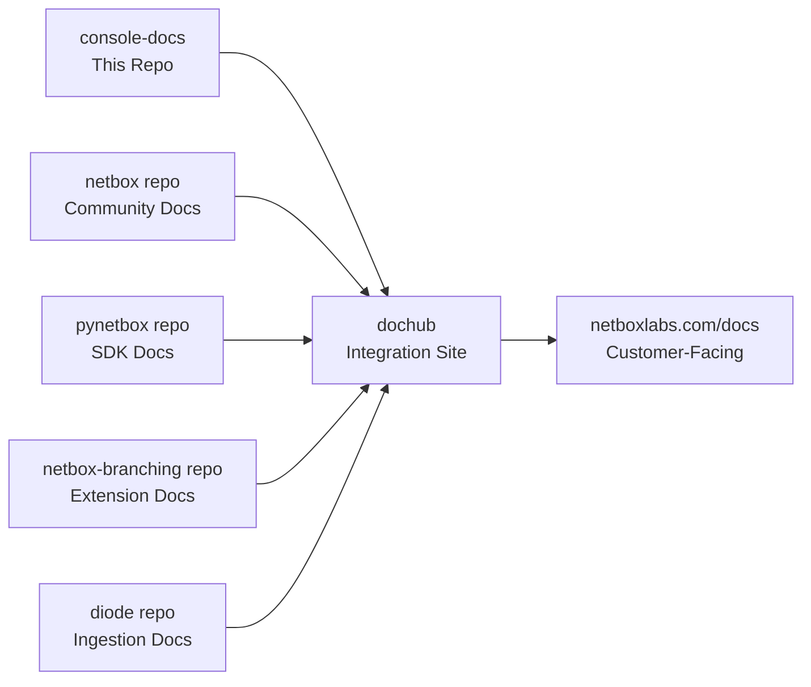

---
tags:
  - ai-reference
  - cloud
  - enterprise
  - community
  - documentation
  - tagging
  - development
title: "AI Reference Materials"
description: "Reference materials, templates, and documentation resources for AI-assisted NetBox Labs documentation development"
author: "NetBox Labs Documentation Team"
last_updated: "2025-06-25"
category: "ai-reference"
audience: "developers"
complexity: "intermediate"
sidebar_position: 999
internal_only: true
draft: true
---

:::info Development Resource
This content is synced from console-docs/ai-reference for development team use.
**This directory is not published to dochub** and is intended for internal development use only.
:::

# AI Reference Materials

This directory contains reference materials, templates, and documentation resources for use with AI/LLM tools when building NetBox Labs documentation.

## Purpose

- 📝 Store reference documentation and examples for AI-assisted writing
- 🤖 Provide context and templates for LLM tools using our comprehensive semantic tagging system
- 📋 Maintain style guides and content patterns with version tracking
- 🔧 Keep development notes and content strategy documents
- 🏷️ Demonstrate proper use of our enhanced semantic tagging system

## Structure

```
ai-reference/
├── README.md                           # This file
├── QUICK_REFERENCE.md                  # Fast lookup for common tasks
├── SYSTEM_OVERVIEW.md                  # High-level system architecture
├── templates/                          # Document templates
│   ├── netbox-feature-doc-template.md  # Standard feature documentation template
│   ├── product-landing-page.md         # Product overview template
│   └── semantic-tagging-usage.md       # Tagging examples and usage
├── style-guides/                       # Writing and formatting guidelines
│   ├── netbox-docs-style-guide.md      # Complete style guide
│   ├── product-tagging-guide.md        # Comprehensive tagging system guide
│   └── ai-prompting-guide.md           # Best practices for AI assistance
├── content-strategy/                   # Strategy docs and planning
│   ├── navigation-strategy.md          # Navigation restructuring approach
│   ├── navigation-guidelines.md        # Navigation best practices
│   └── dochub-integration-strategy.md  # DocHub integration strategy
├── reference-docs/                     # Reference materials and summaries
│   ├── tag-reconciliation-summary.md   # Current comprehensive tagging system
│   ├── netbox-semantic-tagging-guide.md # NetBox-specific tagging guide
│   ├── edition-pill-mapping.md         # Edition pill directory mappings
│   ├── auto-tagging-analysis.md        # Auto-tagging system analysis
│   ├── dochub-coordination.md          # Cross-repository coordination
│   └── dochub-integration-requirements.md # Technical integration specs
└── project-docs/                       # Project documentation
    ├── implementation_plan.md          # Implementation roadmap
    └── DOCUMENTATION_CONSOLIDATION_SUMMARY.md # Project summary
```

## Comprehensive Semantic Tagging System

We use a **comprehensive semantic tagging system** organized into clear categories:

### Edition Tags (Prominent Pills at Top)
These determine which NetBox editions can use the feature:

```yaml
tags:
  - cloud      # NetBox Cloud features
  - enterprise # NetBox Enterprise features  
  - community  # NetBox Community (open source) features
  - airgap     # Air-gapped deployment features
```

### Product Tags (Regular Tags)
Core NetBox Labs products:

```yaml
tags:
  - netbox     # Core NetBox functionality
  - discovery  # NetBox Discovery features
  - assurance  # NetBox Assurance features (premium only)
  - operator   # NetBox Operator features (premium only)
```

### Platform and Deployment Tags

```yaml
tags:
  - kubernetes # Kubernetes deployments
  - helm       # Helm chart deployments
  - docker     # Docker containers
```

### Technical Category Tags

```yaml
tags:
  - api            # REST API, GraphQL, SDKs
  - authentication # SSO, security, access control
  - administration # System administration
  - operations     # Monitoring, backups, maintenance
```

### Content Type Tags

```yaml
tags:
  - installation     # Installation and setup guides
  - configuration    # Configuration and settings
  - troubleshooting  # Problem resolution guides
  - getting-started  # Introductory guides
```

### NetBox Model Categories

```yaml
tags:
  - circuits        # Circuit providers and connectivity
  - dcim           # Data Center Infrastructure Management
  - ipam           # IP Address Management
  - tenancy        # Multi-tenancy features
  - virtualization # Virtual machines and clusters
  - vpn            # VPN tunnels and configurations
  - wireless       # Wireless networks
  - extras         # Custom fields, webhooks, templates
  - core           # Core NetBox functionality
```

### NetBox Feature Tags

```yaml
tags:
  - custom-fields    # Custom field functionality
  - custom-links     # External link integration
  - custom-scripts   # Automation scripting
  - export-templates # Data export formatting
  - data-validation  # Validation rules
  - change-logging   # Audit trail
  - journaling       # Notes and comments
  - notifications    # Alerts and webhooks
  - background-jobs  # Task processing
  - search          # Search and filtering
  - tags            # Tagging system
  - contacts        # Contact management
  - permissions     # Access control
  - plugins         # Plugin development
  - models          # Data models
  - development     # Development guides
```

## Enhanced Frontmatter Format

### Standard Document Template

```yaml
---
tags:
  - cloud                    # Edition (prominent pill)
  - enterprise
  - discovery                # Product (regular tag)
  - authentication           # Technical category (regular tag)
  - configuration            # Content type (regular tag)
title: "Document Title"
description: "SEO-friendly description for search and social sharing"
author: "NetBox Labs Documentation Team"
last_updated: "2025-06-25"
category: "feature"
audience: "end-users"
complexity: "beginner"
---
```

### Premium Feature Example (Cloud/Enterprise Only)

```yaml
---
tags:
  - cloud
  - enterprise
  - assurance                # Premium product
  - monitoring
  - operations
title: "NetBox Assurance Feature"
description: "Network monitoring and compliance with NetBox Assurance"
# Note: community not included - premium feature only
---
```

### Universal Feature Example (All Editions)

```yaml
---
tags:
  - cloud
  - enterprise
  - community
  - netbox                   # Available everywhere
  - api
  - development
title: "NetBox REST API"
description: "REST API documentation for all NetBox editions"
---
```

## Available Tools and Scripts

### Enhanced Tagging Scripts

```bash
# Tag all NetBox documentation with comprehensive semantic tags
yarn enhanced-tag-netbox docs/netbox

# Tag console documentation  
yarn enhanced-tag docs/console

# Transform all documentation (includes tagging)
yarn transform-docs
```

### Development Workflow

```bash
# Start development server with full transformation
yarn dev

# Build for production
yarn build

# Process autodoc directives in NetBox documentation
yarn process-autodoc
```

## Tag Categories Reference

### Edition Tags → Prominent Pills
- `cloud`, `enterprise`, `community`, `airgap`

### Product Tags → Regular Tags  
- `netbox`, `discovery`, `assurance`, `operator`

### Technical Category Tags
- `api`, `authentication`, `administration`, `operations`
- `installation`, `configuration`, `troubleshooting`, `getting-started`
- `circuits`, `dcim`, `ipam`, `tenancy`, `virtualization`, `vpn`, `wireless`, `extras`, `core`

### All Other Tags → Regular Tags
- Feature categories: `automation`, `networking`, `integration`, `ai`
- NetBox models: `circuits`, `dcim`, `ipam`, `tenancy`, etc.
- NetBox features: `custom-fields`, `webhooks`, `plugins`, etc.
- Platform tags: `kubernetes`, `helm`, `docker`
- Extension tags: `netbox-branching`, `extensions`, `diode`, etc.

## Guidelines for AI-Assisted Documentation

### What Goes Here
✅ **DO include:**
- Document templates using our comprehensive semantic tagging system
- Style guides and writing standards
- Reference materials from authoritative sources
- Development notes and planning documents
- AI prompts and content generation helpers
- Migration guides and coordination specs

### What Doesn't Go Here
❌ **DON'T include:**
- Customer-facing documentation (belongs in `docs/`)
- Sensitive information or credentials
- Large binary files or images
- Outdated migration guides (use current comprehensive system)

## Key Files for AI Context

### Essential References
- `QUICK_REFERENCE.md` - Fast lookup for common tasks
- `style-guides/product-tagging-guide.md` - Complete tagging system
- `reference-docs/tag-reconciliation-summary.md` - Current tagging state
- `templates/netbox-feature-doc-template.md` - Standard template

### For Navigation Work
- `content-strategy/navigation-strategy.md` - Navigation principles
- `reference-docs/dochub-coordination.md` - Cross-repo coordination

### For Tagging Work
- `reference-docs/netbox-semantic-tagging-guide.md` - NetBox-specific guide
- `reference-docs/edition-pill-mapping.md` - Directory-based edition rules

## Sync Strategy

This ai-reference directory is maintained in both repositories:
- **Primary**: `/ai-reference` (this repository)
- **Sync Target**: `/external-repos/console-docs/ai-reference`

When making changes:
1. Update content in this repository first
2. Test and validate changes
3. Copy updated content to console-docs repository
4. Ensure both repositories stay in sync

This ensures AI tools have consistent context regardless of which repository they're working in.

## 🔧 Development Workflows & Technical Systems

### Git Submodules Management

This project uses git submodules to pull in documentation from multiple repositories:

- **console-docs**: Official NetBox Labs Console documentation
- **netbox**: Core NetBox documentation 
- **netbox-branching**: NetBox Branching plugin documentation
- **pynetbox**: Official Python API client for NetBox
- **diode**: NetBox data ingestion service documentation

```bash
# Initialize and update all submodules
git submodule update --init --recursive

# Update all submodules to latest
git submodule update --remote

# Update specific submodule
cd external-repos/netbox
git pull origin main
cd ../..
git add external-repos/
git commit -m "Update NetBox docs to latest"
```

### GitHub Actions Workflows

The repository uses several automated workflows:

#### **Documentation Automation**
- `update-submodules.yml`: Automatically detects external repo changes and creates PRs
- `auto-merge-docs.yml`: Safely auto-merges documentation updates after validation
- `cleanup-automated-prs.yml`: Cleans up redundant automated PRs
- `manual-cleanup-automated-prs.yml`: Manual PR management

#### **Release Management**
- `release.yml`: Creates GitHub releases with auto-generated release notes
- `generate-changelog.yml`: Generates comprehensive changelogs
- `update-changelog-weekly.yml`: Weekly changelog updates

#### **Submodule Protection Strategy**
Critical workflow design handles the conflict between:
1. Updating submodules to latest (`git submodule update --remote`)
2. Package installation resetting submodules (`yarn install` triggers postinstall)

**Solution**: Save commits → Install → Restore commits
```bash
NETBOX_COMMIT=$(cd external-repos/netbox && git rev-parse HEAD)
yarn install --frozen-lockfile  # May reset submodules
cd external-repos/netbox && git checkout $NETBOX_COMMIT  # Restore
```

### Version Management Strategy

#### **Current State (Transition Period)**
| Version | Status | Branch | Customer Visibility | Purpose |
|---------|--------|--------|-------------------|---------|
| **v1.9** | 🟢 **LIVE** | `main` | ✅ **Visible** | Current customer documentation |
| **v1.10** | 🟡 **Beta** | *not created yet* | ❌ **Hidden** | NetBox Enterprise + Assurance features |
| **v1.11** | 🔴 **Alpha** | *future* | ❌ **Hidden** | NetBox Enterprise + Helm features |

#### **Version Control Guidelines**
- **For current customers**: Work on `main` branch and tag when ready (deploys immediately)
- **For future features**: Use feature branches, don't merge until version branch exists
- **Cross-version updates**: Apply security updates to all relevant versions

### URL Redirects & Routing

The project uses Vercel's redirect configuration (`vercel.json`) with 200+ redirect rules:

#### **Key Redirect Categories**
- **Primary Navigation**: Root and docs redirects
- **Console Documentation**: Legacy URL patterns to unified structure
- **Submodule Integration**: External repo documentation integration
- **Asset & Media**: GitHub raw content redirects
- **Legacy Compatibility**: Backward compatibility maintenance

#### **Common Redirect Patterns**
```json
{
  "source": "/old-section/(.*)",
  "destination": "/docs/new-section/$1",
  "permanent": true
}
```

#### **Testing Redirects**
```bash
# Install Vercel CLI
npm i -g vercel

# Test redirects locally
vercel dev

# Test specific URLs
curl -I http://localhost:3000/old-url
```

### Content Exclusion System

Pages are excluded from documentation via `docusaurus.config.ts`:

```typescript
docs: {
  exclude: [
    // Internal documentation
    '**/ai-reference/**',
    '**/AUTOMATED_DOCS_SYSTEM.md',
    
    // Incomplete external content
    '**/external-repos/**/console-access-from-ui.md',
    '**/external-repos/**/nbe-kots-installation.md',
    
    // Legacy/superseded files
    '**/external-repos/**/sdks/pynetbox.md',
  ],
}
```

#### **When to Exclude Content**
- ✅ Internal development documentation
- ✅ Incomplete or placeholder content
- ✅ Files that would confuse end users
- ✅ Legacy content that's been superseded

### Troubleshooting Guide

#### **Common Issues**
1. **Submodules not initialized**: `git submodule update --init --recursive`
2. **Transformation errors**: Check `scripts/transformDocs.ts` output
3. **Missing images**: Ensure relative paths in source docs
4. **Sidebar not updating**: Delete and regenerate with `yarn transform-docs`

#### **GitHub Actions Issues**
5. **Workflow not creating PRs**: 
   - Check external repos for new commits: `git submodule update --remote && git status`
   - Verify workflow permissions in repository settings
   - Look for "No changes detected" in workflow logs

6. **PRs created but builds fail**:
   - Check if `yarn build` works locally after `yarn transform-docs`
   - Look for submodule restoration errors in workflow logs
   - Verify Node.js version compatibility (requires 22.x)

7. **Submodule conflicts in CI**:
   - Check "Submodule Protection Strategy" logs for restoration failures
   - Ensure submodule URLs are accessible from GitHub Actions

#### **Debug Mode**
```bash
# Enable verbose transformation logging
DEBUG=true yarn transform-docs

# Test workflow components locally
git submodule update --remote
yarn install --frozen-lockfile
yarn transform-docs
yarn build

# Check submodule status
git submodule status
git diff --name-only
```

### External Documentation Sync

#### **Console-Docs External Sources**
| Path | Repository | Purpose | Update Method |
|------|------------|---------|---------------|
| `docs/netbox-extensions/changes/` | `netbox-changes` | Change Management docs | Script-based sync |

#### **Update Process**
```bash
# Update external documentation
./scripts/update-changes-docs.sh

# Review and commit changes
git diff docs/netbox-extensions/changes/
git add docs/netbox-extensions/changes/
git commit -m "Update NetBox Changes documentation"
```

## 🚀 Integration Architecture

### Documentation Flow
```
External Repos (MkDocs) → Git Submodules → Transformation Script → Docusaurus → Next.js Rewrites → netboxlabs.com/docs
```

### Multi-Repository Coordination


### Transformation Pipeline
1. **Git Submodules**: Pull latest from external repos
2. **Content Processing**: Convert MkDocs to MDX, handle images, escape characters
3. **Semantic Tagging**: Apply comprehensive tagging automatically
4. **Sidebar Generation**: Parse navigation structures and convert to Docusaurus format
5. **Integration**: Combine with custom theme and build static site

### Deployment Strategy
- **Hosting**: Vercel with automatic deployments
- **Integration**: Next.js rewrites serve docs under `/docs/*`
- **Performance**: Edge redirects, optimized builds, CDN distribution
- **SEO**: Enhanced metadata, proper redirects, sitemap generation
