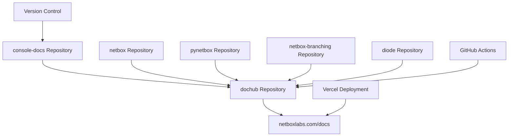

:::info Internal Project Documentation
This directory contains internal project documentation for DocHub2 development.  
**Not published to public documentation sites.** For development team use only.
:::

# NetBox Labs Documentation Project Overview

This document provides comprehensive coverage of both the **dochub** (unified documentation site) and **console-docs** (console documentation) projects, their workflows, and integration strategy.

## 🏗️ Project Architecture

### Two-Repository System



### **Console-Docs Repository**
- **Purpose**: Source repository for NetBox Enterprise/Cloud documentation
- **Content**: Administration, Discovery, Assurance, Extensions, Integrations
- **Workflow**: Version-based branch strategy for release management
- **Integration**: Feeds into dochub via git submodules

### **Dochub Repository** 
- **Purpose**: Unified documentation site combining all NetBox documentation
- **Content**: Transforms and integrates multiple source repositories
- **Workflow**: Automated transformation and deployment pipeline
- **Output**: Customer-facing documentation at netboxlabs.com/docs

## 🔄 Development Workflows

### Console-Docs Workflow

#### **Current Version Strategy**
| Version | Status | Branch | Customer Visibility | Purpose |
|---------|--------|--------|-------------------|---------|
| **v1.9** | 🟢 **LIVE** | `main` | ✅ **Visible** | Current customer documentation |
| **v1.10** | 🟡 **Beta** | *not created yet* | ❌ **Hidden** | Enterprise + Assurance features |
| **v1.11** | 🔴 **Alpha** | *future* | ❌ **Hidden** | Enterprise + Helm features |

#### **Writing Guidelines**
```bash
# For current customers (goes live immediately)
git checkout main
# Make changes
git commit -m "Fix installation guide"
git tag v1.9.1
git push origin main v1.9.1

# For future features (stays hidden)
git checkout -b feature/assurance-monitoring
# Add new feature documentation
git commit -m "Add monitoring documentation"
git push origin feature/assurance-monitoring
# DON'T merge until version branch exists
```

#### **Release Process**
1. **Development**: Write documentation in feature branches
2. **Version Preparation**: Create version branch when ready
3. **Activation**: Move from `future_versions` to `versions` in config
4. **Deployment**: Tag version branch to deploy to customers

### Dochub Workflow

#### **Automated Integration**
```bash
# Daily development workflow
yarn dev              # Start with full transformation
yarn transform-docs  # Transform only
yarn build           # Production build

# Submodule management
git submodule update --remote  # Update all external repos
yarn update-submodules        # Update and transform
```

#### **GitHub Actions Automation**
- **Hourly**: Check for external repo changes (business hours)
- **6-hourly**: Check for changes (off hours)
- **Automatic**: Create PRs with transformed content
- **Validation**: Auto-merge after Vercel deployment checks
- **Cleanup**: Remove outdated automated PRs

## 🏷️ Comprehensive Tagging System

### Edition Tags (Prominent Pills)
```yaml
tags:
  - cloud      # NetBox Cloud features (#00d9be)
  - enterprise # NetBox Enterprise features (#ffac00)  
  - community  # Open source features (#00bee0)
  - airgap     # Air-gapped deployments (#6c757d)
```

### Product Tags (Regular Display)
```yaml
tags:
  - netbox     # Core NetBox functionality
  - discovery  # Network discovery (all editions)
  - assurance  # Network monitoring (Cloud/Enterprise only)
  - operator   # AI operations (Cloud/Enterprise only)
  - branching  # Branching extension (Cloud/Enterprise only)
```

### Semantic Categories (38+ Tags)
- **Authentication**: `authentication`, `sso`, `ldap`, `saml`, `rbac`
- **Security**: `security`, `encryption`, `certificates`, `compliance`
- **Database**: `database`, `backup`, `migration`, `upgrade`, `maintenance`
- **APIs**: `rest-api`, `graphql`, `webhooks`, `automation`, `scripting`
- **Monitoring**: `monitoring`, `notifications`, `alerting`, `logging`
- **Development**: `custom-fields`, `plugins`, `customization`
- **Networking**: `networking`, `infrastructure`, `connectivity`
- **User Experience**: `getting-started`, `installation`, `configuration`

## 🔧 Technical Implementation

### Git Submodules Strategy

#### **Submodule Protection in CI/CD**
Critical issue: `yarn install` triggers `postinstall` which resets submodules.

**Solution**:
```bash
# Save updated commit hashes
NETBOX_COMMIT=$(cd external-repos/netbox && git rev-parse HEAD)
CONSOLE_COMMIT=$(cd external-repos/console-docs && git rev-parse HEAD)

# Install dependencies (resets submodules)
yarn install --frozen-lockfile

# Restore to updated commits
cd external-repos/netbox && git checkout $NETBOX_COMMIT
cd ../console-docs && git checkout $CONSOLE_COMMIT
```

#### **Manual Submodule Management**
```bash
# Initialize all submodules
git submodule update --init --recursive

# Update specific submodule
cd external-repos/netbox
git pull origin main
cd ../..
git add external-repos/netbox
git commit -m "Update NetBox docs to latest"

# Update all submodules
git submodule update --remote
git add external-repos/
git commit -m "Update all documentation submodules"
```

### Transformation Pipeline

#### **Content Processing Steps**
1. **Parse Source**: Read MkDocs YAML and markdown files
2. **Convert Format**: Transform MkDocs syntax to Docusaurus MDX
3. **Handle Assets**: Copy images and static files with path updates
4. **Escape Content**: Handle React/MDX special characters
5. **Apply Tagging**: Add comprehensive semantic tags automatically
6. **Generate Sidebars**: Convert navigation to Docusaurus format
7. **Build Integration**: Combine with custom theme and components

#### **Enhanced Features**
- **Autodoc Processing**: Handle NetBox autodoc directives
- **Link Resolution**: Fix internal cross-references
- **Image Optimization**: Preserve directory structures
- **Frontmatter Enhancement**: Add missing metadata automatically
- **Version Filtering**: Show/hide content based on version compatibility

### URL Redirect System

#### **Vercel Configuration (200+ Rules)**
```json
{
  "redirects": [
    {
      "source": "/Administration Console/(.*)",
      "destination": "/docs/console/administration-console/$1",
      "permanent": true
    },
    {
      "source": "/netbox-discovery/(.*)",
      "destination": "/docs/console/netbox-discovery/$1",
      "permanent": true
    }
  ]
}
```

#### **Redirect Categories**
- **Primary Navigation**: Root and docs path handling
- **Console Legacy**: Old URL patterns to new structure
- **Submodule Integration**: External repo documentation paths
- **Asset Handling**: GitHub raw content for images
- **Backward Compatibility**: Maintain existing customer links

### Content Exclusion System

#### **Docusaurus Configuration**
```typescript
docs: {
  exclude: [
    // Internal development materials
    '**/ai-reference/**',
    '**/AUTOMATED_DOCS_SYSTEM.md',
    '**/CHANGELOG_SYSTEM.md',
    
    // Incomplete external content
    '**/external-repos/**/console-access-from-ui.md',
    '**/external-repos/**/nbe-kots-installation.md',
    
    // Placeholder files
    '**/external-repos/**/aws-direct-connect-setup.md',
    
    // Legacy/superseded content
    '**/external-repos/**/sdks/pynetbox.md',
  ],
}
```

## 🚀 Deployment & Operations

### Production Deployment
- **Platform**: Vercel with automatic deployments
- **Integration**: Next.js rewrites serve docs under `/docs/*`
- **Performance**: Edge redirects, CDN distribution, optimized builds
- **Monitoring**: Analytics, error tracking, performance metrics


### Helm Documentation Reorganization (2025)

#### **File Structure Reorganization**
Recent reorganization moved all Helm-related documentation into organized subdirectories:

```bash
# Before reorganization
static/files/
├── values-extra.yaml
├── private-registry.yaml
└── private-registry.sh

static/guides/
├── netbox-enterprise-helm-overview.md
├── netbox-enterprise-helm-prerequisites.md
├── netbox-enterprise-helm-basic.md
├── netbox-enterprise-helm-advanced.md
├── netbox-enterprise-helm-troubleshooting.md
└── netbox-enterprise-helm-complete.md

# After reorganization
static/files/
├── index.html (simple landing page → links to helm/)
└── helm/
    ├── index.html (detailed file descriptions)
    ├── values-extra.yaml
    ├── private-registry.yaml
    ├── private-registry.sh
    └── validate-config.sh

static/guides/
├── index.html (simple landing page → links to helm/)
└── helm/
    ├── index.html (detailed guide index)
    ├── netbox-enterprise-helm-overview.md
    ├── netbox-enterprise-helm-prerequisites.md
    ├── netbox-enterprise-helm-basic.md
    ├── netbox-enterprise-helm-advanced.md
    ├── netbox-enterprise-helm-troubleshooting.md
    ├── netbox-enterprise-helm-complete.md
    └── helm-values-guide.md
```

#### **Docusaurus-Processed Distribution Solution**
Implemented hybrid approach for Helm guides:
- **Source Files**: Stored as Markdown in `docs/guides/helm/` for Docusaurus processing
- **HTML Generation**: Docusaurus processes markdown and generates styled HTML pages
- **URL Structure**: Clean URLs like `/docs/guides/helm/netbox-enterprise-helm-overview/`
- **Selective Processing**: `docs/guides/` is preserved during submodule updates (only `docs/netbox/` and `docs/console/` are overwritten)
- **Index Pages**: HTML landing pages link to Docusaurus-generated URLs

#### **Search and Navigation Exclusions**
Helm documentation is hidden from primary navigation while remaining accessible:

```typescript
// Docusaurus Algolia Search Exclusions
searchParameters: {
  facetFilters: [
    '-url_without_anchor:*/guides/helm/*',
    '-url_without_anchor:*/guides/index.html',  
    '-url_without_anchor:*/files/index.html',
  ],
}

// Hidden from navbar - no sidebar entries created
// Accessible only via:
// 1. Direct URLs to static files
// 2. HTML index pages  
// 3. Distribution workflow URLs
```

#### **Important Architecture Note**
The `docs/` directory is **selectively generated** during build from submodules:
- `external-repos/netbox/docs` → `docs/netbox/` (overwritten)
- `external-repos/console-docs/docs` → `docs/console/` (overwritten)
- `docs/guides/` → **preserved** (not overwritten by submodule processing)
- `docs/tags.yml`, `docs/index.md` → **preserved** (site-level files)
- Standalone guides can safely live in `docs/guides/` for Docusaurus processing

#### **Implementation Benefits**
- ✅ **Organized Structure**: Clear separation of guides vs configuration files
- ✅ **Enhanced Presentation**: Full Docusaurus styling, theming, and mobile responsiveness
- ✅ **Hidden from Navigation**: No interference with main documentation flow (excluded from sidebars)
- ✅ **Direct Access**: Clean URLs accessible via HTML index pages
- ✅ **Easy Maintenance**: Editable as markdown, automatically processed by Docusaurus
- ✅ **Best of Both Worlds**: Professional presentation with distribution-friendly access

### Quality Assurance

#### **Automated Testing**
- **Build Validation**: Ensure all content transforms correctly
- **Link Checking**: Verify internal and external links
- **Redirect Testing**: Validate URL redirect behavior
- **Performance Testing**: Monitor build times and page load speeds

#### **Manual Verification**
```bash
# Test full pipeline locally
git submodule update --remote
yarn transform-docs
yarn build

# Verify exclusions working
find build/ -name "ai-reference" -type d  # Should be empty
find build/ -name "*AUTOMATED_DOCS_SYSTEM*"  # Should be empty

# Check navigation structure
cat build/sitemap.xml | grep -c "docs/"  # Count pages

# Verify Helm docs accessible but hidden
curl -s https://netboxlabs.com/docs/guides/helm/ | grep -q "NetBox Enterprise Helm"
curl -s https://netboxlabs.com/docs/files/helm/ | grep -q "Configuration Files"
```

## 📊 Project Metrics & Status

### Content Volume
- **Total Repositories**: 5 (console-docs, netbox, pynetbox, netbox-branching, diode)
- **Total Files Processed**: 600+ (284 NetBox + 323 Console + submodules)
- **Redirect Rules**: 200+ in vercel.json
- **Automated Workflows**: 7 GitHub Actions workflows
- **Semantic Tags**: 50+ across 8 major categories

### Build Performance
- **Build Time**: < 30 seconds for full transformation
- **Development Server**: Hot reload in < 5 seconds
- **Deployment**: Automatic via Vercel on git push
- **Submodule Updates**: Automated hourly checks during business hours

### Integration Status
- ✅ **Successful Builds**: All content processes without errors
- ✅ **Navigation Generation**: Automatic sidebar creation
- ✅ **Search Integration**: Algolia search with enhanced metadata
- ✅ **Mobile Optimization**: Responsive design maintained
- ✅ **SEO Enhancement**: Improved metadata and sitemap generation

## 🔮 Future Enhancements

### Phase 2 Capabilities
1. **Content Filtering UI**: User-selectable version/edition filters
2. **Advanced Search**: Metadata-enhanced search results
3. **Content Analytics**: Usage tracking with enhanced metadata
4. **Automated Quality Checks**: Style guide validation
5. **Multi-language Support**: i18n framework preparation

### Technical Improvements
- **Performance Optimization**: Bundle splitting and lazy loading
- **Enhanced Automation**: Smarter change detection
- **Better Error Handling**: Graceful degradation for edge cases
- **Advanced Monitoring**: Detailed analytics and alerting

## 📞 Support & Resources

### **For Console-Docs Contributors**
- **Repository**: https://github.com/netboxlabs/console-docs
- **Local Setup**: `pip install -r requirements.txt && mkdocs serve`
- **Version Strategy**: See version management section above
- **AI Reference**: Use `/ai-reference/` materials for consistency

### **For Dochub Contributors**
- **Repository**: https://github.com/netboxlabs/dochub3
- **Local Setup**: `yarn install && yarn dev`
- **Workflow**: Automated submodule updates via GitHub Actions
- **AI Reference**: Comprehensive materials in `/ai-reference/`

### **For End Users**
- **Live Site**: https://netboxlabs.com/docs
- **Community Support**: NetBox Discussions
- **Enterprise Support**: NetBox Labs Support Portal
- **Issue Reporting**: Respective repository issue trackers

## 📦 Distribution URLs

### Customer Messages Feed System
- **RSS Feed**: `https://netboxlabs.com/docs/feeds/customer-messages.xml`

### NetBox Enterprise Helm Documentation
- **Installation Guides**: `https://netboxlabs.com/docs/guides/helm/` (HTML index with links to all guides)
- **Configuration Files**: `https://netboxlabs.com/docs/files/helm/` (HTML index with file descriptions)
- **Values Template**: `https://netboxlabs.com/docs/files/helm/values-extra.yaml`
- **Private Registry Template**: `https://netboxlabs.com/docs/files/helm/private-registry.yaml`
- **Registry Script**: `https://netboxlabs.com/docs/files/helm/private-registry.sh`

#### Individual Guide URLs (Direct Access)
- **Overview**: `https://netboxlabs.com/docs/guides/helm/netbox-enterprise-helm-overview.md`
- **Prerequisites**: `https://netboxlabs.com/docs/guides/helm/netbox-enterprise-helm-prerequisites.md`
- **Basic Installation**: `https://netboxlabs.com/docs/guides/helm/netbox-enterprise-helm-basic.md`
- **Advanced Installation**: `https://netboxlabs.com/docs/guides/helm/netbox-enterprise-helm-advanced.md`
- **Troubleshooting**: `https://netboxlabs.com/docs/guides/helm/netbox-enterprise-helm-troubleshooting.md`
- **Complete Guide**: `https://netboxlabs.com/docs/guides/helm/netbox-enterprise-helm-complete.md`

#### Usage Notes
- **Customer Messages**: TTL set to 60 minutes for urgent message delivery
- **Helm Resources**: Updated to use `registry.netboxlabs.com` and beta channel
- **Hidden from Navigation**: All resources accessible via direct URL only
- **No Search Indexing**: Excluded from Algolia search and marked with noindex meta tags
- **Air-Gap Support**: Comprehensive private registry configuration and documentation

#### Distribution Workflow
```bash
# Customer Messages - Update feeds
vim static/feeds/customer-messages.xml
git add static/feeds/ && git commit -m "Update customer messages" && git push

# Helm Resources - Update templates and guides (NEW LOCATION)
vim docs/guides/helm/netbox-enterprise-helm-*.md      # Markdown guides (Docusaurus processed)
vim docs/guides/helm/index.mdx                         # Main helm index page
vim static/files/helm/values-extra.yaml               # Configuration templates
vim static/files/helm/private-registry.yaml           # Registry templates
vim static/files/helm/private-registry.sh             # Helper scripts
git add docs/guides/helm/ static/files/helm/ && git commit -m "Update Helm documentation" && git push

# Update individual guide frontmatter when making changes
# Remember to update: author, last_updated, and content sections
```

## 📝 Content Management Workflows

### Helm Documentation Management

#### **Current Architecture (Post-2025 Reorganization)**
Helm documentation uses a **hybrid Docusaurus approach**:

- **Source Location**: `docs/guides/helm/*.md` (Docusaurus processed)
- **Configuration Files**: `static/files/helm/*` (direct download)
- **Index Pages**: `docs/guides/helm/index.mdx` and `docs/guides/index.mdx` (Docusaurus styled)
- **URL Access**: Clean URLs like `/docs/guides/helm/netbox-enterprise-helm-overview/`
- **Search/Navigation**: Hidden from main navigation, excluded from search
- **Preservation**: `docs/guides/` survives submodule updates (only `docs/netbox/` and `docs/console/` are overwritten)

#### **Updating Helm Guides Workflow**

```bash
# Edit Helm documentation files
vim docs/guides/helm/netbox-enterprise-helm-overview.md
vim docs/guides/helm/netbox-enterprise-helm-prerequisites.md
vim docs/guides/helm/netbox-enterprise-helm-basic.md
vim docs/guides/helm/netbox-enterprise-helm-advanced.md
vim docs/guides/helm/netbox-enterprise-helm-troubleshooting.md
vim docs/guides/helm/netbox-enterprise-helm-complete.md
vim docs/guides/helm/helm-values-guide.md

# Update index pages
vim docs/guides/helm/index.mdx        # Helm-specific index
vim docs/guides/index.mdx             # Main installation guides index

# Update configuration files
vim static/files/helm/values-extra.yaml
vim static/files/helm/private-registry.yaml
vim static/files/helm/private-registry.sh
vim static/files/helm/validate-config.sh

# Test locally
yarn dev
# Visit http://localhost:3001/docs/guides/helm/ to verify

# Commit changes
git add docs/guides/helm/ static/files/helm/
git commit -m "Update Helm documentation: [describe changes]"
git push
```

#### **Helm Documentation Standards**
When updating helm guides, ensure:

```yaml
# Frontmatter standards
---
title: "NetBox Enterprise Helm Installation - [Guide Name]"
description: "Clear description of the guide purpose"
tags:
  - netbox-enterprise
  - helm
  - kubernetes
  - installation
  - [specific-tags]
author: "Tom Gamull"
last_updated: "YYYY-MM-DD"  # Update when making changes
category: "enterprise-documentation"
audience: "administrators"
complexity: "beginner|intermediate|advanced"
---
```

**Content Guidelines**:
- Keep `registry.netboxlabs.com` URLs (current beta channel)
- Use "environments with restricted connectivity" (not "air-gap")
- Update version compatibility notes
- Test all code examples and commands
- Ensure cross-references between guides work

### Customer Messages RSS Feed Management

#### **For Customer Success Team**

```bash
# Edit customer messages feed
vim static/feeds/customer-messages.xml

# Add new message (insert before existing items)
<item>
  <title>Clear, Action-Oriented Title</title>
  <description>Detailed message content with relevant links and instructions. Can include HTML formatting.</description>
  <link>https://netboxlabs.com/docs</link>
  <guid isPermaLink="false">unique-message-id-2025-07-02</guid>
  <pubDate>Wed, 02 Jul 2025 12:00:00 GMT</pubDate>
  <category>announcement</category>
</item>

# Update feed build date
<lastBuildDate>Wed, 02 Jul 2025 12:00:00 GMT</lastBuildDate>

# Validate and deploy
xmllint --noout static/feeds/customer-messages.xml
git add static/feeds/customer-messages.xml
git commit -m "Customer message: [brief description]"
git push
```

#### **RSS Message Categories**
- **`announcement`**: General updates, new features, product news
- **`security`**: Security updates, vulnerability notifications
- **`feature`**: Feature releases, beta announcements
- **`maintenance`**: Scheduled maintenance, service updates

#### **RSS Best Practices**
- **TTL 60 minutes**: Messages checked hourly by RSS readers
- **Unique GUIDs**: Use descriptive IDs with dates
- **GMT timestamps**: Consistent timezone for all messages
- **Clear descriptions**: Customers see this in RSS readers
- **Internal links**: Use `https://netboxlabs.com/docs/...` format
- **XML validation**: Invalid XML breaks the entire feed

---

**Project Overview** | **Last Updated**: 2025-06-25  
**Status**: Production Ready | **Integration**: Complete  
**Next Review**: Quarterly project review and enhancement planning

*Comprehensive documentation covering both console-docs and dochub projects for development team coordination.* 