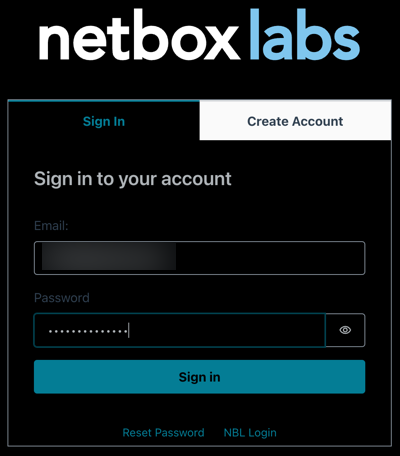
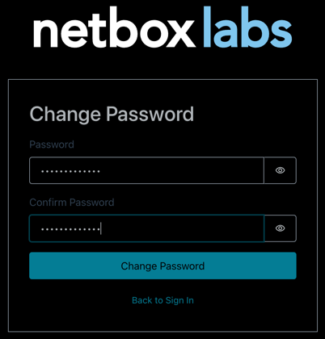
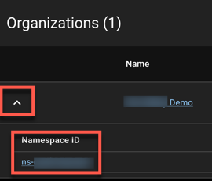
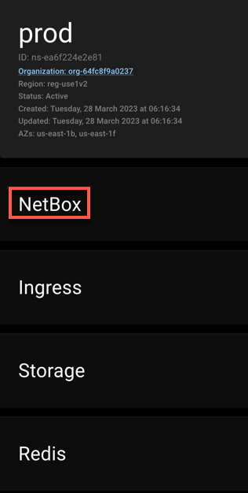
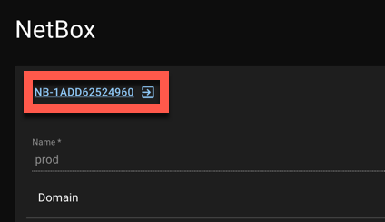

# Admin Console Access Set Up

## Account Setup

The NetBox Cloud team will set up your account with your email address as the username, and you will use this to access the cloud admin console. Access to the console is secured using a TOTP (time-based one time password) which you need to generate using an Authenticator app such as Google Authenticator or Authy. 

To complete the set up of your account for access to the Admin console, follow these steps: 

1. You will receive an email advising you of your username, along with a temporary password and a link to the console URL. Click the link to login

2. Enter the username (your email address) and the temporary password as per the email, and click ‘Sign in’: 

    

3. You will then be prompted to change your password: 

    

4. Next, add NetBox Cloud to your authenticator app of choice, by scanning the QR code from within the app. Then enter the TOTP code from your authenticator app, and click confirm:

    

5. The TOTP set up is now complete and you are logged into the NetBox Cloud Admin Console. You will see (and be able to administer) the instances running under your Organization: 

    

6. That is the set up complete and the next time you log in you will need to enter your email address, the updated password (from step 3), and then you will see the prompt for the TOTP, so enter this from your authenticator app and click ‘Confirm’: 

    

7. To retrieve the password for the Admin user account for the NetBox Cloud web interface, first click the arrow next to your Organization name, and then click on the Namespace ID to open the Namespace: 

    

    Then scroll down to the ‘NetBox’ section, and click to expand the detail:

    

    Then click on the ID of your NetBox instance to view the deployment configuration:

    

8. In the NetBox Deployment section, scroll down to the Secrets section, and click on the eye to reveal the password. Then you can copy the admin user password to your clipboard:

    

9. Then click the green globe icon in the top right corner of the console (underneath the instance name) to open the URL for your instance’s web interface: 

    

10. Login with the Admin user account, username of ‘admin’, and the password you have copied from step 8: 

    