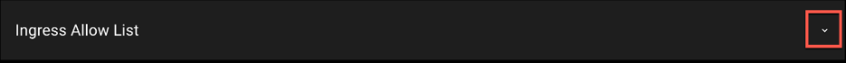
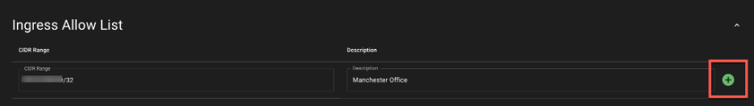
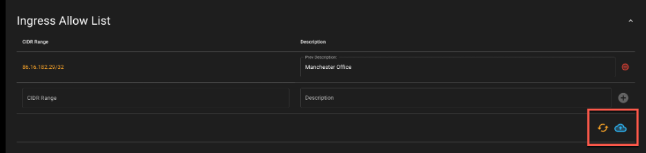
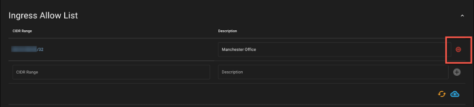

# Configuring Ingress Allow Lists

You can protect access to your NetBox Cloud instance by adding IPv4 and IPv6 addresses and ranges to an ‘Ingress Allow List’ to control which source IP’s your instance will accept connections from. 

*Note* - Be careful as once you add CIDR ranges to the Ingress Allow List you will NOT be able to access the WebUI or API of your instance from any other IP addresses than those covered in the list. Don’t worry, though if you make a mistake, as you can easily remove CIDR ranges from the list. 

1. Scroll down to the ‘Ingress Allow List’ section of the Admin Dashboard’ and expand the view by clicking on the down arrow on the right hand side: 

    

2. Add your IP address or range in CIDR notation. Give the range a description, and click on the green plus symbol to add it to the list: 

    

3. When you have finished adding CIDR ranges, click the blue cloud icon to push the change to your NetBox Cloud instance. After a few minutes the Ingress Access List will be updated. 

    *Note* - If you wish to undo your change before pushing it just click on the orange ‘revert’ icon next to it. 

      

4. To remove an entry from the Ingress Allow List, click the red ‘Remove CIDR Inbound’ icon next to the entry, and then click the blue cloud icon to push the change to your NetBox cloud instance. After a few minutes the Ingress Access List will be updated:

    