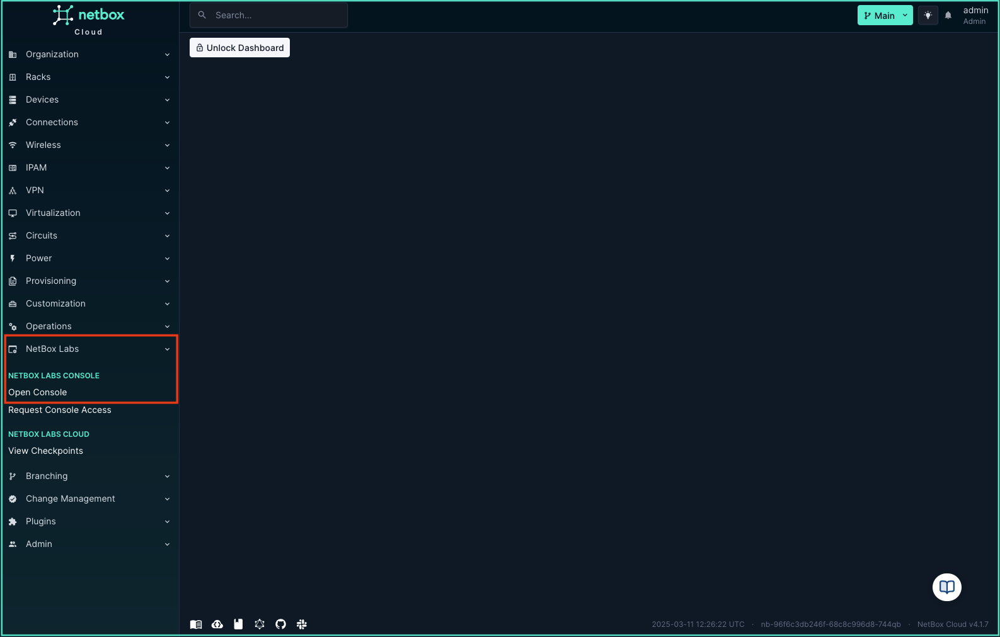

# Accessing the Console from NetBox Cloud

From within the NetBox Cloud Web Interface, you can easily switch to the NetBox Labs Console. Simply follow the steps outlined below: 

1. In the left hand main menu, click to expand the **NetBox Labs plugin** menu, and then click on **Open Console**:

    

2. You will now be taken to the NetBox Labs Console login page:

    

    **Note** If you don't already have access to the console, you can request this by clicking on **Request Console Access** in the **NetBox Labs plugin** menu from the main NetBox Cloud web interface, and then clicking the link to email the [NetBox Labs Support Team](mailto:support@netboxlabs.com) to request access. 

    

    If you encounter any issues when accessing the NetBox Labs Console, raise a support ticket by emailing the [NetBox Labs Support Team](mailto:support@netboxlabs.com)