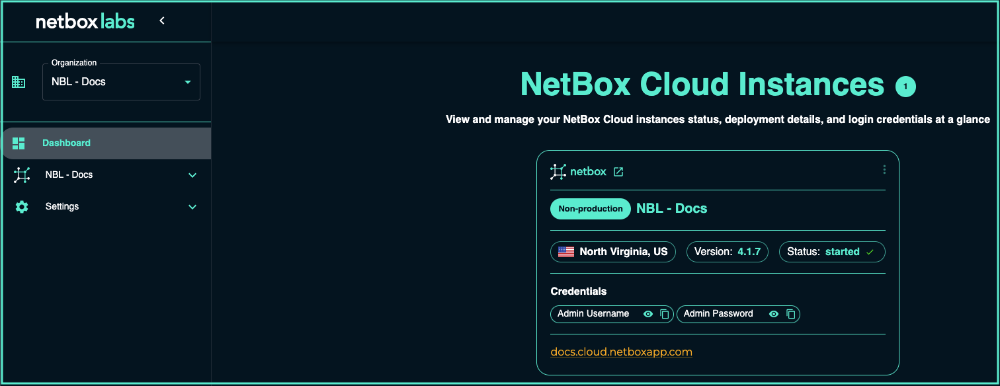

# NetBox Cloud

## Setting up Console Access

Request access to the NetBox Labs Console by emailing the [NetBox Labs Support Team](mailto:support@netboxlabs.com). 

The NetBox Cloud team will set up your account with your email address as the username, and you will use this to access the NetBox Labs [Console](https://console.netboxlabs.com/dashboard/). To complete the set up of your account, follow these steps: 

1. You will receive an email advising you of your username, along with a temporary password and a link to the console URL. Click the link to login

2. Enter the username (your email address) and the temporary password as per the email, and click ‘Sign in’: 

    

3. You will then be prompted to change your password: 

    

4. The set up is now complete and you are logged into the NetBox Labs Console. You will see (and be able to administer) all the NetBox Cloud instances running under your Organization.

    

5. To retrieve the credentials for the admin user of a NetBox Cloud instance, either click to reveal or copy them from the **Credentials** section: 

    

6. Then click the on either of the two links to open the URL of the instance in a new browser window:

    

7. Lastly, login to the NetBox Cloud UI with the username and password you have copied from step 5: 

    
