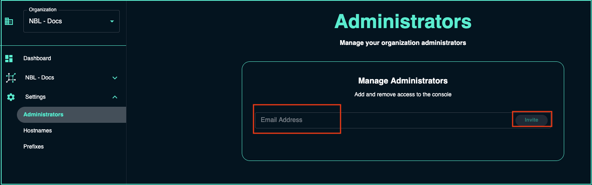

---
tags:
  - cloud
  - administration
title: Console Admin Accounts
---

To invite additional Admins to NetBox Cloud Console, follow these steps: 

- Login to the [console](https://console.netboxlabs.com/)
- Click on **Settings** and then click on the **Administrators**

 

- Enter the email address for the admin you wish to invite and then click **Invite**

 

- The invited user should now have an admin account on Console
