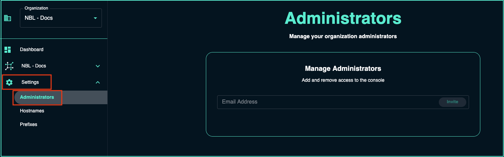

---
tags:
  - cloud
  - administration
  - authentication
  - security
title: "Console Administration"
description: "Administrative tasks for the NetBox Labs Console, including managing administrator accounts, permissions, and security settings."
author: "NetBox Labs Documentation Team"
last_updated: "2025-01-27"
versions:
  netbox_cloud: "v1.10"
status: "current"
category: "administration"
audience: "administrators"
complexity: "intermediate"
---

# Console Administration

This guide covers administrative tasks for the NetBox Labs Console, including managing administrator accounts and console settings.

## Managing Administrator Accounts

### Inviting Additional Administrators

To invite additional administrators to the NetBox Cloud Console:

1. Login to the [NetBox Labs Console](https://console.netboxlabs.com/)

2. Click on **Settings** and then click on **Administrators**:

    

3. Enter the email address for the administrator you wish to invite and then click **Invite**:

    

4. The invited user will receive an email with instructions to set up their console account

### Administrator Permissions

Console administrators have access to:

- **Instance Management**: Start, stop, and monitor NetBox Cloud instances
- **User Management**: Invite and manage other console administrators  
- **Configuration Access**: View and modify instance configurations
- **Backup Operations**: Create, download, and restore database backups
- **Upgrade Management**: Manage NetBox version upgrades
- **Support Access**: View logs and system information for troubleshooting

## Console Settings

### Organization Settings

Console administrators can manage organization-level settings including:

- **Billing Information**: View and update billing details
- **Instance Limits**: Monitor usage against plan limits
- **Support Contacts**: Manage support ticket routing

### Security Settings

- **Access Control**: Manage who can access the console
- **Activity Monitoring**: Review console access logs
- **Session Management**: Configure timeout settings

## Best Practices

### Administrator Management
- **Limit Administrator Access**: Only grant console admin access to users who need it
- **Regular Review**: Periodically review and remove unnecessary admin accounts
- **Use Corporate Email**: Ensure all administrators use corporate email addresses

### Security
- **Enable 2FA**: Require two-factor authentication for all administrators
- **Monitor Activity**: Regularly review console access logs
- **Incident Response**: Have a plan for responding to security incidents

!!! note
    If you encounter any issues with console administration, raise a support ticket by emailing the [NetBox Labs Support Team](mailto:support@netboxlabs.com) 