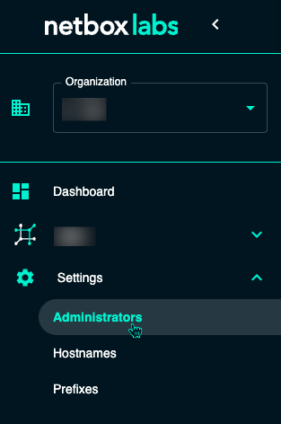
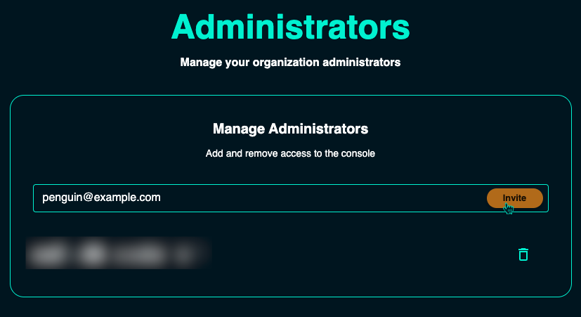
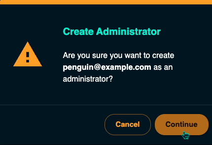

# Add a New User to Free Plan

To invite a new user to a NetBox Cloud Free instance, the user will need to have a valid email address, and be added as an administrator in the NetBox Labs Console.

1. From within the [NetBox Labs Console](https://console.netboxlabs.com), expand **Settings** and select **Administrators**

    

2. Type the user's email address in the box, and click **Invite**

    

3. Click **Continue** to confirm the email address to be invited

    

4. An email will be sent containing a temporary password for the Console

5. Have the user login with the tempoary information, and it will prompt for a new password to be set

6. The user can now login to both the Console and the NetBox instance, using the newly set credentials