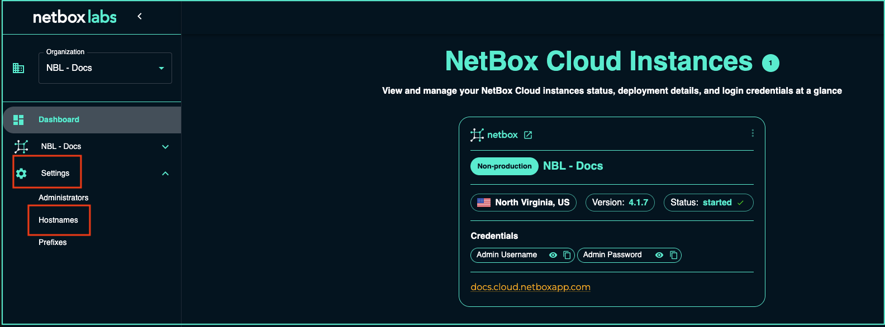
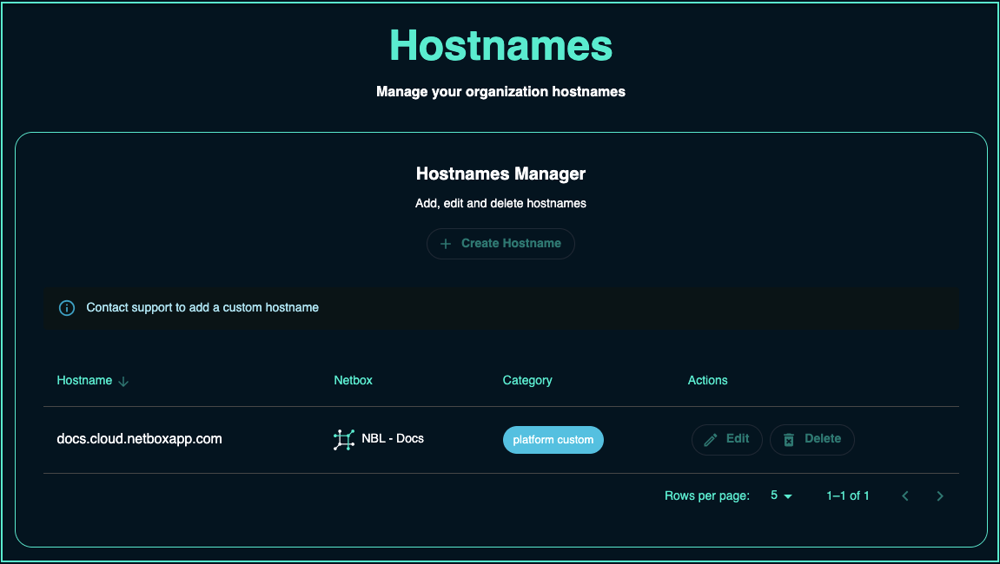

# Managing NetBox Cloud Hostnames

**Note** - Current functionality of the **Hostnames Manager** is limited to viewing Hostnames along with their associated NetBox Cloud instances and categories. Enhanced functionality to manage Hostnames is coming soon in a future release.

1. From within the [NetBox Labs Console](https://console.netboxlabs.com) click on **Settings** in the left-hand main menu to manage the settings for your Organization: 

    

2. Click to expand **Hostnames Manager**

    

3. From here you can view the Hostnames configured for your organization. Under **NetBox** you can see which NetBox instance is associated with a given hostname, and what **Category** the hostname is: 

    

## Hostname Categories: 

Hostname categories are defined as follows: 

| Category | Definition | 
|----------|------------|
| `platform random` | A randomly generated hostname created when a new NetBox Cloud instance is created | 
| `platform custom` | A custom hostname as requested by a NetBox Cloud customer |    

