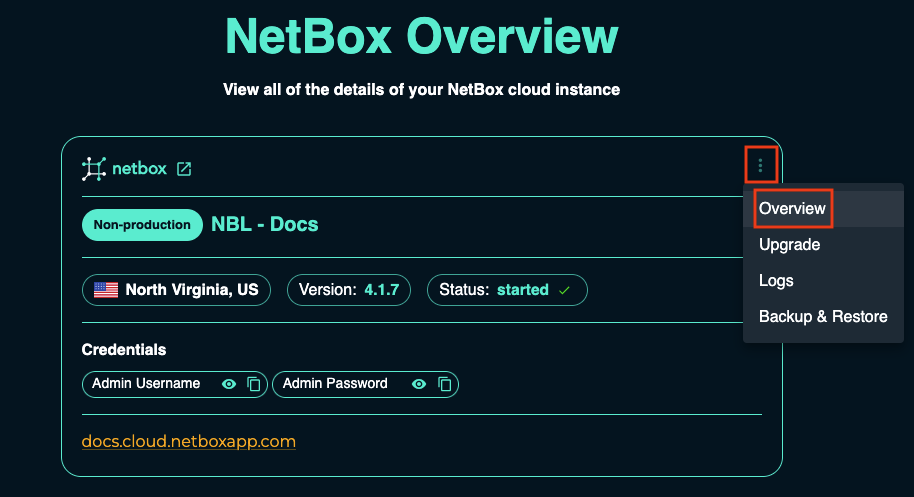
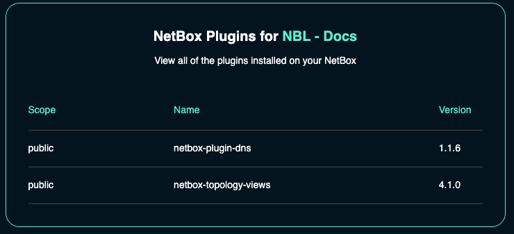

# NetBox Cloud Plugins

From within the NetBox Labs Console, you can easily view installed NetBox Cloud **Plugins**, along with their **Scope** and **Version number**. Simply follow these steps: 

1. From within the [NetBox Labs Console](https://console.netboxlabs.com) click on the three dots in the top right corner of the NetBox Instance panel, and click **manage**   

    

2. Click on **Plugins** to view the installed **Plugins**:

    

3. View the list of installed **Plugins**, their scopes and version numbers: 

    

    !!! info
        There are two types of plugin scope - **public** for any plugins that are publicly available and **organization** for custom plugins.