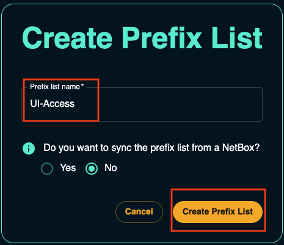
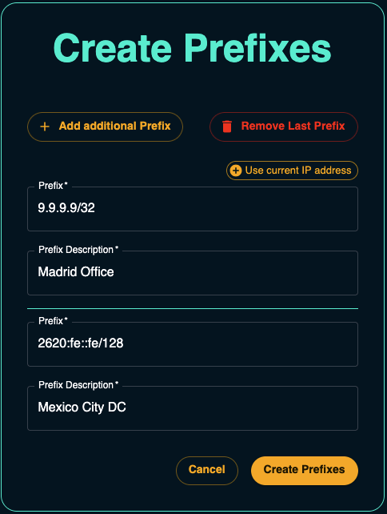
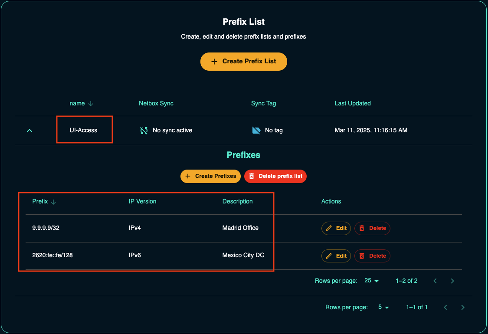
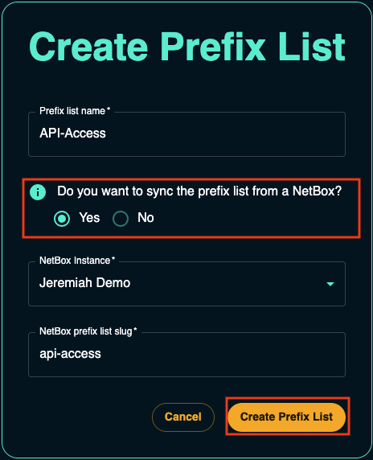
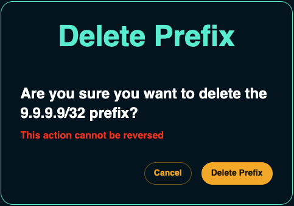

---
title: Prefix Lists
tags:
  - netbox-cloud
---# Prefix Lists

You can secure access to your NetBox Cloud instance by adding IPv4 and IPv6 addresses and ranges to **Prefix Lists**, which can then be applied to NetBox instances to control which source IPs your instances will accept connections from. 

The following features are available in the NetBox Labs [Admin Console](https://console.netboxlabs.com) when working with prefix lists: 

- Create, Edit and Delete prefix lists
- Synchronize prefix lists from a NetBox instance using tags

There is also large list support (~15K prefixes) and separate prefixes can be applied to the NetBox Cloud UI, API and GraphQL interfaces. 

!!! note
    When you have built your prefix lists in the Admin Console, raise a support ticket by emailing the [NetBox Labs Support Team](mailto:support@netboxlabs.com) and we will apply them to your NetBox Cloud instances. 

<!-- COMMENTING VIDEO OUT OF CODE! 
Watch this quick video or follow the steps outlined below to start managing your prefix lists:

<iframe width="560" height="315" src="https://www.youtube.com/embed/nPwL7ve513g?si=gbsuGCvK3s8VXPP8" title="YouTube video player" frameborder="0" allow="accelerometer; autoplay; clipboard-write; encrypted-media; gyroscope; picture-in-picture; web-share" referrerpolicy="strict-origin-when-cross-origin" allowfullscreen></iframe> -->

## Create a Prefix List (not synchronized with a NetBox)

1. From within the Admin Console, navigate to **Settings** in the left-hand menu

    

2. Scroll down and click to expand the **Prefix List** section, and then click on **Create Prefix List** on the right hand side to start the wizard: 

    

3. Give the prefix list a name and then click **CREATE PREFIX LIST**:

    

4. Enter the first prefix and give it a description. If you wish to add additional prefixes then you can also do that here by clicking **+ ADD ADDITIONAL PREFIX**, then when you are happy click **CREATE PREFIXES**.

    *Note* - if you wish to add the IP address that you are currently using then click **Use Current IP Address** and this will add it to the prefix list: 

    
 
 5. You can then view the prefix list from within **Settings > Prefix List**: 

    

## Create a Prefix List (synchronized with a NetBox)

1. From within the Admin Console, navigate to **Settings** in the left-hand menu

    

2. Scroll down and click to expand the **Prefix List** section, and then click on **Create Prefix List** on the right hand side to start the wizard: 

    

3. Give the prefix list a name and then select the **Yes** radio button to sync the prefix list from a NetBox. Then select the NetBox instance you wish to sync from, specify the NetBox Tag that you wish to use, and then click **CREATE PREFIX LIST**:    

    

4. Switch to your NetBox instance, and go to **Customization > Tags** and create the required tag(s) to be applied to any prefixes that are to be synchronized to the Prefix List: 

    
 
5. Under **IPAM > Prefixes** add the prefixes, give them a description and tag them with the appropriate tag: 

    

6. You can then view the prefixes in NetBox under **IPAM > Prefixes** (*Tip* - filter on the tag): 

    

7. Switch back to the Admin Console to view the prefix list from within **Settings > Prefix List**. *Note* - it can take a few minutes for the prefix list to be fully synchronized from NetBox. 

    

## Edit a Prefix List

*Note* - this only works for prefix lists that are not synchronized with a NetBox. To edit NetBox synchronized prefix lists you should make the edits within NetBox. 

1. From within the Admin Console, navigate to **Settings** in the left-hand menu, and then scroll down and click to expand the **Prefix List** section. Then click on the name of the prefix list you wish to edit: 

    

2. To add more prefixes to the list, click on **Create Prefix** and then follow the wizard again to add more prefixes. 

3. To edit a prefix, click **EDIT** and then make your required changes and then click **EDIT PREFIX** to save your changes: 

    

4. To delete a prefix, click **DELETE** and then if you are sure you wish to delete the prefix, click **DELETE PREFIX** when prompted: 

    

## Delete a Prefix List 

*Note* - in order for a prefix list to be deleted it must first be detached from any NetBox instances that it is securing. You will need to contact support and request this before you can delete it. 

1. From within the Admin Console, navigate to **Settings** in the left-hand menu, and then scroll down and click to expand the **Prefix List** section. Then click on the name of the prefix list you wish to delete, and click **DELETE PREFIX LIST**:

    

2. If you are sure you wish to delete the prefix list then click **DELETE PREFIX LIST** when you are prompted to confirm the deletion: 

    

If you encounter any issues while working with the IP Allow List raise a support ticket by emailing the [NetBox Labs Support Team](mailto:support@netboxlabs.com)