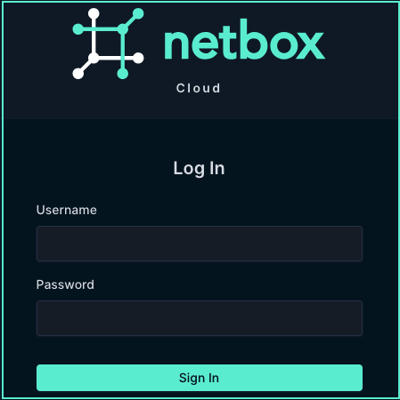

# Retrieving the NetBox Cloud Admin Credentials 

To log into a NetBox Cloud instance with the **admin** username and password, you first need to login to the NetBox Labs [Console](https://console.netboxlabs.com/dashboard/) and then retrieve the credentials. Follow these steps: 

1. Login to NetBox Labs [Console](https://console.netboxlabs.com/dashboard/) and you will see (and be able to administer) all the NetBox Cloud instances running under your Organization.

    

2. To retrieve the credentials for the admin user of a NetBox Cloud instance, either click to reveal or copy them from the **Credentials** section: 

    

3. Then click the on either of the two links to open the URL of the instance in a new browser window:

    

4. Lastly, login to the NetBox Cloud UI with the username and password you have copied from step 2: 

    
