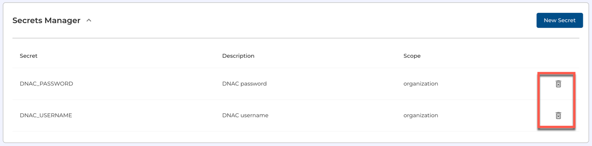
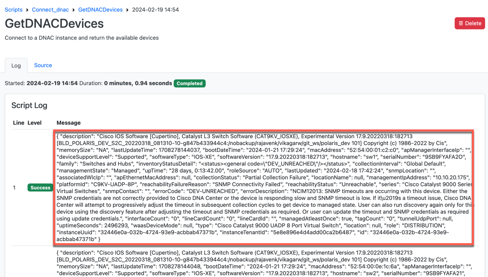

# NetBox Cloud Secrets Manager

Secrets Manager is a self-service vault in Netbox Cloud, that is a secure, flexible solution for managing sensitive information. This innovative feature enhances your ability to safely store secrets to be used in reports, custom scripts, and plugins, ensuring your integrations and automations are both secure and efficient.

## Secrets Manager Benefits: 

- **Enhanced Security:** With the Secrets Manager, your sensitive information is stored securely, giving you peace of mind.
- **Effortless Integrations:** Automate and enhance your workflows using custom scripts, reports and plugins, all while leveraging the security of the Secrets Manager.

Watch this quick video or follow the steps outlined below to get started: 

<iframe width="560" height="315" src="https://www.youtube.com/embed/1YnQhsC6KFQ?si=q4JyPGQIbN-Q_0Yv" title="YouTube video player" frameborder="0" allow="accelerometer; autoplay; clipboard-write; encrypted-media; gyroscope; picture-in-picture; web-share" allowfullscreen></iframe>

## Adding Secrets to the Vault

1. Login to the NetBox Labs [Console](https://console.netboxlabs.com/dashboard/) and then click on **Settings** in the left-hand menu, then click the drop-down menu to expand the **Secret Manager** section, then click on **New Secret**: 

    

2. In this example we will add a `DNAC_USERNAME` and `DNAC_PASSWORD` combination that will be used in a simple Custom Script that connects to a Cisco DNA Center Controller (now called Cisco Catalyst Center) which is an always-on sandbox hosted by [Cisco DevNet](https://sandboxdnac.cisco.com).

    To add the username, enter the **Name**, **Description**, and set the secret **Scope** as required. The scope can be either your **Organization**, which makes the secret available to all NetBox Cloud instances under your organization, or just to a single NetBox Cloud instance. Then click the plus sign to add the secret to the vault: 

    

    Note the once the secret has been added, then you can no longer view the secret in the user interface, but the secret is available to be used in your custom scripts, reports and plugins within NetBox. 

3. Then simply repeat the process for the password, and once the this has been added, you will be able to view the list off all the secrets in the vault: 

    

## Deleting Secrets From the Vault

1. To delete a secret from the vault, simply click the **trash** icon on the right=hand side next to the secret you wish to delete, and then click on **CONTINUE** if you are sure you wish to delete the secret:   

    

    

## Using Secrets in Custom Scripts, Reports and Plugins 

The way to access the secrets and their values is the same for custom scripts, reports and plugins. This example will show you how to use the secrets we added in the earlier steps in a simple custom script called `GetDNACDevices` that connects to the Cisco DNA Center Controller and retrieves a list of the devices managed by the controller. 


> ℹ️ Note
> 
> We have how-to guides for getting started with both [custom scripts](https://netboxlabs.com/blog/getting-started-with-netbox-custom-scripts/) and [reports](https://netboxlabs.com/blog/getting-started-with-netbox-reports/) in NetBox.  

1. In your custom script you first need to import the `SecretAgent` python library from the `netboxlabs.cloud.sdk.secrets` Software Development Kit (SDK): 

    ```
    from netboxlabs.cloud.sdk.secrets import SecretAgent

    def my_function():
        
        # Create a SecretAgent instance
        agent = SecretAgent()

        # Get a secret
        secret_api_key = agent.get_secret("my_api_key")
    ```

2. Reference the secrets in your custom script

3. Add the custom Script to NetBox Cloud (see this [guide](https://netboxlabs.com/blog/getting-started-with-netbox-custom-scripts/) for more info).

4. Run the custom script, from **Customization** > **Scripts**, click on the name of the script, and then click **Run Script**:

    

    

5. The script will run, accessing the secrets for the `DNAC_USERNAME` and `DNAC_PASSWORD` from the vault and then display the output. In this example the output is simply a list of the network devices managed by the Cisco DNAC Controller: 

    

If you encounter any issues while working with database backups raise a support ticket by emailing the [NetBox Labs Support Team](mailto:support@netboxlabs.com)