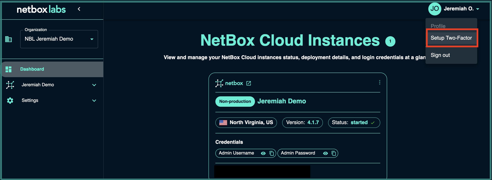
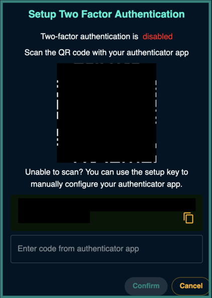
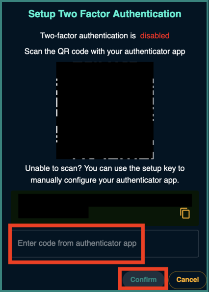
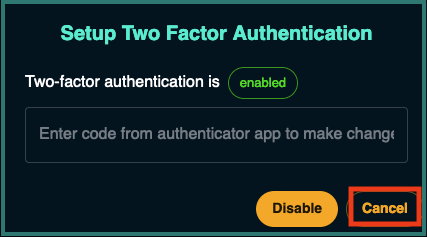
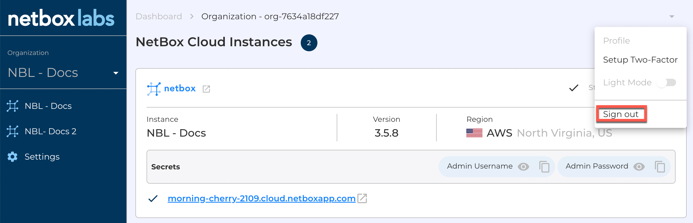
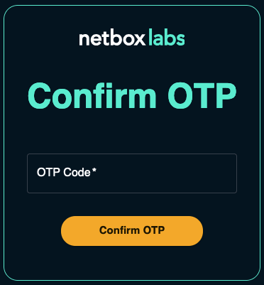
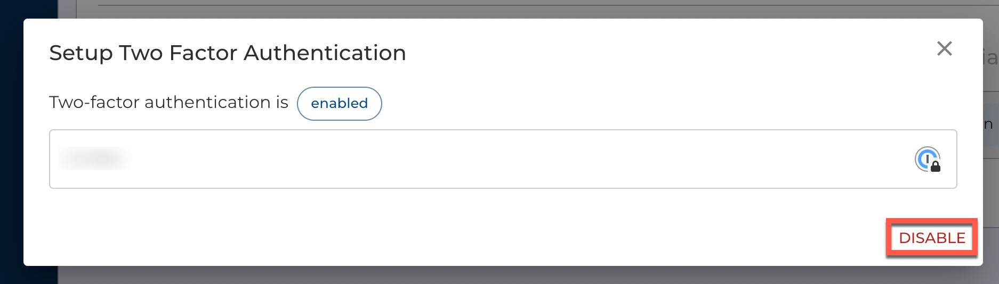
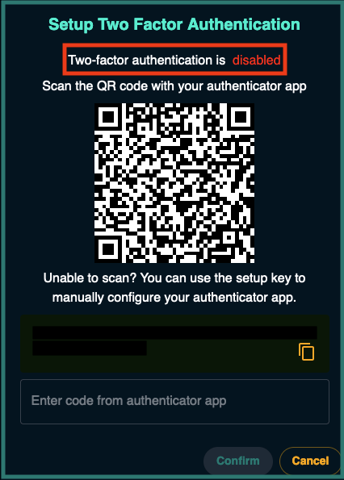

# Setting up Two-Factor Authentication for the Admin Console

<!-- COMMENTING VIDEO OUT OF CODE! 
From within the NetBox Labs [Console](https://console.netboxlabs.com/dashboard/) you can easily enable and disable two-factor authentication (2FA) on a per-user basis. 

Watch this quick video or follow the steps outlined below: 

<iframe width="560" height="315" src="https://www.youtube.com/embed/uli2qNRl7UU?si=meblrHYJ-04Au7fr" title="YouTube video player" frameborder="0" allow="accelerometer; autoplay; clipboard-write; encrypted-media; gyroscope; picture-in-picture; web-share" allowfullscreen></iframe> -->

## Enable Two-Factor Authentication

1. Login to the NetBox Labs [Console](https://console.netboxlabs.com/dashboard/) and then click on the down arrow (top-right) and select **Setup Two-Factor**.

    

2. Follow the on-screen instructions and scan the QR code with your Authenticator App of choice (eg. Google Authenticator):

    

3. Enter the code from your authenticator app and click **confirm**:

    

4. Click on **Cancel** on the bottom-right corner to close the dialog box: 

    

5. Click on the down arrow (top-right) and select **Sign Out**:

     

6. Log back into the console with your username and password and then when prompted, enter the **TOTP code** generated by your authenticator app, and click **Confirm**

     

## Disable Two-Factor Authentication

1. Login to the NetBox Labs [Console](https://console.netboxlabs.com/dashboard/) and then click on the down arrow (top-right) and select **Setup Two-Factor**.

    

1. Enter the **TOTP Code** from your authenticator app and click **Disable**.

    

2. In the dialog box, note that Two-factor authentication is now **disabled** and close the dialog box.  

    

If you encounter any issues while working with two-factor authentication, please raise a support ticket by emailing the [NetBox Labs Support Team](mailto:support@netboxlabs.com)
