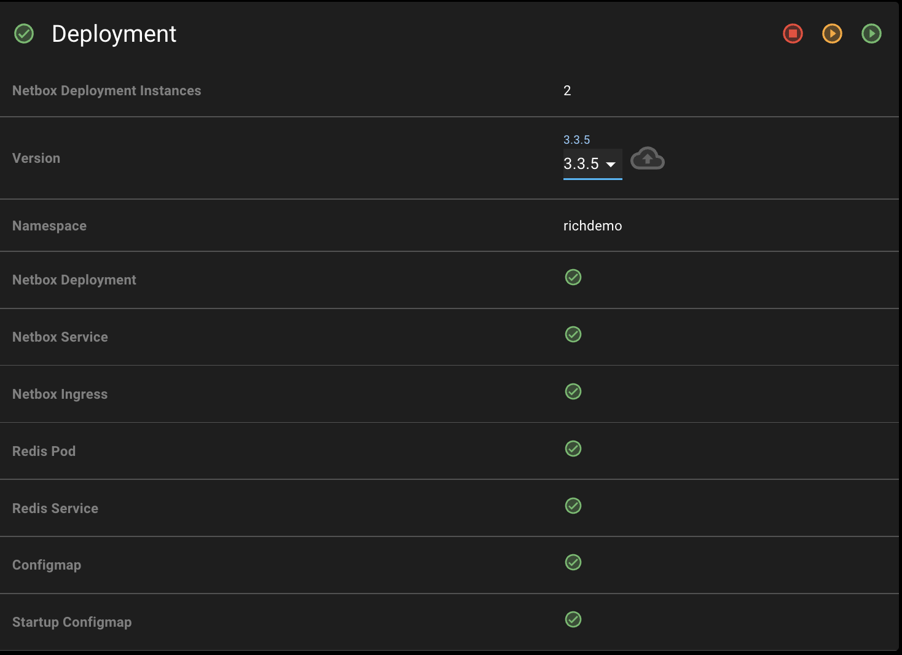
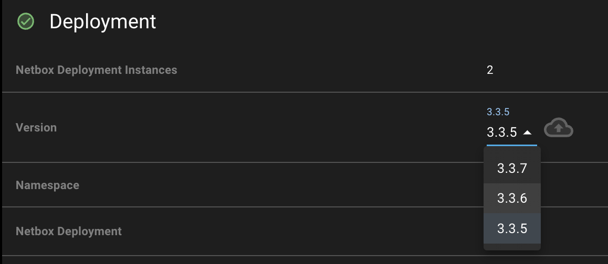
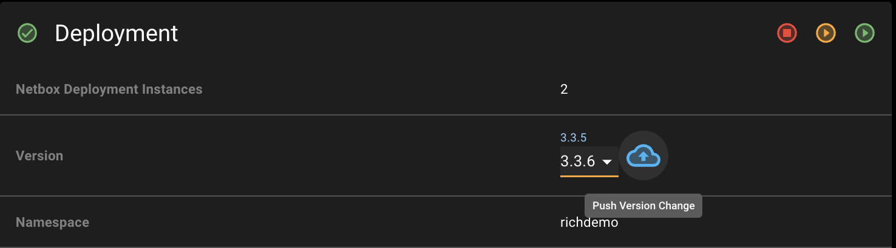
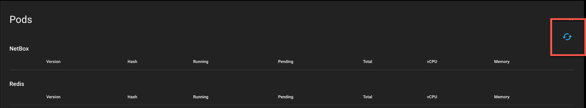
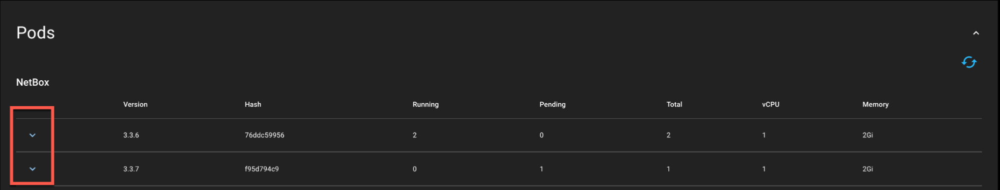
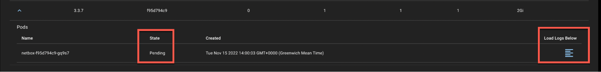
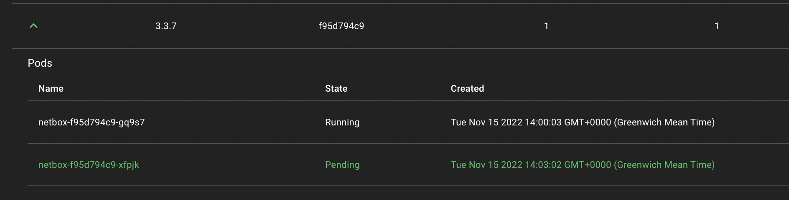

# Upgrading NetBox Cloud

To upgrade your version of NetBox Cloud, follow these steps:

1. Scroll down to the "Deployment" section of the admin console:

    

2. From the drop-down menu, select the version that you wish to upgrade to. In this example we are upgrading from `v3.3.5` to `v3.3.6`

    

3. Then click the blue cloud icon to push the change to your NetBox cloud instance: 

    

4. The upgrade will take a few minutes to complete. you can monitor the progress of the upgrade by navigating down to the 'Pods' section, and clicking the refresh icon on the right hand side, and then the drop-down arrow to view the state of each of the application instances.

    

    Then click the down arrow on the left hand side of the screen to expand the pod data:

    

5. When you see a status of 'pending' then this is the upgrade taking place. To view the log output for each pod in real-time, click the ‘Load Logs Below’ icon on the right hand side.

    

    This will load the log view for the selected pod:

    

6. Once the status of all the pods is 'running' then the upgrade is complete.

    

7. You can then confirm the version in number in the ‘Deployment’ section (see step 1) or by logging into the Web Interface, where you will find the version number in the bottom right hand corner:

        