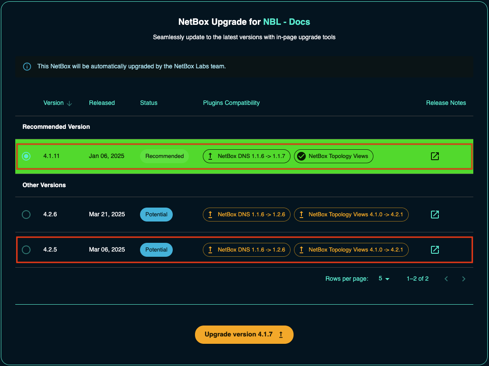
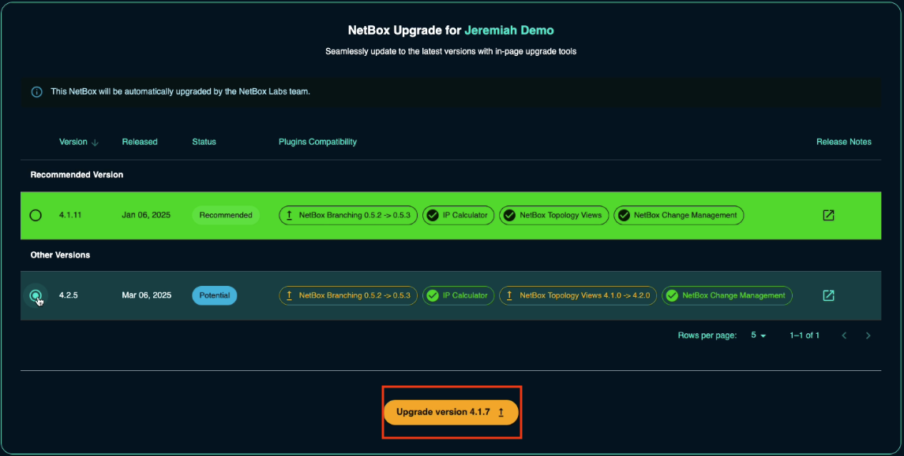
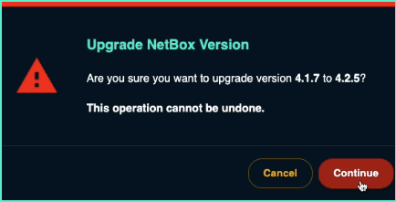

# Upgrading NetBox Cloud

To safely and easily upgrade your NetBox Cloud instance without worrying about any Plugin compatibility issues, follow the steps outlined below or watch the video instructions: 

<iframe width="560" height="315" src="https://www.youtube.com/embed/eRWaIXODHR4?si=vf-qdZ53tcICodW_" title="YouTube video player" frameborder="0" allow="accelerometer; autoplay; clipboard-write; encrypted-media; gyroscope; picture-in-picture; web-share" allowfullscreen></iframe>

1. In the NetBox Labs [Console](https://console.netboxlabs.com/dashboard/), click on the three dots in the top right corner of the instance you wish to upgrade and click **Manage**. Note the current NetBox version in this example is 3.5.1.  

    

2. Then click on the down arrow next to **Plugins** and note any installed plugins and their versions: 

    

3. Next, click on the down arrow next to **Version Upgrade**:

    

4. The **Safe Upgrade tool** will present you with the **potential** and **recommended** versions you can upgrade to. You will see the version number, the status, and the whether or not installed plugins are compatible with the target NetBox version, plus a link to the release notes for that version.  

    

    Note that in this case the **NetBox BGP** and **NetBox Topology Views** plugins are at a version that is compatible with NetBox version 3.5.9. All Versions higher than this (up to 3.6.6) will require an upgrade to the plugins also, but don't worry the safe upgrade tool will handle all of that for you. 

    Also note that we could upgrade to any of the other **potential** options, but that the Safe Upgrade tool is recommending an upgrade to version 3.6.6, and if we select this option, both the plugins will be automatically upgraded to compatible versions as part of the upgrade process.

    Note too that if a plugin is **not compatible** with a certain netbox version then you will see a warning like this: 

    

    In this case you would not be able to upgrade to this version, and the tool will not let you select it. In these cases it can mean that the plugin developer has not yet released an updated version of the plugin that is compatible with that particular version of NetBox. 

5. Next, select the version you wish to upgrade to, and in this example we will select the recommended version 3.6.6, and then click on **UPGRADE VERSION**:

    

6. Click on **Continue** if you are sure you want to go ahead with the upgrade: 

    

7. You will then see a dialog box confirming the upgrade is in progress: 

    

8. A few seconds later you will see that your NetBox Cloud upgrade is now complete and you will see the new version number: 

    

9. Finally, if you check **Plugins** again, you will now see the updated versions of the plugins: 

    

If you encounter any issues while performing the upgrades or have any questions, please raise a support ticket by emailing the [NetBox Labs Support Team](mailto:support@netboxlabs.com)
