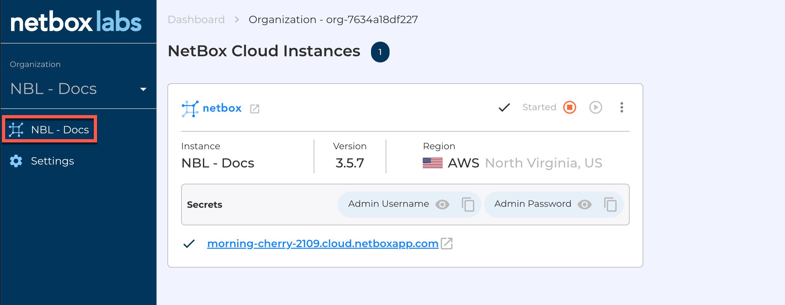
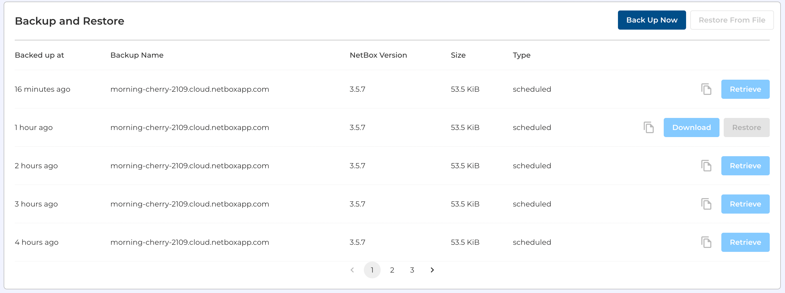
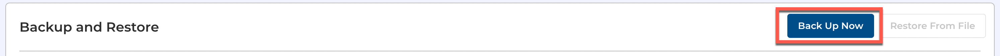
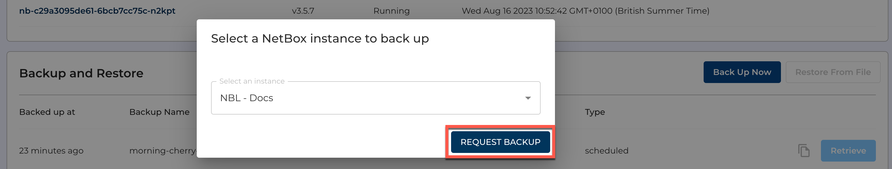
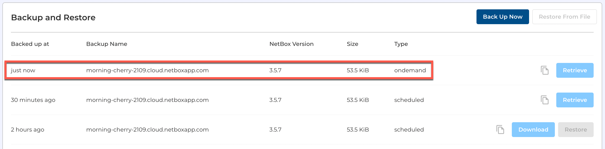
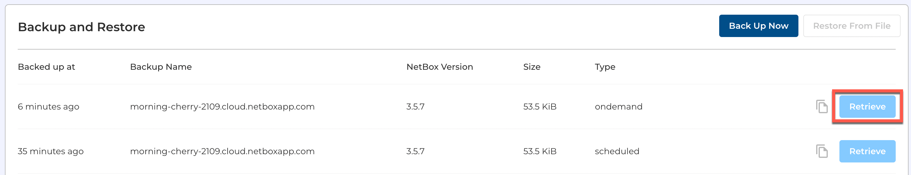
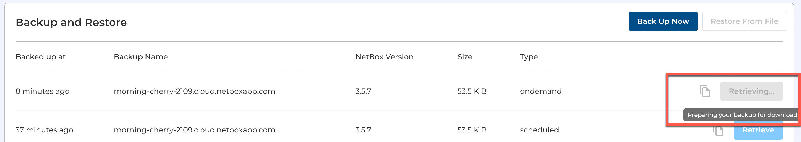
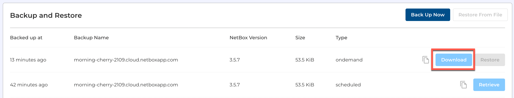

# Working with NetBox Cloud Database Backups

Within the NetBox Labs [Console](https://console.netboxlabs.com/dashboard/) you can access the backups of your NetBox Cloud database, and are able to perform the following actions:  

- View a list of all available database backups
- Take an 'on-demand' backup at any time
- Retrieve and download a specific backup file  

## View a List of Available Database Backups

1. Login to the NetBox Labs [Console](https://console.netboxlabs.com/dashboard/) and then click on the name of the NetBox instance you are working with, on the left-hand side:

    

2. Scroll down to the **Backup and Restore** panel and view the list of available backups.

    

## Take an 'On-Demand' Database Backup

1. From within the **Backup and Restore** panel click on **Back Up Now**, on the right-hand side: 

    

2. Select the NetBox Cloud instance you wish to backup from the drop-down menu, then click **Request Backup**. Note that if you have multiple NetBox Cloud instances then they will appear in this list. 

    

3. After a few seconds you will see the on-demand backup in the list of available backups: 

    

## Retrieve and Download a Backup File

1. Locate the backup file you wish to retrieve, and click **Retrieve** 

    

    The retrieval process will then start: 

    

2. Once the file has been retrieved, click **Download** and the file will be downloaded to your local computer. Note the file is a **gzip compressed archive** of the **SQL** database file so it will end in `.sql.gz`

    