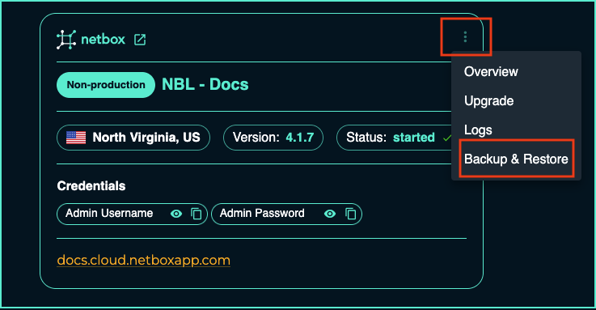
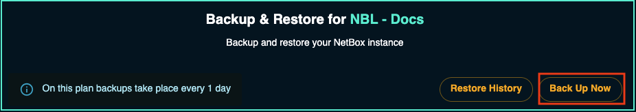

---
title: Working with NetBox Cloud Database Backups
tags:
  - cloud
---# Working with NetBox Cloud Database Backups

Within the NetBox Labs [Console](https://console.netboxlabs.com/dashboard/) you can access the backups of your NetBox Cloud database, and are able to perform the following actions:  

- View a list of all available database backups
- Take an 'On Demand' backup at any time
- Download a local copy of a specific backup file  
- Restore your NetBox Cloud instance from a database backup

<!-- COMMENTING VIDEO OUT OF CODE!
Watch this quick video or follow the steps outlined below to get started: 

<iframe width="560" height="315" src="https://www.youtube.com/embed/1YnQhsC6KFQ?si=q4JyPGQIbN-Q_0Yv" title="YouTube video player" frameborder="0" allow="accelerometer; autoplay; clipboard-write; encrypted-media; gyroscope; picture-in-picture; web-share" allowfullscreen></iframe> -->

## View a List of Available Database Backups

1. Login to the NetBox Labs [Console](https://console.netboxlabs.com/dashboard/) and then click on the three dots in the top-right corner of the instance you wish to manage and click **Backup & Restore**:

    

2. Within **Backup and Restore** you can view the list of available backups:

    

## Take an 'On Demand' Database Backup

1. From within the **Backup and Restore** panel click on **Back Up Now**, on the right-hand side: 

    

2. Click **CONTINUE** to confirm that you want to backup of the current version of NetBox Cloud

    

3. After a short while you will see the **On Demand** backup you just created appear in the list of available backups: 

    

## Download a Local Copy of a Backup File

1. Locate the backup file you wish to retrieve, and click on the **Download** icon:

    

2. The download will then be prepared: 

    

3. Once the backup file has been prepared it will automatically be downloaded into the **Downloads** directory on your local computer's file system. Note the file is a **gzip compressed archive** of the **SQL** database file so it will end in `.sql.gz`.

## Restore From a Database Backup File

1. Identify the database backup you wish to restore from, and click **Restore**:

    

2. Click **CONTINUE** if you are sure you wish to restore the selected backup:

    

3. The restore process will take place in the background, and depending on the size of the database should take no longer than a few minutes to complete. Once the restore has completed, you can click on **Restore History** to view the list of database restores, and you will see your completed restore listed:

    

    

4. Your database restore is now complete. 

!!! info
    Once the database restore is complete your NetBox Cloud instance will restart, and you may briefly see a `503 - Service Unavailable` message when you browse to the Web interface. This is normal and will clear after a short while, after which you can log in again. 
    
    Also, please be aware that the NetBox changelog will be empty when you first log in after a database restore.

If you encounter any issues while working with database backups raise a support ticket by emailing the [NetBox Labs Support Team](mailto:support@netboxlabs.com)