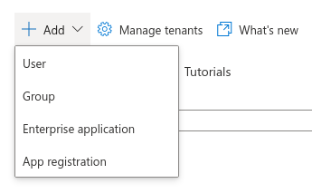
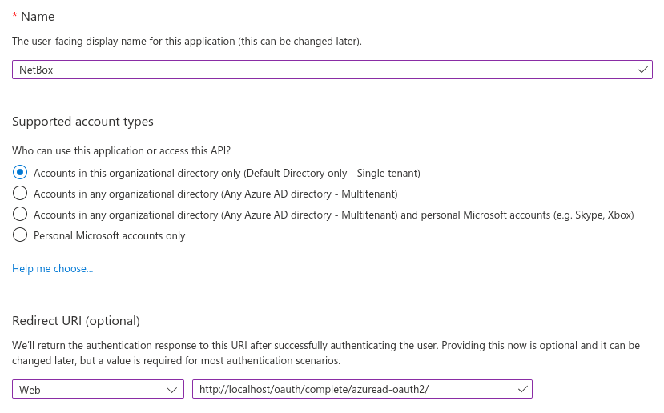
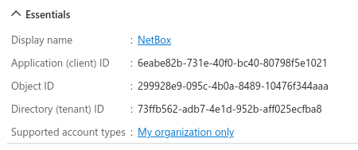
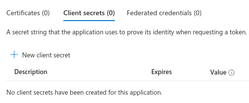
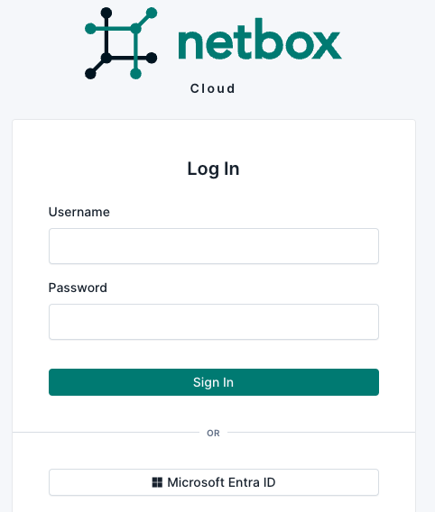
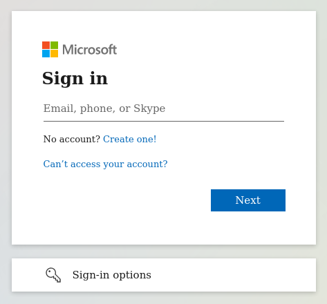

---
tags:
  - cloud
  - authentication
  - administration
  - configuration
  - getting-started
  - integration
versions:
  netbox_cloud: "v1.10"
status: "current"
---

# Microsoft Entra ID Setup (formerly Azure Active Directory)

This guide explains how to configure single sign-on (SSO) support for NetBox Cloud using Microsoft Entra ID (formerly Azure Active Directory) as an authentication backend.

## Entra ID Configuration
1. Create a test user (optional)
Create a new Entra ID user to be used for testing. You can skip this step if you already have a suitable account created.

2. Create an app registration
Under the Microsoft Entra ID dashboard, navigate to **Add** > **App registration**.

    

    Enter a name for the registration (e.g. "NetBox Cloud") and ensure that the "single tenant" option is selected.

    Under "Redirect URI", select "Web" for the platform and enter the path to your NetBox Cloud installation, ending with /oauth/complete/azuread-oauth2/. 

    Eg. https://{your-domain}.cloud.netboxapp.com/oauth/complete/azuread-oauth2/

    

    Once finished, make note of the application (client) ID; this will be used when configuring NetBox Cloud.

    

    **Multitenant authentication**

    NetBox also supports multitenant authentication via Entra ID, however it requires a different backend and an additional configuration parameter. Please see the `python-social-auth` [documentation](https://python-social-auth.readthedocs.io/en/latest/backends/azuread.html#tenant-support) for details concerning multitenant authentication.

3. Create a secret

    When viewing the newly-created app registration, click the "Add a certificate or secret" link under "Client credentials". Under the "Client secrets" tab, click the "New client secret" button.

    

    You can optionally specify a description and select a lifetime for the secret.

    

    Once finished, make note of the secret value (not the secret ID); this will be used when configuring NetBox Cloud.

    

## NetBox Cloud Configuration

Securely share the following configuration parameters with [NetBox Labs Support](mailto:support@netboxlabs.com), substituting your own values:

REMOTE_AUTH_BACKEND = 'social_core.backends.azuread.AzureADOAuth2'
SOCIAL_AUTH_AZUREAD_OAUTH2_KEY = '{APPLICATION_ID}'
SOCIAL_AUTH_AZUREAD_OAUTH2_SECRET = '{SECRET_VALUE}'

The support team will add these parameters to your NetBox Cloud instance and confirm when this is ready for testing.

## Testing
Log out of NetBox Cloud if already authenticated, and click the "Log In" button at top right. You should see the normal login form as well as an option to authenticate using Entra ID. Click that link.

You should be redirected to Microsoft's authentication portal. Enter the username/email and password of your account to continue. You may also be prompted to grant this application access to your account.

If successful, you will be redirected back to the NetBox Cloud UI, and will be logged in as the Entra ID user. You can verify this by navigating to your profile (using the button at top right).

This user account has been replicated locally to NetBox Cloud, and can now be assigned groups and permissions within the NetBox Cloud admin UI.

## Troubleshooting
### Redirect URI does not Match
Entra ID requires that the authenticating client request a redirect URI that matches what you've configured for the app in step two. This URI must begin with https:// 

### Not Logged in After Authenticating
If you are redirected to the NetBox Cloud UI after authenticating successfully, but are not logged in, double-check the configured backend and app registration. The instructions in this guide pertain only to the `azuread.AzureADOAuth2` backend using a single-tenant app registration.
