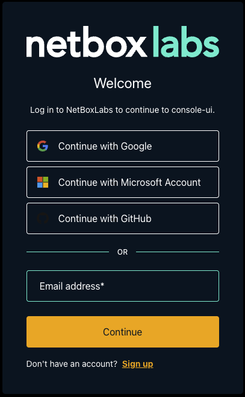
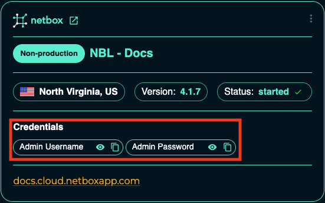
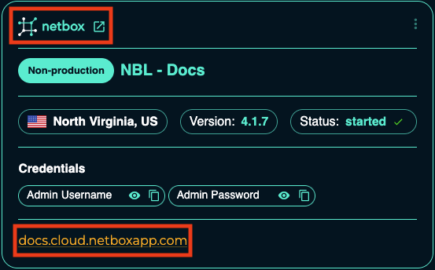

---
tags:
  - cloud
  - administration
  - getting-started
  - authentication
title: "NetBox Cloud Console Access"
description: "How to access the NetBox Labs Console through direct URL or from within NetBox Cloud UI, including login options and account setup."
author: "NetBox Labs Documentation Team"
last_updated: "2025-01-27"
versions:
  netbox_cloud: "v1.10"
status: "current"
category: "administration"
audience: "administrators"
complexity: "beginner"
---

# NetBox Cloud Console Access

You should already have access to the NetBox Labs [Console](https://console.netboxlabs.com/dashboard/) when you sign up for NetBox Cloud.

## How to Access the Console

There are two ways to access the NetBox Labs Console:

### Option 1: Direct URL Access

Simply go directly to the [NetBox Labs Console](https://console.netboxlabs.com/dashboard/) in your browser.

### Option 2: Access from NetBox Cloud UI

From within the NetBox Cloud Web Interface, you can easily switch to the NetBox Labs Console:

1. In the left hand main menu, click to expand the **NetBox Labs plugin** menu, and then click on **Open Console**:

    

2. This will take you directly to the NetBox Labs Console login page.

## Requesting Console Access

If you don't already have access to the console, you can request it by:

- Clicking **Request Console Access** in the **NetBox Labs plugin** menu from the NetBox Cloud web interface
- Then clicking the link to email the [NetBox Labs Support Team](mailto:support@netboxlabs.com) to request access

!!! note
    If you encounter any issues when accessing the NetBox Labs Console, raise a support ticket by emailing the [NetBox Labs Support Team](mailto:support@netboxlabs.com)

## Login and Account Setup

The NetBox Cloud team will set up your account with your email address as the username. You can login to the NetBox Labs Console using:

- **Email/Password**: Your email address and the password you set up when your account was created
- **Single Sign-On (SSO)**: Providers such as Google, GitHub, and Microsoft
- **Enterprise SSO**: Your organization's Identity Provider (IdP) if configured

## Using the Console

Once logged in, you will see all the NetBox Cloud instances running under your Organization, which you can administer from the console.

### Accessing Your NetBox Cloud Instances

To access a specific NetBox Cloud instance:

1. **Get the credentials**: Click to reveal or copy the admin credentials from the **Credentials** section:

    

2. **Open the instance**: Click on either of the links to open the NetBox Cloud interface in a new browser window:

    

3. **Login to NetBox Cloud**: Use the username and password you copied from step 1:

    
