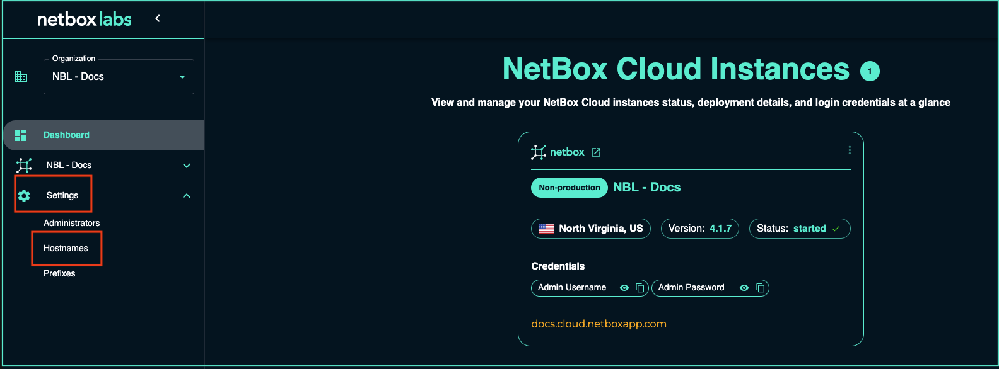
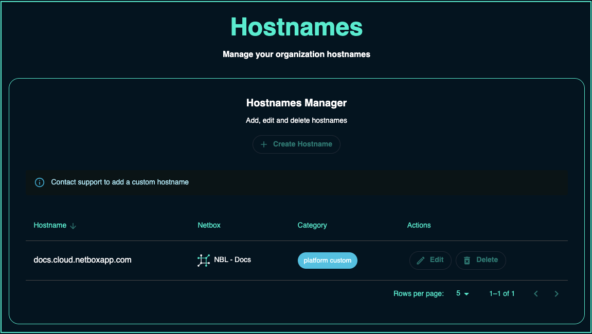

---
tags:
  - cloud
  - administration
  - networking
  - configuration
  - dns
title: "Managing Hostnames"
description: "Configure and manage custom hostnames and DNS settings for your NetBox Cloud instance."
versions:
  netbox_cloud: "v1.10"
status: "current"
category: "administration"
audience: "administrators"
complexity: "intermediate"
---

# NetBox Cloud Hostnames

1. From within the [NetBox Labs Console](https://console.netboxlabs.com) click on **Settings** and then **Hostnames Manager** in the left-hand main menu to view the settings for your Organization: 

    

2. From here you can view the Hostnames configured for your organization. Under **NetBox** you can see which NetBox instance is associated with a given hostname, and what **Category** the hostname is: 

    

## Hostname Categories: 

Hostname categories are defined as follows: 

| Category | Definition | 
|----------|------------|
| `platform random` | A randomly generated hostname created when a new NetBox Cloud instance is created, usually as a trial. | 
| `platform custom` | A custom hostname on the NetBox Cloud platform (e.g., `abcwidgets.cloud.netboxapp.com`) - available for all paid plans. |   
| `org custom` | A custom hostname using your organization's own domain (e.g., `netbox-prod.abcwidgets.com`) - available for Professional and Enterprise plans. |  

# Custom Hostnames

## Platform Custom Hostnames
Platform Custom Hostnames (e.g., `yourcompany.cloud.netboxapp.com`) are available for all NetBox Cloud paid plans and are typically set up automatically when you subscribe to a paid plan.

## Organization Custom Hostnames 
Organization Custom Hostnames allow you to use your own domain name (e.g., `netbox.yourcompany.com`) and are available for NetBox Cloud **Professional** and **Enterprise** plans. If you would like to set up an organization custom hostname, please raise a support ticket by emailing the [NetBox Labs Support Team](mailto:support@netboxlabs.com). 
