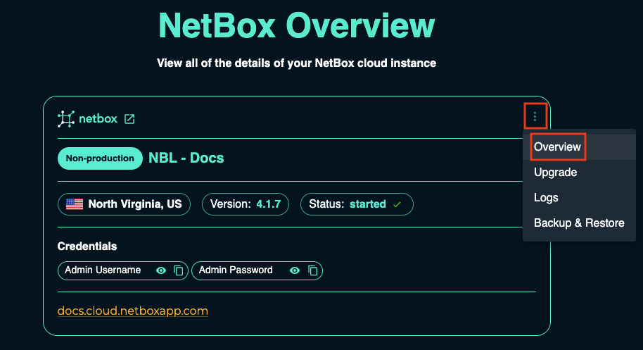
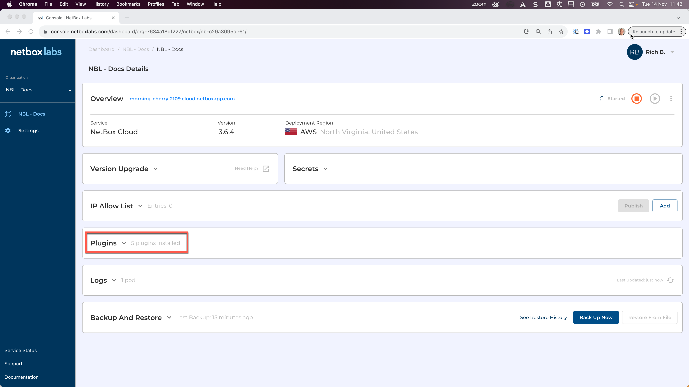

---
tags:
  - cloud
  - plugins
  - features
title: "NetBox Cloud Plugins"
description: "View and manage installed plugins in your NetBox Cloud instance through the administrative console."
author: "NetBox Labs Documentation Team"
last_updated: "2025-01-27"
versions:
  netbox_cloud: "v1.10"
status: "current"
category: "features"
audience: "administrators"
complexity: "beginner"
---

# NetBox Cloud Plugins

From within the NetBox Labs Console, you can easily view installed NetBox Cloud **Plugins**, along with their **Scope** and **Version number**. Simply follow these steps: 

1. From within the [NetBox Labs Console](https://console.netboxlabs.com) click on the three dots in the top right corner of the NetBox Instance panel, and click **Overview**   

    

2. Scroll down to view the list of installed **Plugins**, their scopes and version numbers:

    

    !!! info
        There are two types of plugin scope - **public** for any plugins that are publicly available and **organization** for custom plugins.
