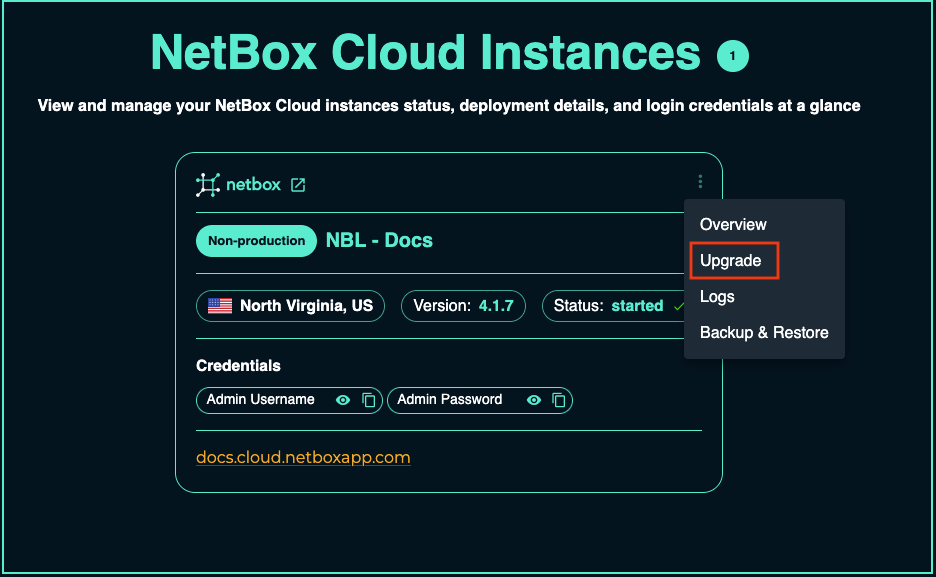
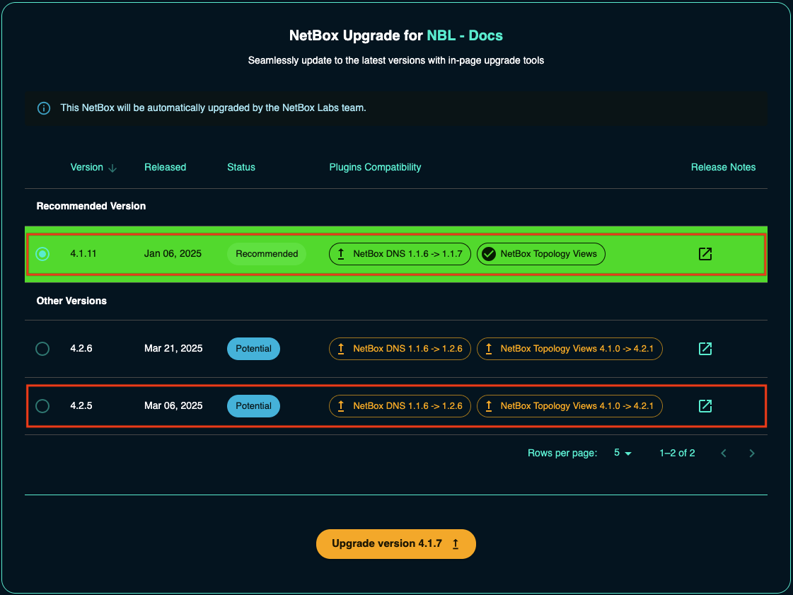
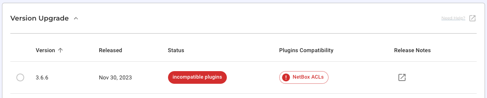
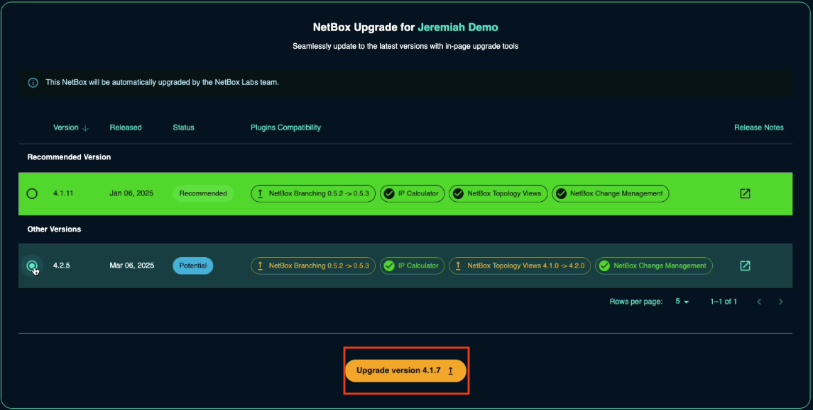
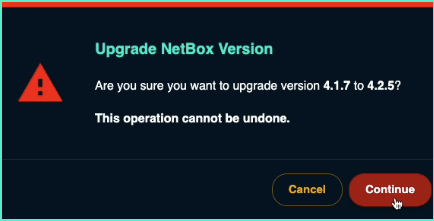
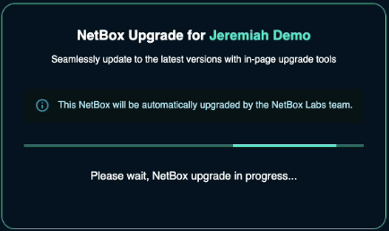
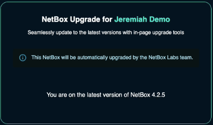

---
tags:
  - cloud
  - administration
  - upgrade
  - maintenance
title: "Upgrading NetBox Cloud"
description: "Step-by-step guide to upgrading your NetBox Cloud instance to newer versions through the administrative console."
author: "NetBox Labs Documentation Team"
last_updated: "2025-01-27"
versions:
  netbox_cloud: "v1.10"
status: "current"
category: "administration"
audience: "administrators"
complexity: "intermediate"
---

# Upgrading NetBox Cloud

To safely and easily upgrade your NetBox Cloud instance without worrying about any plugin compatibility issues, follow the steps outlined below:

[//]: # (COMMENTING VIDEO OUT OF CODE!)
[//]: # (<iframe width="560" height="315" src="https://www.youtube.com/embed/eRWaIXODHR4?si=vf-qdZ53tcICodW_" title="YouTube video player" frameborder="0" allow="accelerometer; autoplay; clipboard-write; encrypted-media; gyroscope; picture-in-picture; web-share" allowfullscreen></iframe>)

1. In the NetBox Labs [Console](https://console.netboxlabs.com/dashboard/), click on the three dots in the top right corner of the instance you wish to upgrade and click **Upgrade**. Note the current NetBox version in this example is 4.1.7.

    

2. The **Safe Upgrade tool** will present you with the **potential** and **recommended** versions you can upgrade to.

    You will see the version number, the status, whether installed plugins are compatible with the target NetBox version, and a link to the release notes for that version.

    

    Note that we could upgrade to any of the other **potential** options, but the Safe Upgrade tool is recommending an upgrade to version 4.1.11. If you select this option, all plugins will be automatically upgraded to compatible versions as part of the upgrade process.

    Note too that if a plugin is **not compatible** with a certain NetBox version, you will see a warning like this:

    

    In this case, you would not be able to upgrade to that version, and the tool will not allow you to select it. This typically means the plugin developer has not yet released a version compatible with that NetBox version.

3. Select the version you wish to upgrade to. In this example, we will select the recommended version 3.6.

4. Click on **UPGRADE VERSION**.

    

5. Click on **Continue** if you are sure you want to go ahead with the upgrade.

    

6. You will then see a dialog box confirming the upgrade is in progress.

    

7. A few seconds later, your NetBox Cloud upgrade will be complete. You will see the new version number.

    

If you encounter any issues during the upgrade or have any questions, please raise a support ticket by emailing the [NetBox Labs Support Team](mailto:support@netboxlabs.com).