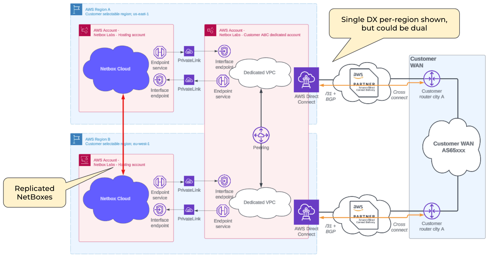

---
tags:
  - cloud
  - cloud-connectivity
  - networking
  - aws
  - direct-connect
  - multi-region
  - high-availability
title: "AWS Direct Connect (Multi-Region)"
description: "High-performance, multi-region NetBox Cloud connectivity with AWS Direct Connect for maximum redundancy and scalability."
versions:
  netbox_cloud: "v1.10"
status: "current"
category: "networking"
audience: "administrators"
complexity: "advanced"
---

# AWS Direct Connect (Multi-Region)

Delivery via [AWS Direct Connect](https://aws.amazon.com/directconnect/) in two regions, with replicated NetBoxes, Single (or Dual) Direct Connect in each region. Customer IP space (2 x /25's) is assigned for the VPCs. This is to host load balancers and proxies within the dedicated customer Account/VPC. Internally we will allocate a /27 per availability zone for each of the 3 availability zones.

The connections do not have to be dedicated, a VLAN can be added to an existing layer 2 fabric provider, such as Equinix Fabric. In terms of bandwidth requirements, 50Mbps is fine.

