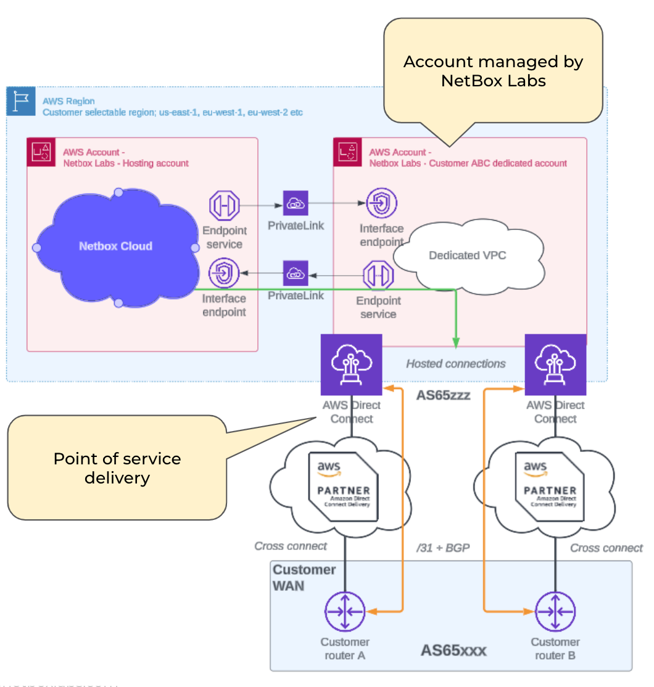

[AWS Direct Connect](https://aws.amazon.com/directconnect/) is available via hosted connections from BT, Equinix Fabric, MegaPort, Optus, PCCW, Zayo etc. VLAN hand-off is with BGP and Single or Dual Direct Connect services are available. Customer IP space (/24 or /25) is assigned for the VPC, as this is required to host load balancers and proxies within the dedicated customer Account/VPC. Internally we will allocate a /27 per availability zone for each of the 3 availability zones.

The connection does not have to be dedicated, a VLAN can be added to an existing layer 2 fabric provider, such as Equinix Fabric. In terms of bandwidth requirements, 50Mbps is fine.

