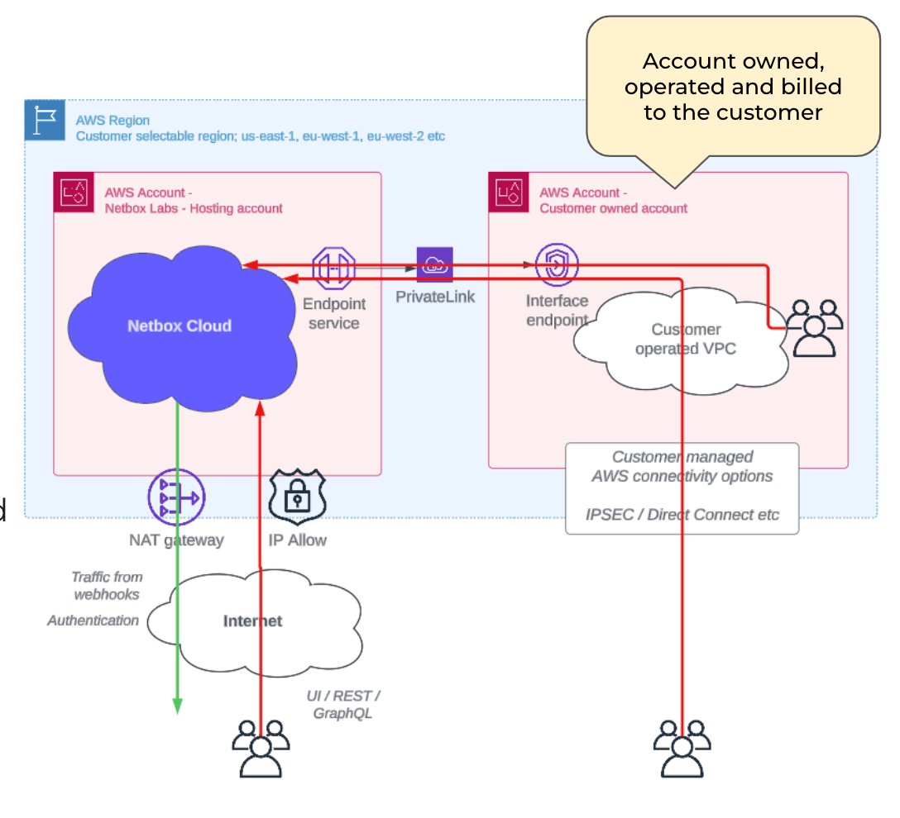

---
tags:
  - cloud
  - cloud-connectivity
  - networking
  - aws
  - private-link
versions:
  netbox_cloud: "v1.10"
status: "current"
---

# AWS Private Link (Single Region)

Delivery via [Private Link](https://aws.amazon.com/privatelink/) between a customer's existing AWS account and the NetBox Labs AWS account, with VPC endpoints using private IPs. This option has fast turn-up times and standard Internet delivery can optionally be disabled.

