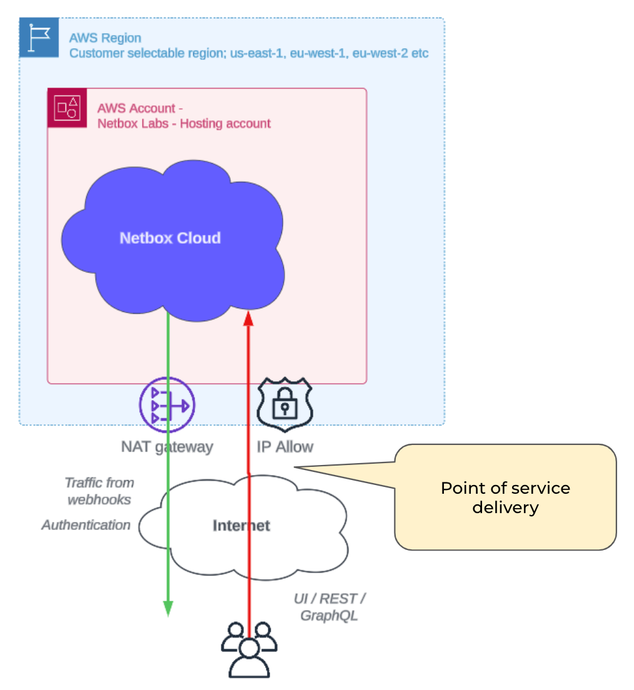

---
tags:
  - cloud
  - enterprise
---

Internet Delivery (Single Region) is the standard product offering for NetBox Cloud. It comes with extensive security features (see below) and is suitable for the majority of use cases and environments:

## NetBox Cloud Security Features
Below are just a few of the Security features available on the NetBox Cloud platform. All of these can be enabled over our standard Internet Delivery option:

- Securing Access with [Prefix Lists](https://docs.netboxlabs.com/Administration%20Console/prefix-lists/)
- mTLS and Dedicated IP Addresses
- [Database Backup and Restore](https://docs.netboxlabs.com/Administration%20Console/working_with_database_backups/)
- [Safe Upgrade Tool](https://docs.netboxlabs.com/Administration%20Console/upgrading-nbc/)
- [Two-Factor Authentication](https://docs.netboxlabs.com/Administration%20Console/set_up_2fa/) for the NetBox Labs Admin Console
- [SSO Options](https://docs.netboxlabs.com/Administration%20Console/azure-ad-sso-setup/) for NetBox Cloud

!!! info
    Read more about all of these features in this [blog](https://netboxlabs.com/blog/security-and-convenience-are-always-in-focus-in-the-netbox-cloud-platform/?preview_id=19124&preview_nonce=8a862c2421&preview=true) or watch an on-demand [webinar](https://netboxlabs.com/events/webinar-new-security-and-efficiency-enhancements-in-netbox-cloud/) to learn how these NetBox Cloud features are designed to make the lives of the network team easier, whilst at the same time enhancing the security of NetBox Cloud.