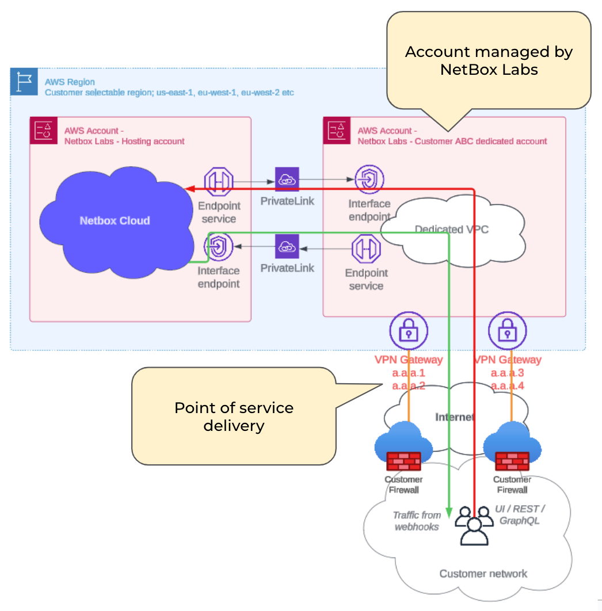
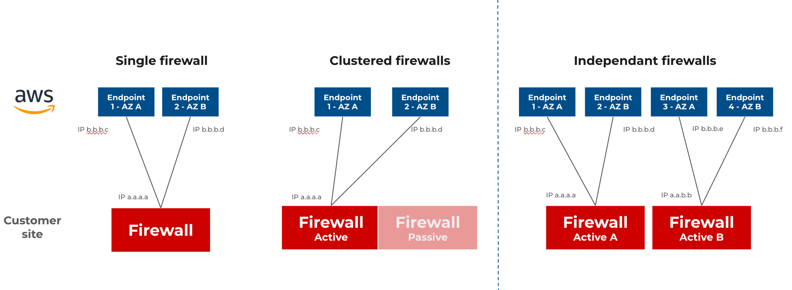

In this solution NetBox Cloud is securely delivered over an IPSEC VPN. You have single or dual tunnel options, and use a static route or the preferred option of BGP routing. Customer IP space (/24 or /25) is assigned for the VPC.

## Redundancy options
With the IPSEC VPN solution there are options for Single, Active/Passive and Active/Active Firewalls:

