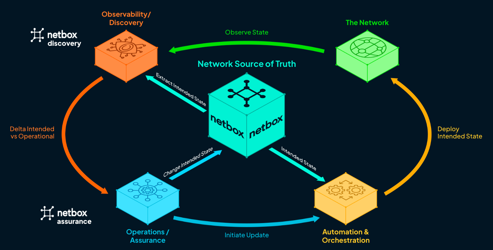

🟢 **NetBox Cloud**
🟠 **NetBox Enterprise**
🔵 **NetBox Community**

## NetBox Discovery

!!! info "*Public Preview*"
    **NetBox Discovery** is currently in Public Preview. Please refer to [NetBox Labs Product and Feature Lifecycle](https://docs.netboxlabs.com/product_feature_lifecycle/) to get more details.

NetBox Discovery enables operators to gather and ingest network and infrastructure information into NetBox to rapidly document the IT footprint within NetBox's model. The product seamlessly facilitates fast onboarding of infrastructure into NetBox, and accelerates the journey to intent-based automation with NetBox as the source of truth.

NetBox Discovery is powered by Orb's rock solid distributed agent framework, enabling discovery agents to be deployed quickly and easily in your network. NetBox Discovery agents can be deployed strategically in segmented network environments with strict reachability boundaries, enabling discovery even in environments where central deployment limits reach and visibility. Agents can be fanned out to parallelize discovery workloads, improving performance in large environments. 

## NetBox Assurance

!!! info "*Coming early 2025*"
    Be among the first to experience **NetBox Assurance**. [Sign up](https://netboxlabs.com/netbox-assurance/) to be notified when we launch.

NetBox Assurance enables operators to identify, understand, and mitigate operational drift - deviations in the infrastructure from the intended state and configuration. With NetBox Assurance, teams can leverage NetBox's source of truth alongside NetBox Discovery and other data sources to constantly identify, analyze, and report on drift across their infrastructure. The product provides the insights needed to establish remediation plans and quickly make decisions and take action on every deviation. NetBox Assurance speeds up troubleshooting, reduces outages, and unlocks the path to automation.

NetBox Assurance builds atop Diode, the scalable data ingestion service for NetBox. Any source that can send data to Diode's open APIs, such as NetBox Discovery, other discovery tools, data exchange integrations, or custom scripts using the Diode SDK, can feed input to NetBox Assurance. The product provides analytics and exploration tools for characterizing and planning remediation of operational drift, along with power tools for inspecting and taking mitigation actions on deviations as they arise including triggering automated remediations. With NetBox Assurance, operators can improve overall operations, reduce change risk, mitigate failures and security threats quickly, and accelerate automation.