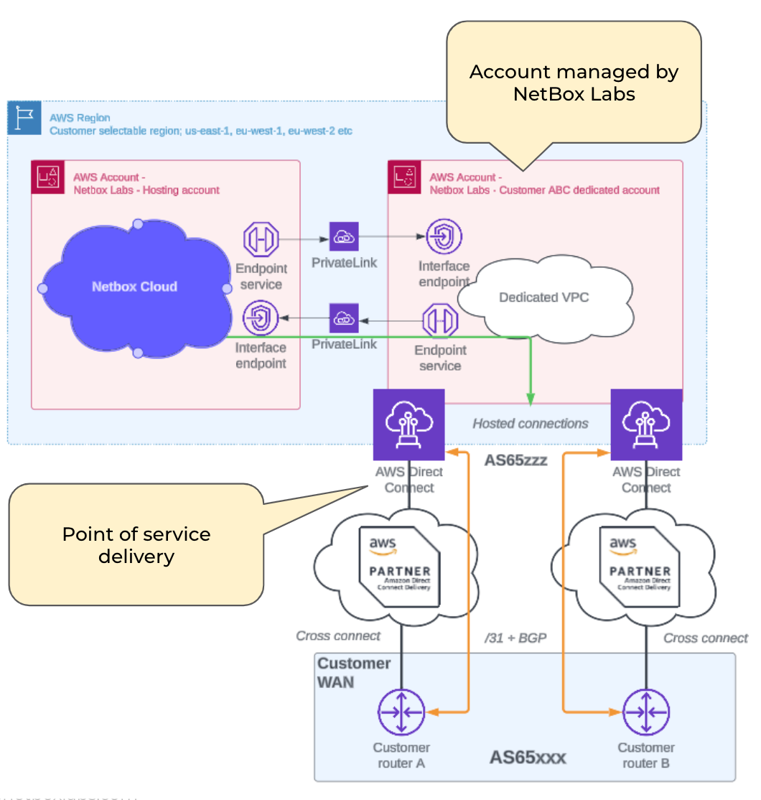

AWS Direct is available via hosted connections from BT, Equinix Fabric, MegaPort, Optus, PCCW, Zayo etc. VLAN hand-off is with BGP and Single or Dual Direct Connect services are available. Customer IP space is assigned for the VPC.

