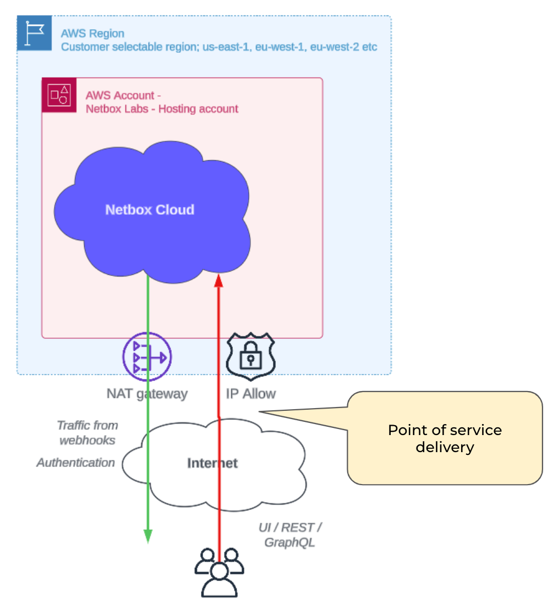

Internet Delivery (Single Region) is the standard product offering for NetBox Cloud. It comes with **TLS Security** and access is controlled by **Prefix Lists** that protect the UI, API and GraphQL interfaces. Separate Prefix Lists can protect each interface:

This solution is suitable for a large majority of customers, however if do you require connectivity over and above the standard offering then there are multiple [options](/docs/enterprise-connectivity/which-connectivity-option.md) available. With that said, in a lot of cases where you might think that you need connectivity over and above the standard offering, there are features available that may well address your needs without enterprise connectivity needing to be set up. This guide takes look at some of those options.

## CRUD (Create/Update/Delete) Access to the NetBox Data Model via REST and GraphQL API
Out of the box NetBox Cloud allows you to programmatically interact with the NetBox Database to perform CRUD operations. This can be via the REST API or GraphQL interface.

### REST API
REST stands for [Representational State Transfer](https://en.wikipedia.org/wiki/REST). It's a particular type of API which employs HTTP requests and [JavaScript Object Notation (JSON)](https://www.json.org/json-en.html) to facilitate create, retrieve, update, and delete (CRUD) operations on objects within an application.

To read more about how to get started with the REST API, check out the [NetBox docs](https://netbox.readthedocs.io/en/stable/integrations/rest-api/) or this [video](https://youtu.be/Gsarb0elmoA?si=KUli-RLlJeYS5gp4) from the NetBox Zero to Hero training course.

### GraphQL API
NetBox provides a read-only [GraphQL](https://graphql.org/) API to complement its REST API. This API is powered by [Strawberry Django](https://strawberry-graphql.github.io/strawberry-django/). GraphQL enables the client to specify an arbitrary nested list of fields to include in the response. All queries are made to the root /graphql API endpoint.

To read more about how to get started with the GraphQL API, check out the [NetBox docs](https://netbox.readthedocs.io/en/stable/integrations/graphql-api/).

## Streaming Change Events with Webhooks and Event Streams
Events in NetBox can trigger calls to other systems with Webhooks, or other systems can subscribe to Event Streams, and in either case this can trigger other systems to take action based on the event.

### NetBox Webhooks
NetBox can be configured via [Event Rules](https://netbox.readthedocs.io/en/stable/features/event-rules/) to transmit outgoing webhooks to remote systems in response to internal object changes. The receiver can act on the data in these webhook messages to perform related tasks.

For example, suppose you want to automatically configure a monitoring system to start monitoring a device when its operational status is changed to active, and remove it from monitoring for any other status. You can create a webhook in NetBox for the device model and craft its content and destination URL to effect the desired change on the receiving system. Webhooks will be sent automatically by NetBox whenever the configured constraints are met.

To read more about how to get started with the Webhooks, check out the [NetBox docs](hhttps://netbox.readthedocs.io/en/stable/integrations/webhooks/).

### NetBox Event Streams
[NetBox Event Streams](https://netboxlabs.com/blog/netbox-labs-introduces-netbox-event-streams/) unlock event-driven architectures by enabling teams to easily subscribe to network state and management events from the NetBox Cloud Platform, feeding events to other systems or triggering automations. This capability spans various types of events, from operational updates like the addition of new devices, to security-oriented alerts such as unauthorized access attempts.

To learn more about NetBox Event Streams you can sign up for an [on-demand webinar](https://netboxlabs.com/events/event-driven-architectures-for-networking-and-security-webinar/) or read our [blog](https://netboxlabs.com/blog/revolutionizing-netsecops-netbox-event-streams-and-siem-integration/) about how NetBox Event Streams integrated with SIEM tools like Splunk Enterprise and ElasticSearch, is setting a new standard for how networks are managed and secured.

## NetBox Cloud Security Features
Security and convenience are always in focus in the NetBox Cloud Platform and we understand that with any application, getting the balance right between security and convenience is crucial. At NetBox Labs, we believe that you shouldn’t have to compromise in either area. Just a few of the Security features the NetBox Cloud platform offers are:

- Securing Access with [Prefix Lists](https://docs.netboxlabs.com/Administration%20Console/prefix-lists/)
- mTLS and Dedicated IP Addresses
- [Database Backup and Restore](https://docs.netboxlabs.com/Administration%20Console/working_with_database_backups/)
- [Safe Upgrade Tool](https://docs.netboxlabs.com/Administration%20Console/upgrading-nbc/)
- [Two-Factor Authentication](https://docs.netboxlabs.com/Administration%20Console/set_up_2fa/) for the NetBox Labs Admin Console
- [SSO Options](https://docs.netboxlabs.com/Administration%20Console/azure-ad-sso-setup/) for NetBox Cloud

Read more about all of these features in this [blog](https://netboxlabs.com/blog/security-and-convenience-are-always-in-focus-in-the-netbox-cloud-platform/?preview_id=19124&preview_nonce=8a862c2421&preview=true) or watch an on-demand [webinar](https://netboxlabs.com/events/webinar-new-security-and-efficiency-enhancements-in-netbox-cloud/) to learn how these NetBox Cloud features are designed to make the lives of the network team easier, whilst at the same time enhancing the security of NetBox Cloud.