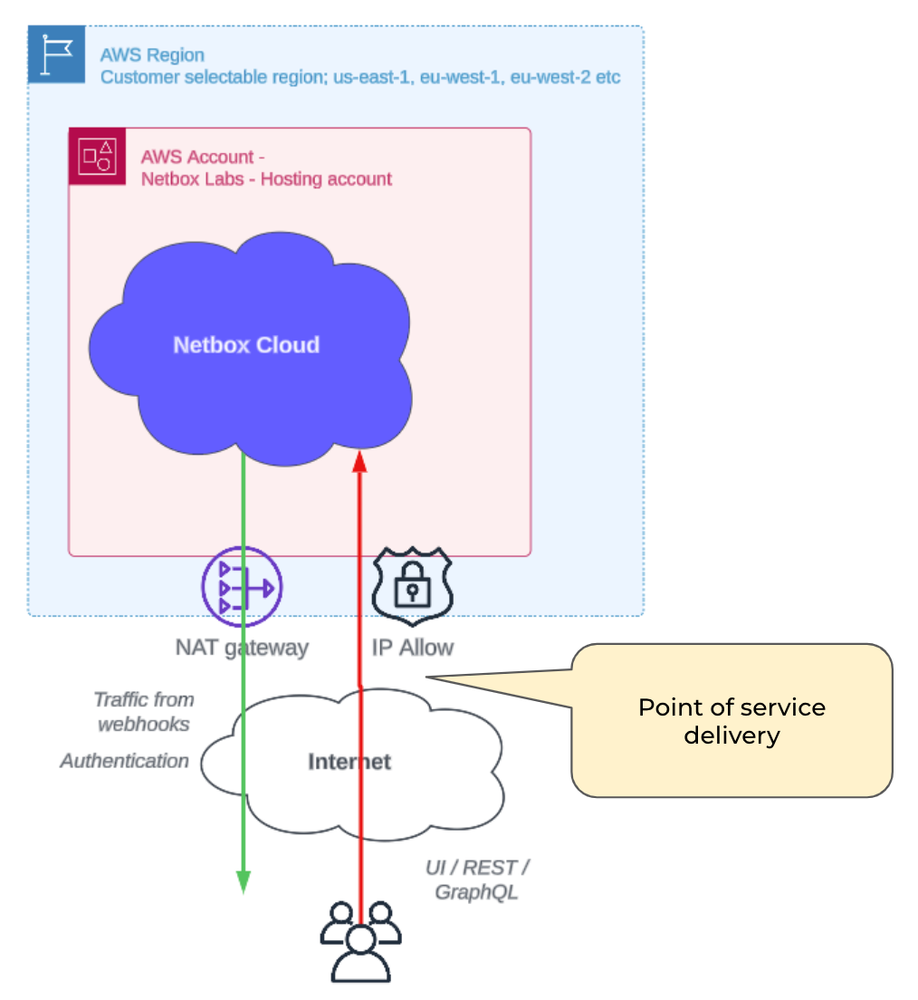

Internet Delivery (Single Region) is the standard product offering for NetBox Cloud. It comes with **TLS Security** and access is controlled by **Prefix Lists** that protect the UI, API and GraphQL interfaces. Separate Prefix Lists can protect each interface.

