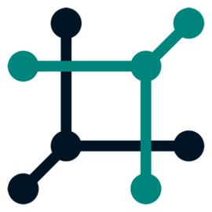

---
hide:
  - navigation
  - toc
tags:
  - cloud
  - enterprise
  - community
  - discovery
  - assurance
  - operator
  - netbox
---

# Welcome to the NetBox Labs Documentation Site 

The home of documentation for NetBox <a href="Administration Console/console-access" style="color: #00d9be; text-decoration: none;">Cloud</a>, <a href="netbox-enterprise/nbe-overview" style="color: #ffac00; text-decoration: none;">Enterprise</a>, <a href="netbox-integrations/netbox-ansible-collection" style="color: #28a745; text-decoration: none;">Integrations</a>, <a href="sdks/pynetbox" style="color: #007bff; text-decoration: none;">SDKs</a> and <a href="netbox-extensions/diode/index" style="color: #6f42c1; text-decoration: none;">Extensions</a>.

  <h2 style="color: white; font-size: 2.5rem; font-weight: bold; margin-bottom: 1rem;">Products</h2>
  

  
  <!-- NetBox Card -->
  

    

      

        
      

      <h3 style="color: white; font-size: 1.25rem; font-weight: bold; margin: 0;">NetBox</h3>
    

    

      The world's leading network source of truth. Model, document, and automate your infrastructure.
    

    

      <a href="https://github.com/netbox-community/netbox" style="color: #00bee0; text-decoration: none; font-weight: 500;">Community</a>
      <a href="netbox-enterprise/nbe-overview" style="color: #ffac00; text-decoration: none; font-weight: 500;">Enterprise</a>
      <a href="NetBox Cloud/getting-started-with-nbc" style="color: #00d9be; text-decoration: none; font-weight: 500;">Cloud</a>
    

  

  <!-- Discovery Card -->
  

    

      

        
D

      

      <h3 style="color: white; font-size: 1.25rem; font-weight: bold; margin: 0;">Discovery</h3>
    

    

      Automatically map your networks and infrastructure. Accelerate documentation and streamline operations.
    

    

      <a href="netbox-discovery/index" style="color: #00bee0; text-decoration: none; font-weight: 500;">Community</a>
      <a href="netbox-discovery/index" style="color: #ffac00; text-decoration: none; font-weight: 500;">Enterprise</a>
      <a href="netbox-discovery/index" style="color: #00d9be; text-decoration: none; font-weight: 500;">Cloud</a>
    

  

  <!-- Assurance Card -->
  

    

      

        
A

      

      <h3 style="color: white; font-size: 1.25rem; font-weight: bold; margin: 0;">Assurance</h3>
    

    

      Find and fix operational drift. Continuously monitor and detect deviations in your infrastructure.
    

    

      Community (Not Available)
      <a href="netbox-assurance/index" style="color: #ffac00; text-decoration: none; font-weight: 500;">Enterprise</a>
      <a href="netbox-assurance/index" style="color: #00d9be; text-decoration: none; font-weight: 500;">Cloud (Coming Soon)</a>
    

  

  <!-- Operator Card -->
  

    

      

        
O

      

      <h3 style="color: white; font-size: 1.25rem; font-weight: bold; margin: 0;">Operator</h3>
    

    

      AI superpowers for network engineers. Agentic AI operations with NetBox as your infrastructure map.
    

    

      Community (Not Available)
      <a href="netbox-operator/index" style="color: #ffac00; text-decoration: none; font-weight: 500;">Enterprise (Coming Soon)</a>
      <a href="netbox-operator/index" style="color: #00d9be; text-decoration: none; font-weight: 500;">Cloud (Coming Soon)</a>
    

  

  <h2 style="color: white; font-size: 2.5rem; font-weight: bold; margin-bottom: 1rem;">Extensions & Integrations</h2>
  

  
  

    <h3 style="color: white; font-size: 1.25rem; font-weight: bold; margin-bottom: 1rem;">NetBox Branching Plugin</h3>
    

      Introduces branching functionality with discrete, static snapshots of the NetBox database that can be modified independently and merged back.
    

    <a href="netbox-extensions/branching/index" style="color: #6f42c1; text-decoration: none; font-weight: 500;">Learn more about NetBox Branching →</a>
  

  

    <h3 style="color: white; font-size: 1.25rem; font-weight: bold; margin-bottom: 1rem;">NetBox Change Management Plugin</h3>
    

      Powerful workflows for team collaboration in designing, testing, and deploying network and infrastructure changes.
    

    <a href="netbox-extensions/changes/index" style="color: #6f42c1; text-decoration: none; font-weight: 500;">Learn more about Change Management →</a>
  

  

    <h3 style="color: white; font-size: 1.25rem; font-weight: bold; margin-bottom: 1rem;">Diode</h3>
    

      Data ingestion service that simplifies and enhances the process to add and update network data in NetBox.
    

    <a href="netbox-extensions/diode/index" style="color: #6f42c1; text-decoration: none; font-weight: 500;">Learn more about Diode →</a>
  

  

    <h3 style="color: white; font-size: 1.25rem; font-weight: bold; margin-bottom: 1rem;">NetBox Ansible Collection</h3>
    

      Automate NetBox operations and integrate with your Ansible workflows for infrastructure as code.
    

    <a href="netbox-integrations/netbox-ansible-collection" style="color: #28a745; text-decoration: none; font-weight: 500;">Learn more about Ansible Collection →</a>
  

  

    <h3 style="color: white; font-size: 1.25rem; font-weight: bold; margin-bottom: 1rem;">ServiceNow Integration</h3>
    

      Seamlessly integrate NetBox with ServiceNow for ITSM workflows and configuration management.
    

    <a href="netbox-integrations/servicenow/index" style="color: #28a745; text-decoration: none; font-weight: 500;">Learn more about ServiceNow Integration →</a>
  

  

    <h3 style="color: white; font-size: 1.25rem; font-weight: bold; margin-bottom: 1rem;">PyNetBox SDK</h3>
    

      Python SDK for NetBox API integration. Build custom tools and automations with ease.
    

    <a href="sdks/pynetbox" style="color: #007bff; text-decoration: none; font-weight: 500;">Learn more about PyNetBox →</a>
  

  

    <h2 style="color: white; font-size: 2.5rem; font-weight: bold; margin-bottom: 1rem;">Open Source & Community</h2>
    
NetBox Labs builds software in the open, with thriving communities

  

  
  

    
    

      

        
        <h3 style="color: white; font-size: 1.25rem; font-weight: bold; margin: 0;">NetBox Community</h3>
      

      

        NetBox exists to empower network engineers. Since 2016, it has become the go-to solution for modeling and documenting network infrastructure worldwide.
      

      <a href="https://github.com/netbox-community/netbox" style="color: #00bee0; text-decoration: none; font-weight: 500;">Visit NetBox Community GitHub →</a>
    

    

      

        
DA

        <h3 style="color: white; font-size: 1.25rem; font-weight: bold; margin: 0;">Discovery Agent</h3>
      

      

        NetBox discovery agents map network resources and gather device information to build a comprehensive model of your infrastructure.
      

      <a href="netbox-discovery/agent/index" style="color: #28a745; text-decoration: none; font-weight: 500;">Learn more about Discovery Agent →</a>
    

  

