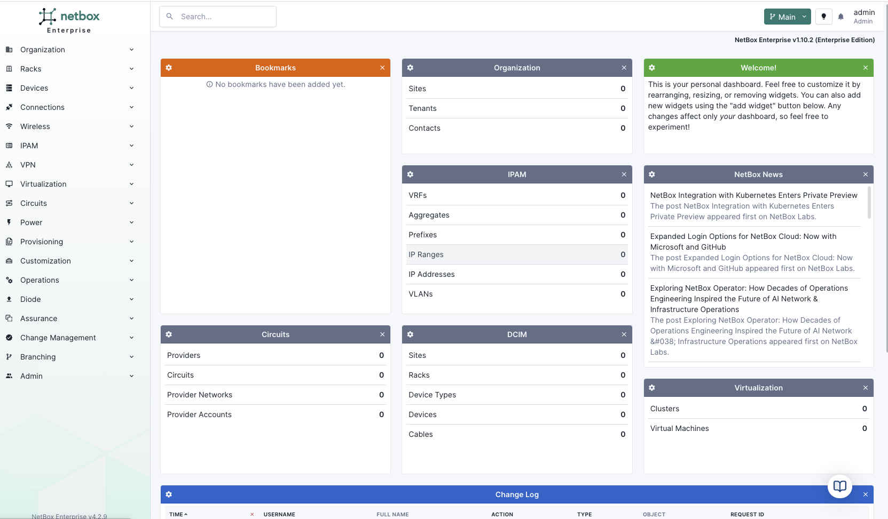

---
tags:
  - cloud
  - enterprise
  - assurance
title: "NetBox Assurance"
---

!!! info "*Coming June 2025 for NetBox Enterprise, July 2025 for NetBox Cloud*"
    Be among the first to experience **NetBox Assurance**. [Sign up](https://netboxlabs.com/netbox-assurance/) to be notified when we launch.

!!! note "NetBox Cloud Support"
    NetBox Cloud support coming early July 2025.

NetBox Assurance allows you to control which data goes into NetBox by detecting and managing "operational drift"—the difference between your intended network state documented in NetBox and the actual operational state of your network infrastructure.

## Key Features
- **Operational Drift Detection**: Identify differences between NetBox's intended state and actual network state
- **Data Ingestion Control**: Review and approve data before it enters NetBox, maintaining data quality
- **Seamless Integration**: Works with NetBox Discovery and supports custom integrations via the Diode SDK
- **Change Set Management**: Review proposed updates and apply them to NetBox branches or ignore as needed
- **Audit Trail**: Track all changes and decisions for compliance and operational history

## How It Works
NetBox Assurance follows a structured four-step workflow:

1. **Data Ingestion**: Network information flows in from NetBox Discovery, direct device interrogation, or other sources via the Diode SDK
2. **Analysis & Comparison**: Ingested data is analyzed against existing NetBox records to identify operational drift
3. **Deviation Review**: Review detected deviations and examine proposed change sets
4. **Action & Resolution**: Apply changes to NetBox, recalculate drift, or ignore deviations as needed

## Use Cases
- **Day 1 - Initial NetBox Population**: Control data quality while rapidly populating NetBox with discovery data
- **Day 1.5 - Improving Network Maturity**: Maintain operations while gradually improving documentation and automation processes  
- **Day 2 - Operational Excellence**: Proactively detect and resolve operational drift to maintain network reliability

## Getting Started

1. **[Quickstart Guide](quickstart-guide.md)**: Get up and running quickly with NetBox Assurance
2. **[Assurance Workflows](workflows/index.md)**: Configure drift detection and review processes
3. **[Data Ingestion](monitoring/index.md)**: Set up data sources from NetBox Discovery and other systems

## Support and Resources
- **Community Support**: Connect with the community on [Slack](https://netdev.chat/) in the `#netbox` channel
- **Documentation**: Additional resources and integration guides available in related sections
- **GitHub Repository**: Find NetBox Discovery integration [here](https://github.com/netboxlabs/orb-agent)

---
By leveraging **NetBox Assurance**, organizations can maintain accurate network documentation, reduce operational risk, and build confidence in their network automation initiatives through continuous validation and drift detection.