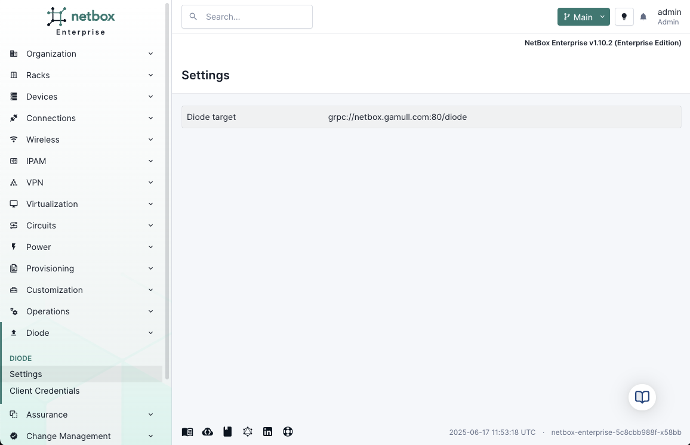
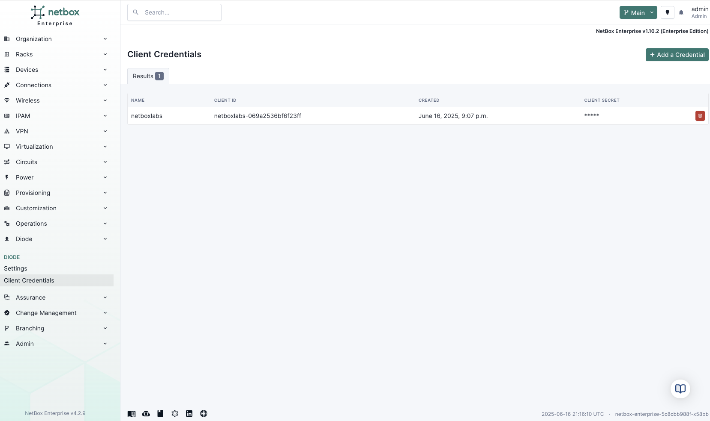
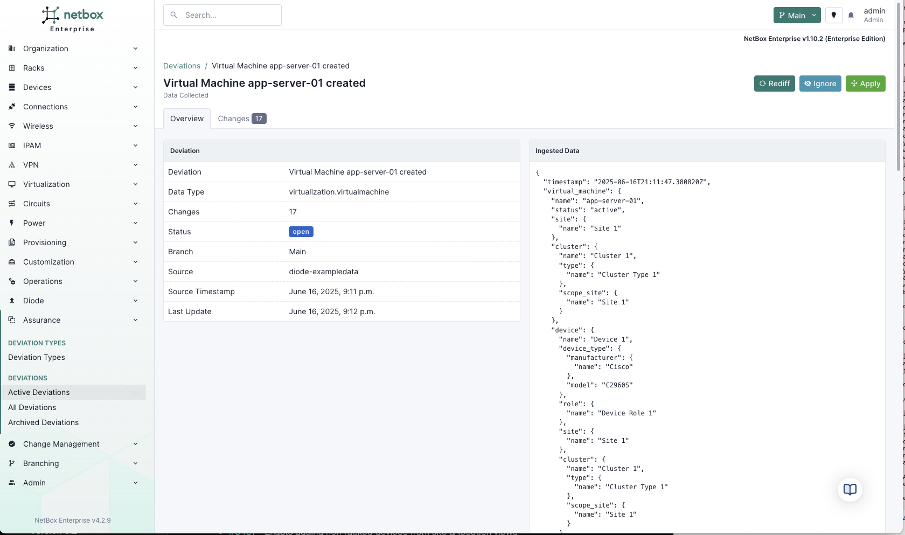

Enterprise

# Data Ingestion and Analysis

!!! note "NetBox Cloud Support"
    NetBox Cloud support coming early July 2025.

NetBox Assurance ingests network data from multiple sources and analyzes it against your NetBox documentation to identify operational drift. This process ensures your network documentation stays accurate and up-to-date.

## Data Sources

### NetBox Discovery Integration
The primary source for automated network data collection:

- **Network Discovery**: Automated discovery of network devices and topology
- **Device Discovery**: Detailed device inventory and configuration collection
- **Controller Integrations**: VMware vCenter, Cisco Catalyst Center, Juniper Mist, Microsoft DHCP, AWS VPC IPAM

### Diode SDK Integration
Public API for custom data sources and integrations:

- **Python and Golang SDKs**: Development kits for building custom integrations
- **Monitoring Systems**: Prometheus, Grafana, DataDog, Splunk
- **Inventory Systems**: CMDBs, spreadsheets, asset management systems
- **Automation Tools**: Ansible, Terraform, custom scripts

### Direct API Access
Send data directly to NetBox Assurance:
- **REST API**: Standard HTTP-based data submission
- **Bulk Operations**: Efficient handling of large data sets
- **Real-time Updates**: Immediate processing of network changes
- **Idempotent Operations**: Safe to retry without duplicating data

## Analysis Process

### Operational Drift Detection
NetBox Assurance compares ingested data against existing NetBox records to identify:

- **Missing Objects**: Network elements discovered but not documented in NetBox
- **Obsolete Objects**: NetBox entries that no longer exist in the actual network
- **Configuration Drift**: Differences in device attributes, IP addresses, or relationships
- **Topology Changes**: New connections or removed links between devices

### Data Quality Control
Before data enters NetBox, Assurance provides:

- **Change Preview**: See exactly what would be modified in NetBox
- **Impact Analysis**: Understand the scope of proposed changes
- **Conflict Resolution**: Handle overlapping or contradictory data
- **Validation Rules**: Ensure data meets organizational standards

## Integration Patterns

### Continuous Monitoring
Real-time observation of network state:
- **Event-driven Updates**: Process changes as they occur
- **Low-latency Detection**: Immediate identification of drift
- **Critical Infrastructure Focus**: Priority monitoring for essential systems

### Scheduled Collection
Periodic comprehensive data gathering:
- **Daily Discovery Runs**: Regular network scans
- **Weekly Compliance Audits**: Systematic validation of network state
- **Monthly Trend Analysis**: Long-term drift pattern identification

### Hybrid Approach
Combination of real-time and scheduled monitoring:
- **Critical Systems**: Continuous monitoring for core infrastructure
- **Standard Systems**: Scheduled collection for routine equipment
- **Flexible Policies**: Different monitoring strategies per device type

## Getting Started

1. **Configure NetBox Discovery**: Set up automated network and device discovery
2. **Enable Diode Integration**: Connect monitoring systems and data sources
3. **Define Data Sources**: Specify which systems should send data to Assurance
4. **Set Collection Schedules**: Determine how frequently to gather network data
5. **Review Initial Results**: Examine first deviations and tune detection sensitivity

## Best Practices

- **Start with Discovery**: Use NetBox Discovery as your primary data source
- **Gradual Expansion**: Add custom integrations incrementally
- **Data Validation**: Verify data quality before large-scale ingestion
- **Monitor Performance**: Track ingestion rates and processing times
- **Document Sources**: Maintain clear records of all data integration points 