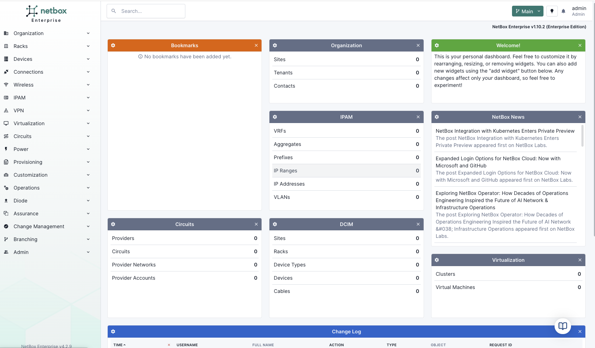

---
tags:
  - cloud
  - enterprise
  - assurance
title: "NetBox Assurance Quickstart Guide"
---

!!! note "NetBox Cloud Support"
    NetBox Cloud support coming early July 2025.

This quickstart guide will help you get NetBox Assurance up and running to detect and manage operational drift between your intended network state in NetBox and the actual state of your network infrastructure.

## Prerequisites

- NetBox Enterprise installation with Assurance enabled
- Network data sources configured (NetBox Discovery recommended)
- Administrative access to NetBox Enterprise
- Network devices accessible for data collection

## Installation and Setup

### Step 1: Enable NetBox Assurance

During NetBox Enterprise installation, ensure NetBox Assurance is selected in the configuration screen:

### Step 2: Access NetBox Assurance

Once installed, NetBox Assurance appears in your NetBox navigation sidebar:

### Step 3: Configure Data Sources

Set up data ingestion from one or more sources:

- **NetBox Discovery**: Leverage existing network and device discovery data
- **Diode SDK**: Configure custom integrations with monitoring systems, CMDBs, or other data sources
- **Direct API**: Send data directly from scripts or automation tools

### Step 4: Review Your First Deviations

Once data flows in, Assurance will detect operational drift and present deviations for review:

### Step 5: Take Action

For each deviation, you can:
- **Apply**: Update NetBox with the discovered network state
- **Ignore**: Mark as acceptable deviation
- **Recalculate**: Refresh the comparison after making changes

## Next Steps

- **[Configure Workflows](workflows/index.md)**: Set up automated drift detection rules
- **[Data Ingestion Setup](monitoring/index.md)**: Configure additional data sources
- **[Workflow Configuration](workflows/configuration.md)**: Customize detection and review processes

## Getting Help

- **Community Support**: Join the [NetBox Slack](https://netdev.chat/) `#netbox` channel
- **Documentation**: Explore the detailed workflow and configuration guides 