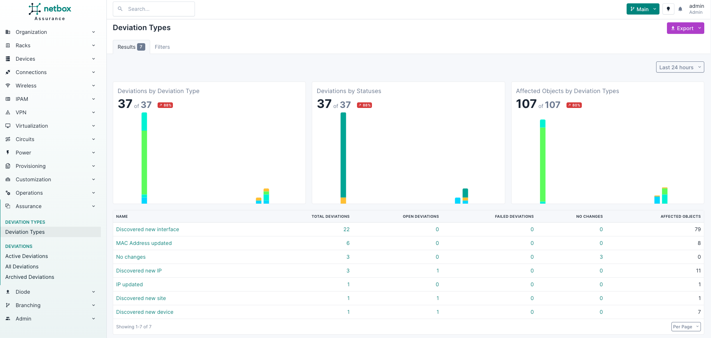
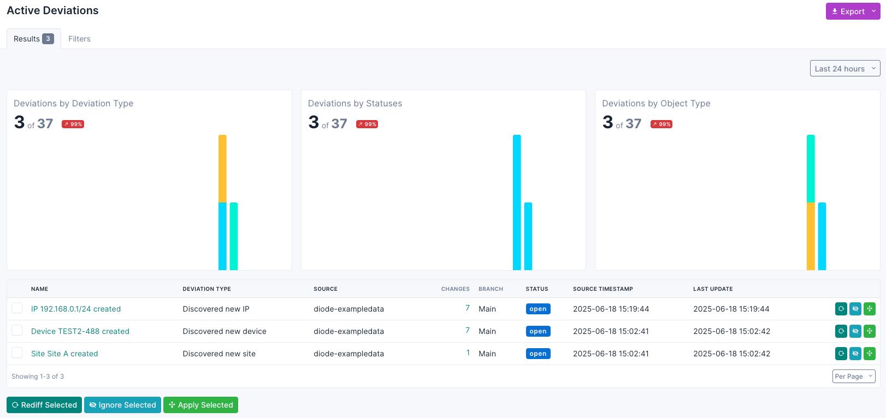
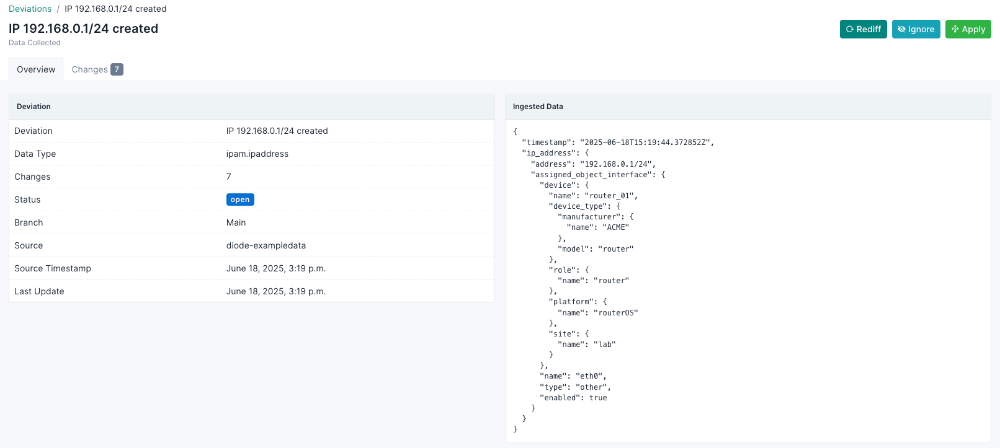
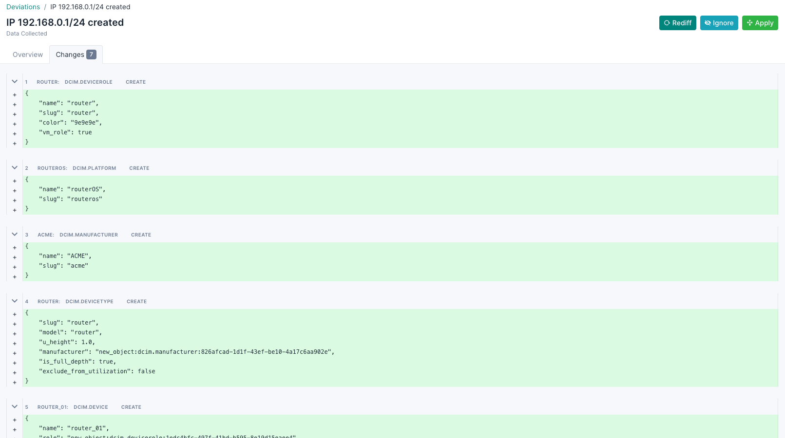

---
tags:
  - cloud
  - enterprise
title: "Using the NetBox Assurance UI"
description: "Comprehensive guide to the NetBox Assurance web interface - navigation, deviation management, workflows, and daily operations for network drift detection"
author: "NetBox Labs Documentation Team"
last_updated: "2025-01-27"
versions:
  cloud: "v1.10"
  enterprise: "v1.10"
status: "current"
category: "feature"
audience: "end-users"
complexity: "beginner"
related_docs:
  - "index.md"
  - "getting-started.md"
external_links:
  - "https://netdev.chat/"
---

# Using the NetBox Assurance UI

NetBox Cloud (Coming Soon)
NetBox Enterprise

The NetBox Assurance plugin provides a comprehensive web interface within NetBox for monitoring network drift, viewing deviation reports, and managing remediation workflows. This guide covers the interface features, navigation, and operational workflows for day-to-day use of NetBox Assurance.

> **Prerequisites**: Before using this guide, complete the [Getting Started](getting-started.md) setup to ensure NetBox Assurance is properly configured and receiving data.

## Navigation

Once the NetBox Assurance plugin is installed, you'll find the **Assurance** menu in the NetBox sidebar with the following sections:

### Deviation Types
- **Deviation Types**: Browse and manage different types of network deviations that can be detected

### Deviations
- **Active Deviations**: View currently unresolved configuration deviations
- **All Deviations**: Complete list of all detected deviations (active and resolved)
- **Archived Deviations**: Historical view of resolved or archived deviations

## Main Deviation Views

### All Deviations List

The main deviations page provides a comprehensive overview of all detected network drift:

**Key Features:**
- **Visual Charts**: Timeline charts showing deviation trends and patterns
- **Filterable Table**: Search and filter deviations by various criteria
- **Export Options**: Export deviation data in multiple formats
- **Bulk Actions**: Apply actions to multiple deviations simultaneously

**Available Filters:**
- Date range selection for focused analysis
- Deviation type filtering
- Status-based filtering
- Source-based filtering

### Active Deviations

Shows only unresolved deviations that require attention:
- Real-time view of current network drift
- Prioritized by detection date
- Immediate action items for network operations teams

### Archived Deviations

Historical view of resolved deviations:
- Track remediation history
- Analyze patterns in network drift
- Compliance reporting and auditing

## Deviation Detail View

When you click on a specific deviation, you'll see detailed information:

### Overview Tab
**Deviation Information:**
- Deviation name and identifier
- Data type affected
- Number of changes detected
- Current status with visual indicators
- Branch information (if using NetBox branching)
- Source system and timestamp
- Last update information

**Ingested Data Panel:**
- Raw data that was ingested from the network
- Formatted JSON view for technical analysis

**Error Details** (if applicable):
- Error messages for failed operations
- Detailed error information for troubleshooting

### Changes Tab
- Detailed view of specific configuration changes
- Object-by-object comparison
- Before/after state visualization

## Bulk Operations

The deviation list supports several bulk operations:

### Rediff Selected
- Re-analyze selected deviations
- Useful when network state may have changed
- Updates deviation status based on current conditions

### Ignore Selected
- Mark deviations as acceptable
- Removes them from active monitoring
- Useful for planned configuration differences

### Apply Selected
- Automatically remediate selected deviations
- Applies corrections based on predefined rules
- Updates NetBox or network devices as configured

## Data Visualization

### Timeline Charts
- Visual representation of deviation trends over time
- Stacked bar charts showing deviation types
- Customizable date ranges for analysis
- Color-coded by deviation status

### Status Indicators
Deviations are marked with clear visual indicators:
- **Active**: Requires attention
- **Applied**: Successfully remediated
- **Failed**: Remediation attempt failed
- **Ignored**: Marked as acceptable

## Export and Reporting

### Export Options
- **Current View**: Export filtered results
- **All Data**: Complete deviation dataset
- **Custom Templates**: Use predefined export formats

### Supported Formats
- Table format for immediate viewing
- Structured data formats for integration
- Custom export templates for specific reporting needs

## Integration Features

### NetBox Integration
- Seamless integration with NetBox's existing interface
- Respects NetBox's user permissions and roles
- Consistent styling and user experience
- Integration with NetBox's change logging system

### Branching Support
- Compatible with NetBox branching features
- Branch-specific deviation tracking
- Branch information displayed in deviation details

## Workflow Best Practices

### Daily Operations
1. **Review Active Deviations**: Start with the active deviations view
2. **Analyze Trends**: Check timeline charts for patterns
3. **Prioritize Actions**: Focus on critical deviations first
4. **Bulk Processing**: Use bulk actions for similar deviations

### Investigation Process
1. **Drill Down**: Click on deviations for detailed analysis
2. **Review Changes**: Examine specific configuration differences
3. **Check Source Data**: Verify ingested data accuracy
4. **Determine Action**: Decide between applying, ignoring, or escalating

### Remediation Workflow
1. **Select Appropriate Action**: Choose between update NetBox or correct device
2. **Use Bulk Operations**: Process similar deviations together
3. **Monitor Results**: Verify successful remediation
4. **Document Decisions**: Use NetBox's change logging for audit trails

## Troubleshooting

### Common Issues
- **Failed Deviations**: Check error details for specific failure reasons
- **Missing Data**: Verify source system connectivity
- **Permission Issues**: Ensure proper NetBox user permissions

### Performance Considerations
- Use date range filters to limit large datasets
- Export data in smaller chunks for better performance
- Leverage bulk operations for efficiency

---

The NetBox Assurance UI provides a powerful platform for managing network drift detection and remediation, helping maintain consistency between your documented network design and operational reality through an intuitive web interface.