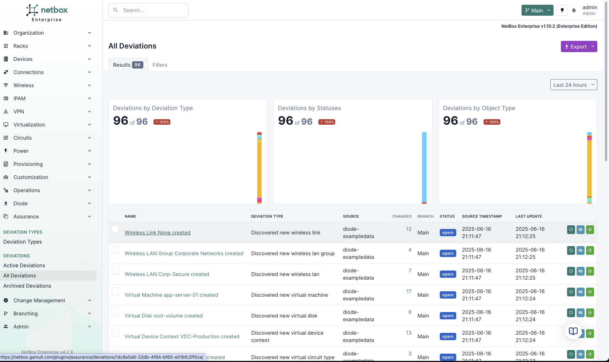

Enterprise

# Assurance Workflows

!!! note "NetBox Cloud Support"
    NetBox Cloud support coming early July 2025.

NetBox Assurance workflows provide structured processes for detecting, reviewing, and resolving operational drift between your intended network state in NetBox and the actual network state discovered from various data sources.

## Core Workflow Process

NetBox Assurance follows a four-step workflow that puts you in complete control of your network data:

### 1. Data Ingestion
Network information flows into NetBox Assurance from multiple sources:
- **NetBox Discovery**: Automated network and device discovery
- **Controller Integrations**: VMware vCenter, Cisco Catalyst Center, Juniper Mist, etc.
- **Diode SDK**: Custom integrations with monitoring systems, CMDBs, spreadsheets
- **Direct API**: Manual or scripted data submission

### 2. Analysis & Comparison
Ingested data is automatically compared against existing NetBox records to identify:
- **Missing Objects**: Items found in the network but not documented in NetBox
- **Extra Objects**: Items in NetBox that don't exist in the actual network
- **Attribute Differences**: Configuration or state mismatches between systems

### 3. Deviation Review
Review detected deviations through the Assurance interface:
- **Categorized Deviations**: Organized by type and severity
- **Change Previews**: See exactly what would change in NetBox
- **Bulk Operations**: Process multiple related deviations together
- **Filtering and Search**: Find specific types of drift quickly

### 4. Action & Resolution
Take appropriate action for each deviation:
- **Apply Changes**: Update NetBox with discovered network state
- **Ignore Deviations**: Mark acceptable differences as exceptions
- **Recalculate**: Refresh analysis after manual NetBox changes
- **Archive**: Move resolved deviations to historical records

## Workflow Configuration

### Detection Rules
Configure what constitutes operational drift:
- **Object Types**: Which network objects to monitor
- **Attributes**: Which properties to compare
- **Thresholds**: Sensitivity levels for change detection
- **Exclusions**: Known acceptable differences

### Review Processes
Establish approval workflows:
- **Assignment Rules**: Route deviations to appropriate team members
- **Approval Chains**: Multi-step review for critical changes
- **Notification Settings**: Alerts for new deviations or escalations
- **SLA Tracking**: Monitor response times and resolution rates

### Branch Management
Control how changes are applied to NetBox:
- **Main Branch**: Direct updates to production NetBox data
- **User Branches**: Isolated environments for testing changes
- **Merge Policies**: Rules for incorporating branch changes
- **Rollback Procedures**: Undo changes when needed

## Getting Started

1. **[Configuration](configuration.md)**: Set up detection rules and approval processes
2. **[Deviation Detection](deviation-detection.md)**: Understand how drift is identified and classified
3. **[Remediation](remediation.md)**: Learn resolution strategies and automation options

## Best Practices

- **Start Small**: Begin with a subset of devices or object types
- **Review Regularly**: Establish daily or weekly deviation review cycles
- **Document Decisions**: Use ignore functionality to record acceptable exceptions
- **Monitor Trends**: Track deviation patterns to identify systemic issues
- **Automate Gradually**: Move from manual to automated resolution as confidence grows 