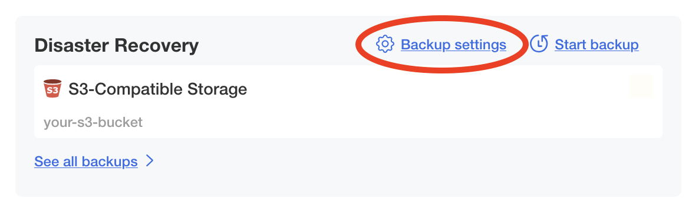

# NetBox Enterprise Backups

Much like the NetBox software itself, NetBox Enterprise uses 2 main datastores: PostgreSQL, and Redis.

PostgreSQL is used for the primary model data in NetBox, including sites, facilities, racks, and so on.
Redis is used for caching, the task queue, and some other data including stored scripts.

Additionally, NetBox Enterprise uses an S3-compatible store for some specific resources, most notably image uploads.
_NOTE: The built-in S3-compatible store keeps its data in Redis, so it is not necessary to back it up separately._

For each type of datastore you can choose to use a built-in deployment, or configure NetBox Enterprise to use an existing external resource already in your environment.

## External Databases

!!! warning
    If you are providing your own database(s) for use by NetBox Enterprise, it is expected that you have your own processes for high availability, backup, and restore.

## Accessing Your Cluster

Before you can back anything up, you must first make sure you can access the cluster on the command line.

See the [advanced tools documentation](./nbe-troubleshooting.md#accessing-your-cluster-from-the-command-line) for details on connecting to your NetBox Enterprise cluster.

!!! note
    The default namespace for installs is `netbox-enterprise`, but if you have overridden it in your installation, replace the argument after `-n` in the examples below with the namespace for your NetBox Enterprise instance.

## Using Disaster Recovery for Backups

A disaster recovery backup will preserve the complete state of your NetBox Enterprise install, from allocated volumes to databases to custom configuration.

This feature is included in Embedded Cluster installs, and can be enabled by installing some extra dependencies to your cluster for KOTS installs.

### Backing Up the Embedded Cluster

1. Navigate to the backup configuration by clicking the _^^Backup settings^^_ link in the **Disaster Recovery** section of the admin console.
   { width=75% }
2. Input your S3 bucket, credentials, endpoint, and region.<br>
   { width=75% }
3. Click **Update storage settings** -- it will spend a few moments validating that your settings work.<br>
   { width=75% }
4. Perform a backup by clicking the **Backups** tab, and then clicking **Start backup**.<br>
   

### Restoring the Embedded Cluster

1. Download the latest embedded cluster installer following the same instructions you did for a new install, if you haven't already.
2. Run: `./netbox-enterprise restore`
3. Enter the same S3 credentials you use for backups.<br>
   { width=75% }
4. Next, it will take a few minutes to bring up the node.
   When it's complete, you will be prompted to continue the restore:<br>
   
5. Enter `Y` to continue, and the restore will launch the cluster.
6. (Optional) If you plan to have more than one node in the new cluster, you can go to the admin console and configure them when prompted.
7. Enter `continue` to finish bringing the NetBox Enterprise application up.<br>
   
8. It will take a few more minutes to finish bringing the application up, and then you will see "Application restored!"<br>
   { width=90% }<br>
   NetBox Enterprise and the Admin Console should now be completely restored and available as normal.

<!-- ### KOTS Install -->


## Manually Backing Up Your Data

### Built-In PostgreSQL

The built-in PostgreSQL is deployed using the CrunchyData Postgres Operator.

Since the PostgreSQL CLI tools are already available inside the cluster, all we need to do to dump the database is to call into the correct container and run a `pg_dump` there.

To perform a database dump, run these commands:

```shell
POSTGRESQL_MAIN_POD="$(kubectl get pod \
  -o name \
  -n netbox-enterprise \
  -l 'postgres-operator.crunchydata.com/role=master' \
  )" && \
kubectl exec "${POSTGRESQL_MAIN_POD}" \
  -n netbox-enterprise \
  -c database \
  -- \
    pg_dump -Fc -C netbox > netbox.pgsql
```

This will create a `netbox.pgsql` file in your local directory.
Save it somewhere safe for future restores.

!!! info
    The above command uses the `-Fc` argument to `pg_dump`, which instructs it to create a "custom" format dump file.
    This is a binary file that is more efficient than a standard SQL dump, and also provides some additional metadata that makes PostgreSQL handle restores across different versions a bit better.
    You can remove the `-Fc` if you wish to create a human-readable SQL text file dump instead.

For more details on backing up NetBox databases, see [the official NetBox documentation](https://netboxlabs.com/docs/netbox/en/stable/administration/replicating-netbox/).

### Built-In Redis

The built-in Redis is deployed using the Bitnami Redis Helm chart.

Backing up Redis is straightforward, since it does its work in memory and then writes checkpoints to the filesystem atomically.

All that's necessary to back up the data in your Redis install is a basic tar command to create an archive from the `/data` directory inside the container:

```shell
REDIS_MAIN_POD="$(kubectl get pod \
  -o name \
  -n netbox-enterprise \
  -l 'app.kubernetes.io/component=master,app.kubernetes.io/name=redis' \
  )" && \
kubectl exec ${REDIS_MAIN_POD} \
  -n netbox-enterprise \
  -c redis \
  -- \
    tar -czf - -C /data . > /tmp/redis-data.tar.gz
```