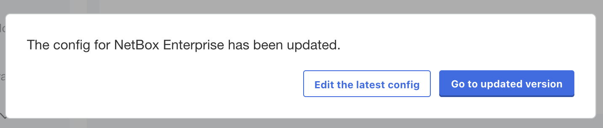

# NetBox Enterprise Backups

Much like the NetBox software itself, NetBox Enterprise uses 2 main datastores: PostgreSQL, and Redis.

PostgreSQL is used for the primary model data in NetBox, including sites, facilities, racks, and so on.

Redis is used for internal caching and the task queue.

For each type of datastore you can choose to use a built-in deployment, or configure NetBox Enterprise to use an existing external resource already in your environment.

## External Databases

!!! info
    If you are providing your own database(s) for use by NetBox Enterprise, it is expected that you have your own processes for high availability, backup, and restore.

## Using Disaster Recovery for Backups

A disaster recovery backup will preserve the complete state of your NetBox Enterprise install, from allocated volumes to databases to custom configuration.

This feature is included in NetBox Enterprise installs, and can be enabled by installing some extra dependencies to your cluster for KOTS installs.

### Backing Up the NetBox Enterprise Installation

1. Navigate to the backup configuration by clicking the _^^Backup settings^^_ link in the **Disaster Recovery** section of the admin console.
   { width=75% }
2. Input your S3 bucket, credentials, endpoint, and region.<br>
   { width=75% }
3. Click **Update storage settings** -- it will spend a few moments validating that your settings work.<br>
   { width=75% }
4. Perform a backup by clicking the **Backups** tab, and then clicking **Start backup**.<br>
   

### Restoring the NetBox Enterprise Installation

1. Download the latest NetBox Enterprise installer following the same instructions you did for a new install, if you haven't already.
2. Run: `./netbox-enterprise restore`
3. Enter the same S3 credentials you use for backups.<br>
   { width=75% }
4. Next, it will take a few minutes to bring up the node.
   When it's complete, you will be prompted to continue the restore:<br>
   
5. Enter `Y` to continue, and the restore will launch the cluster.
6. (Optional) If you plan to have more than one node in the new cluster, you can go to the admin console and configure them when prompted.
7. Enter `continue` to finish bringing the NetBox Enterprise application up.<br>
   
8. It will take a few more minutes to finish bringing the application up, and then you will see "Application restored!"<br>
   { width=90% }<br>
   NetBox Enterprise and the Admin Console should now be completely restored and available as normal.

<!-- ### KOTS Install -->

## Manual Backup and Restore

Besides disaster recovery, it is also a good idea to keep backups of your data in case you want to view, partially restore, or move your data to another system.

!!! info "NetBox Enterprise Namespace"
    The default namespace is `kotsadm`.

    The instructions below default to `kotsadm`, but you can change the `NETBOX_NAMESPACE` variable to match your system.

### Backing Up Your Data

Backing up NetBox Enterprise's data manually is reasonably simple, and Kubernetes makes it easy to access them from the command-line.

!!! warning "Before You Back Up: Accessing Your Cluster"
    Before you can back anything up, you must first make sure you can access the cluster on the command line.

    See the [advanced tools documentation](./nbe-troubleshooting.md#accessing-your-cluster-from-the-command-line) for details on connecting to your NetBox Enterprise cluster.

#### Media, Scripts, and Reports

Runtime files are stored in a volume accessible from the NetBox containers.
To back them up, you can run this:

```shell
NETBOX_NAMESPACE="kotsadm" && \
NETBOX_MAIN_POD="$(kubectl get pod \
  -o name \
  -n "${NETBOX_NAMESPACE}" \
  -l 'app.kubernetes.io/component=netbox' \
  | head -n 1 \
  )" && \
kubectl exec "${NETBOX_MAIN_POD}" \
  -n "${NETBOX_NAMESPACE}" \
  -c netbox \
  -- /bin/sh -c ' \
      cd /opt/netbox/netbox && \
      find media scripts reports static -type f > /tmp/files.txt && \
      tar -czf - \
      --owner=0 \
      --group=0 \
      -T /tmp/files.txt' > netbox-data.tar.gz
```

#### Built-In PostgreSQL

The built-in PostgreSQL is deployed using the CrunchyData Postgres Operator.

Since the PostgreSQL CLI tools are already available inside the cluster, all we need to do to dump the database is to call into the correct container and run a `pg_dump` there.

To perform a database dump, run these commands:

```shell
NETBOX_NAMESPACE="kotsadm" && \
NETBOX_DATABASE_FILE="netbox-enterprise.pgsql" && \
POSTGRESQL_MAIN_POD="$(kubectl get pod \
  -o name \
  -n "${NETBOX_NAMESPACE}" \
  -l 'postgres-operator.crunchydata.com/role=master' \
  | head -n 1 \
  )" && \
EXCLUDE_DATABASES="$(kubectl exec "${POSTGRESQL_MAIN_POD}" \
  -n "${NETBOX_NAMESPACE}" \
  -c database \
  -- \
    psql -t -c "SELECT CONCAT('--exclude-database=', datname) \
      FROM pg_database \
      WHERE datname <> ALL ('{netbox,diode,hydra}')" \
)" && \
kubectl exec "${POSTGRESQL_MAIN_POD}" \
  -n "${NETBOX_NAMESPACE}" \
  -c database \
  -- \
    pg_dumpall \
      --no-role-passwords \
      --no-privileges \
      --no-owner \
      $EXCLUDE_DATABASES \
    > "${NETBOX_DATABASE_FILE}"
```

This will create a `netbox-enterprise.pgsql` file in your local directory.
Save it somewhere safe for future restores.

For more details on backing up NetBox databases, see [the official NetBox documentation](https://netboxlabs.com/docs/netbox/en/stable/administration/replicating-netbox/).

#### Diode and Hydra Secrets (NetBox 1.10 and Up)

To ensure that Diode OAuth login information is not lost, you will also need to save the Diode and Hydra secrets from the cluster.

Run this set of commands:

```shell
NETBOX_NAMESPACE="kotsadm" && \
(
  kubectl get secrets \
    --namespace "${NETBOX_NAMESPACE}" \
    --no-headers \
    --output name \
  | grep secret/diode \
  | while read -r SECRET; do \
    echo "---" && \
    kubectl get \
      "${SECRET}" \
      --namespace "${NETBOX_NAMESPACE}" \
      -o yaml \
    | grep -v -E '^  (creationTimestamp|resourceVersion|uid):'; \
  done \
) > netbox-enterprise-diode-secrets.yaml
```

Save it alongside your `netbox-enterprise.pgsql` for future restores.

### Restoring Your Backups

Restoring is almost as simple as backing up.
You just need to put NetBox Enterprise into restore mode first.

#### Enabling and Disabling Restore Mode

1. Put NetBox Enterprise into "Restore Mode" by going to the _Config_ tab and checking the _Enable Restore Mode_ checkbox.
   
2. Click the "Save config" button at the bottom of the form, and then when the admin console prompts you, click "go to updated version".<br>
   { width=75% }
3. Confirm that the _New version available_ at the top denotes it's a config change, and if so click the "Deploy" button.
   

This will shut down NetBox but leave the other NetBox Enterprise infrastructure up, so you can safely restore.

When you are done restoring your data, just follow the same steps, unchecking _Enable Restore Mode_ and deploying the updated configuration.

#### Media, Scripts, and Reports

To restore media, scripts, and reports, you just need to unpack them into the correct directory inside a NetBox container.

!!! note
    The backup instructions above back up all three of the `media/`, `scripts/`, and `reports/` subdirectories in one file.

    If you are restoring a backup from another NetBox instance, you might need to change the name of the tarball and the path after the `-C` at the end of this command to unpack your backup into the right location.

```shell
NETBOX_NAMESPACE="kotsadm" && \
NETBOX_RESTORE_POD="$(kubectl get pod \
  -o name \
  -n "${NETBOX_NAMESPACE}" \
  -l 'app.kubernetes.io/component=restore-mode' \
  | head -n 1 \
  )" && \
cat netbox-data.tar.gz | kubectl exec ${NETBOX_RESTORE_POD} \
  -n "${NETBOX_NAMESPACE}" \
  -i \
  -- tar -xvzf - \
    --no-same-owner \
    --no-same-permission \
    -C /opt/netbox/netbox
```

#### Diode and Hydra Secrets (NetBox 1.10 and Up)

To restore from a secrets yaml file, pass it to `kubectl apply` like so:

```shell
NETBOX_NAMESPACE="kotsadm" && \
kubectl apply \
  --server-side \
  --namespace "${NETBOX_NAMESPACE}" \
  --filename netbox-enterprise-diode-secrets.yaml
```

#### Built-In PostgreSQL

To restore from a dump file, pipe the `netbox-enterprise.pgsql` created during backup into `psql` in the PostgreSQL pod:

```shell
NETBOX_NAMESPACE="kotsadm" && \
NETBOX_DATABASE_FILE="netbox-enterprise.pgsql" && \
POSTGRESQL_MAIN_POD="$(kubectl get pod \
  -o name \
  -n "${NETBOX_NAMESPACE}" \
  -l 'postgres-operator.crunchydata.com/role=master' \
  | head -n 1 \
  )" && \
grep -E '^CREATE DATABASE ' "${NETBOX_DATABASE_FILE}" | awk '{ print $3 }' | \
while read -r DB; do
  kubectl exec "${POSTGRESQL_MAIN_POD}" \
    -n "${NETBOX_NAMESPACE}" \
    -c database \
    -- dropdb --if-exists --force "${DB}"; \
done && \
cat "${NETBOX_DATABASE_FILE}" \
  | kubectl exec "${POSTGRESQL_MAIN_POD}" \
    -n "${NETBOX_NAMESPACE}" \
    -i \
    -c database \
      -- psql -d template1 -f-
```

Following this run the below to ensure all database permissions are correct:

```shell
NETBOX_NAMESPACE="kotsadm" && \
NETBOX_DATABASE_FILE="netbox-enterprise.pgsql" && \
POSTGRESQL_MAIN_POD="$(kubectl get pod \
  -o name \
  -n "${NETBOX_NAMESPACE}" \
  -l 'postgres-operator.crunchydata.com/role=master' \
  | head -n 1 \
  )" && \
grep -E '^CREATE DATABASE ' "${NETBOX_DATABASE_FILE}" | awk '{ print $3 }' | \
while read -r DB; do
  kubectl exec "${POSTGRESQL_MAIN_POD}" \
  -n "${NETBOX_NAMESPACE}" \
  -i \
  -c database \
  -- \
    psql --dbname "${DB}" -c "\
      ALTER DATABASE ${DB} OWNER TO ${DB}; \
      GRANT ALL PRIVILEGES ON DATABASE ${DB} TO ${DB}; \
      GRANT CREATE ON SCHEMA public TO ${DB}; \
      GRANT ALL PRIVILEGES ON ALL FUNCTIONS IN SCHEMA public TO ${DB}; \
      GRANT ALL PRIVILEGES ON ALL SEQUENCES IN SCHEMA public TO ${DB}; \
      GRANT ALL PRIVILEGES ON ALL TABLES IN SCHEMA public TO ${DB}; \
    "; \
done
```
