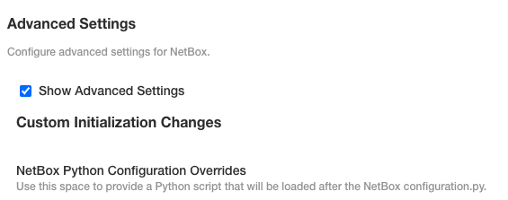

# Built-in Plugins in NetBox Enterprise

NetBox Enterprise ships with a curated set of built-in plugins that extend the platform's core capabilities—offering enhanced features without the complexity of manual integration. These plugins are pre-integrated and supported within the platform, ensuring streamlined deployment and reliable performance.

## Available Plugins

The set of plugins available out-of-the-box evolves with each NetBox Enterprise release. For the most current list of built-in plugins, refer to the [NetBox Enterprise Release Notes](https://docs.netboxlabs.com/netbox-enterprise/nbe-release-notes/).

## Plugin Management and Deployment

Managing plugins in NetBox Enterprise is simple and fully integrated into the platform’s admin interface:

1. Navigate to the `Config` tab in the admin console.
2. Enable **Show Advanced Settings**
{ style="max-width: 75%" }
3. In the **NetBox Python Configuration Overrides** field, define your plugin list.
```
PLUGINS = ['netbox_topology_views', 'netbox_bgp']
```
4. Click **Go to updated version**, then select **Deploy** to apply the configuration.

This process ensures your deployment is safely updated with plugin support in place.


