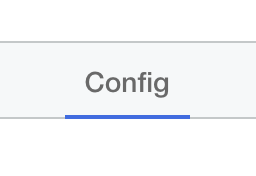
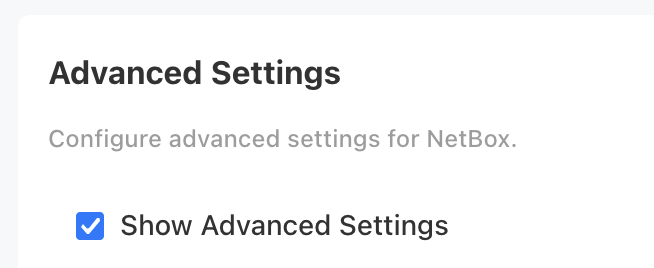
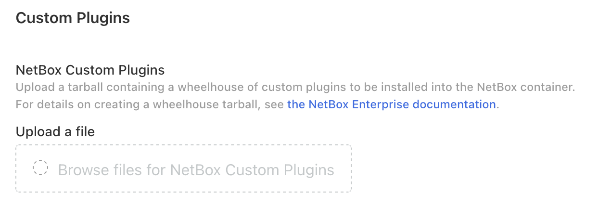

# Installing Custom NetBox Plugins

While NetBox Enterprise comes with a variety of certified and other community plugins built-in, there are cases where you will want to include additional plugins in your NetBox runtime.

To do so, you will need to create a tarball containing the plugins you wish to install, known as a wheelhouse archive.

## Create a working directory

First, create a temporary directory for your plugin downloads to go:

```{.bash}
mkdir /tmp/wheelhouse
```

## Use `pip` to download the plugins

Next, use `pip` to populate the wheelhouse folder, by running it with the `download` command, and the arguments necessary to pull the correct architecture and version to run inside the NetBox Enterprise container:

```{.bash}
pip download \
  --platform="manylinux1_x86_64" \
  --only-binary=":all:" \
  --python-version="3.12" \
  --dest "/tmp/wheelhouse" \
  <your plugins>
```

Replace the `<your plugins>` line at the end with the arguments for your plugins.
These can be any combination of:

* a bare python package name: `netbox-ipcalculator`
* a requirements file: `-r path/to/requirements.txt`
* a VCS path: `https+git://github.com/some-project/plugin-name.git#egg=plugin-name`
* a local path containing plugin source: `/path/to/source`
* a plugin tarball: `path/to/plugin.tar.gz`

If all went well, you should see `*.whl` files in the `/tmp/wheelhouse/` folder for each of the packages you specified, as well as their dependencies.

## Create the archive

Finally, create the archive:

```{.bash}
tar -C /tmp \
    -czf /tmp/wheelhouse.tar.gz \
    wheelhouse
```

This should create a tarball that contains the `wheelhouse/` directory and everything inside of it.

## Add your plugins to NetBox Enterprise

In the NetBox Enterprise Admin Console (usually port `30000` on your host), click the `Config` tab at the top-center.

{ style="max-width: 50%" }

Then, scroll down to `Advanced Settings` and make sure `Show Advanced Settings` is checked.

{ style="max-width: 60%" }

Finally, look for the `Custom Plugins` section, and click the box below `Upload a file` and select your wheelhouse tarball.



!!! note "Enable Your Plugins"
    Don't forget to create or update `PLUGINS = []` in the `NetBox Python Configuration Overrides` at the top of the advanced settings to enable your new plugins!

## Deploy your updated configuration

Click `Save config` and then deploy your latest config change to install the plugins.