---
title: NetBox Enterprise Installation
tags:
  - enterprise
---# NetBox Enterprise Installation

You should be able to follow these instructions for installing NetBox Enterprise in most environments.

!!! Note
    The hostname and IP address of the host cannot be changed after installation, and must be finalized before proceeding.

## Deploying the cluster

The following steps are required for a NetBox Enterprise installation.

1. Download the installer and license file to your host (the `Authorization` token should be provided by NetBox Labs):

     ```
      curl -f "https://app.enterprise.netboxlabs.com/embedded/netbox-enterprise/stable" -H "Authorization: <provided by NetBox Labs>" -o netbox-enterprise-stable.tgz
     ```
       Confirm the file size is ~300MB

2. Uncompress the package and launch the installation:

      ```
      tar -xvzf netbox-enterprise-stable.tgz
      sudo ./netbox-enterprise install --license license.yaml
      ```

      You’ll be requested to create a password for the NetBox Enterprise admin console. A Kubernetes cluster will then be deployed, ready to host all the NetBox application components. The deployment of the cluster is complete with this message:

      ```{.bash .no-copy} 
      Visit the Admin Console to configure and install netbox-enterprise: http://my.netbox-enterprise.host:30000
      ```

## Deploying NetBox

Access the NetBox Enterprise admin console and configure NetBox.

**Open the provided URL in a browser. A prompt will require the password created in Step 2:**

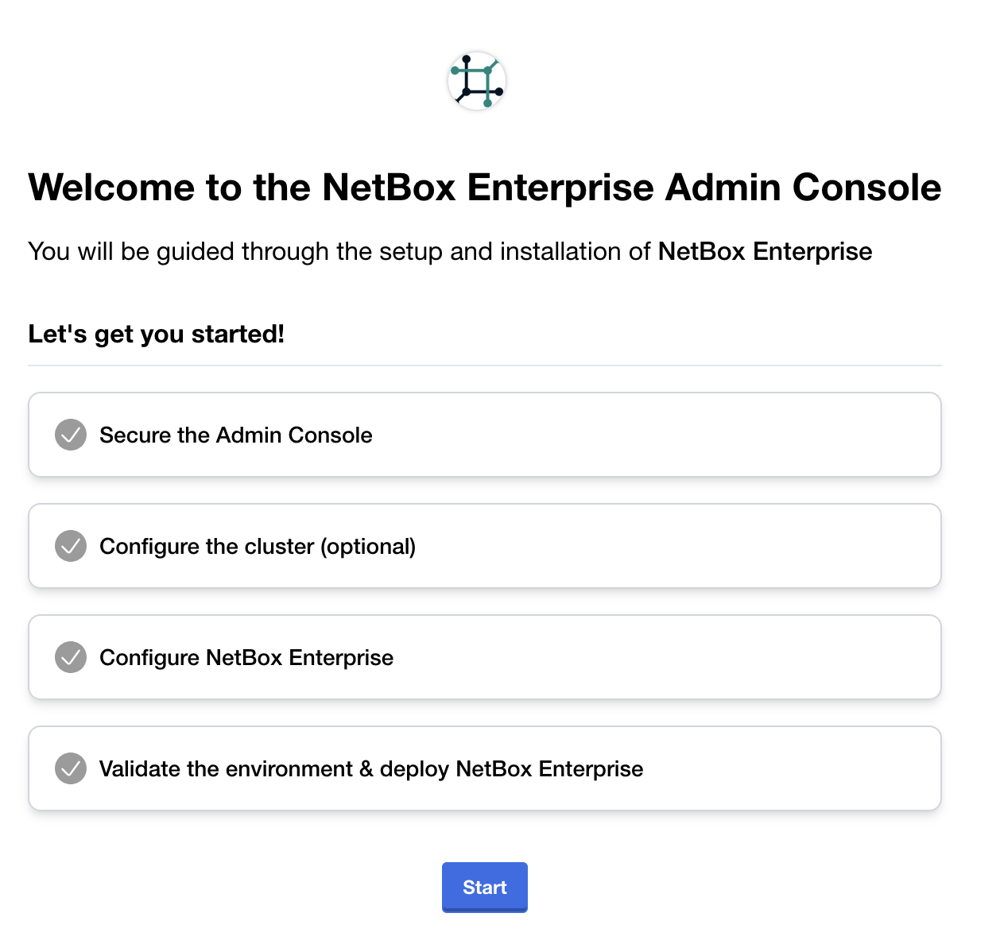{ style="max-width: 75%" }

**Click `Start` and you will be greeted by a warning about self-signed certificates:**

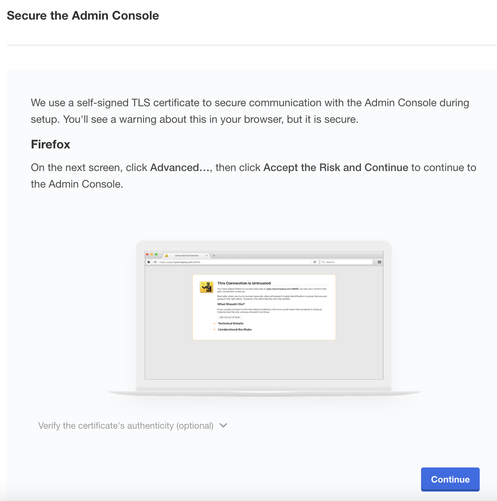{ style="max-width: 75%" }

**Click `Continue` and accept the self-signed TLS certificate according to the instructions for your browser.**

You will then be prompted to optionally set a hostname and upload a self-signed certificate.
It is recommended that you set the hostname now, but if you do not upload a TLS certificate you can do it later.
Instructions for TLS configuration are available in [the TLS and Ingress documentation](nbe-tls-ingress.md)

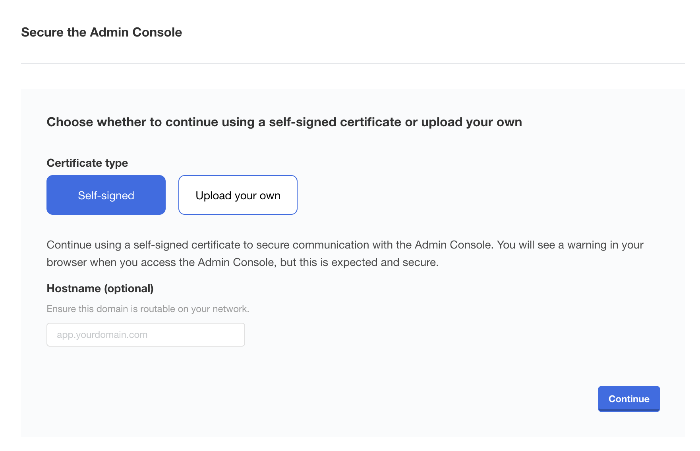{ style="max-width: 75%" }

**Log In to the Admin Console**

Once TLS is configured, you will be prompted to log in to the NetBox Enterprise Admin Console.
Enter the password you created in the installer CLI.

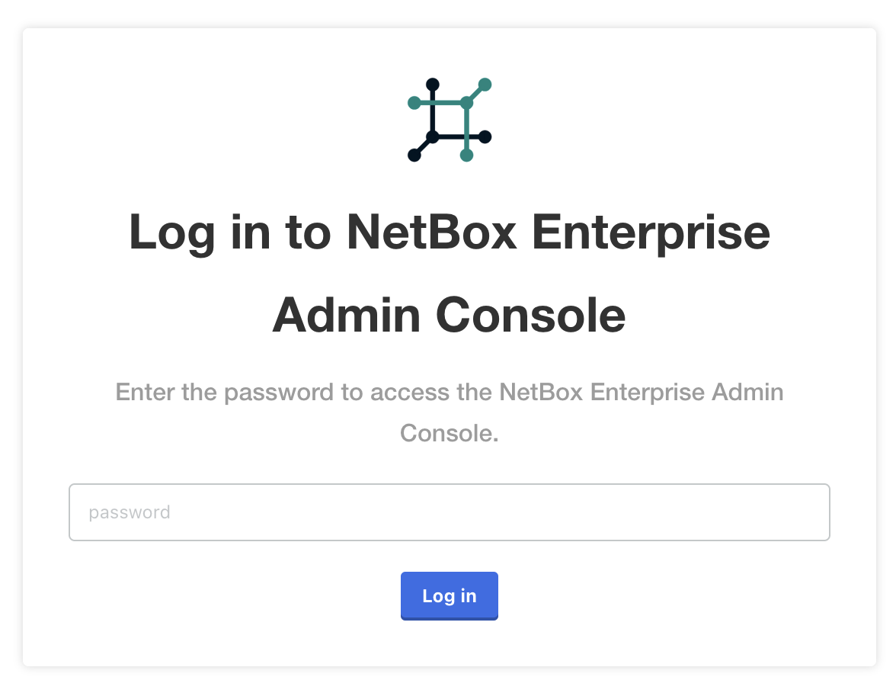{ style="max-width: 75%" }

**Once logged in, you'll be presented with the option to add additional nodes to the cluster.** 

**Do not** configure additional nodes, it is currently not supported.

!!! danger "Multi-Node Clusters"
    Adding nodes to the cluster is **currently not supported**.

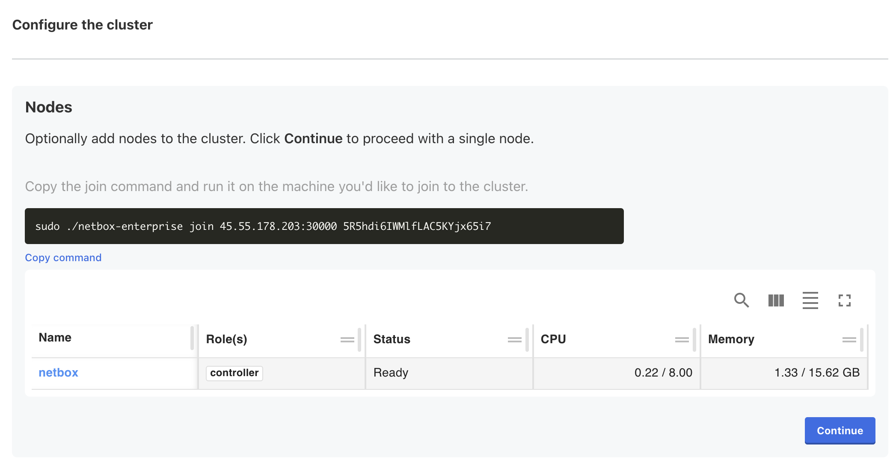{ style="max-width: 75%" }

**Click `Continue` to move on to the NetBox Enterprise configuration wizard.**

## Configure NetBox Enterprise

A wizard will guide the configuration of NetBox for the environment:

**Provisions a Superuser and password:**
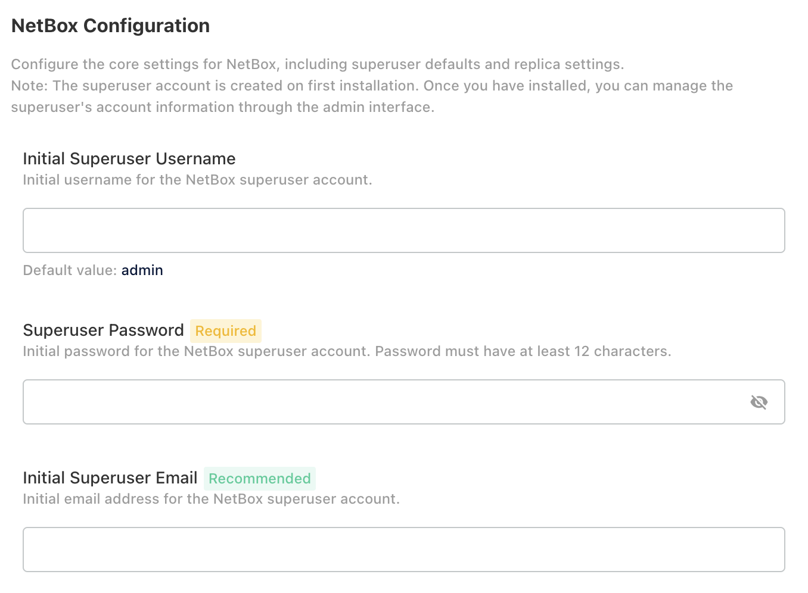{ style="max-width: 75%" }

**Set the number of replicas and choose a preset for the resources allocated to NetBox.**

_It is recommended that you set the number of replicas to `1` until initial installation has completed, and then update it to a higher value._

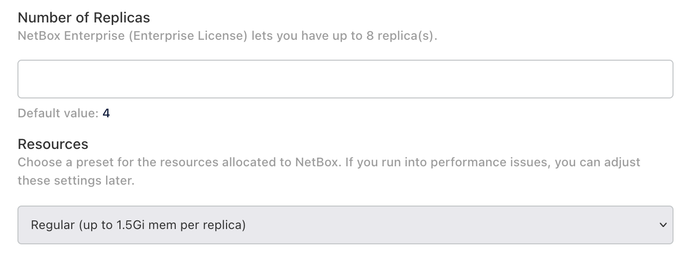{ style="max-width: 75%" }

!!! warning "Be Advised"
    Do not enable Restore Mode when initially setting up NetBox or the installation will fail.

**Configure your PostgreSQL database and Redis cache:**

Choose the built-in or external PostgreSQL:
  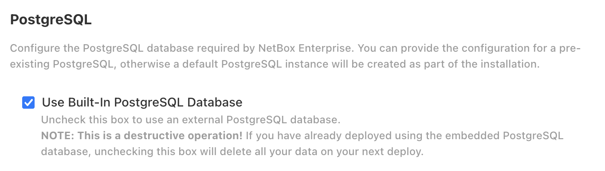{ style="max-width: 75%" }

Choose the built-in or external Redis object store:
  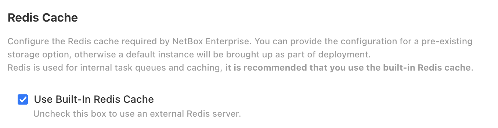{ style="max-width: 75%" }

<!-- Advanced settings to configure plugins and SSO remote authentication, and IPv4/IPv6 compatibility:
  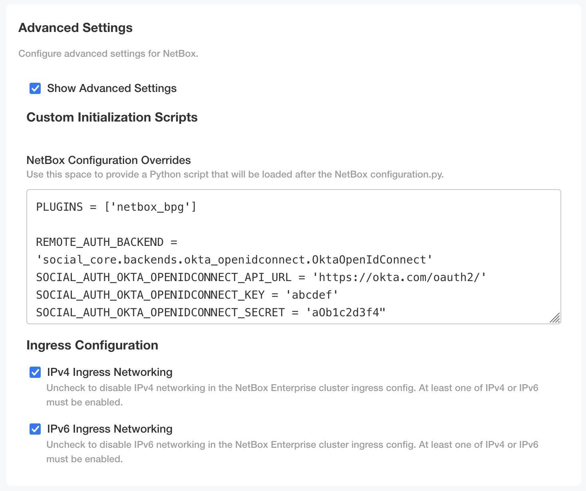
For now, skip `Advanced Settings` 
  -->

**Finally, accept the terms of service by writing "ACCEPT" (case-insensitive) and you can proceed to the deployment.**

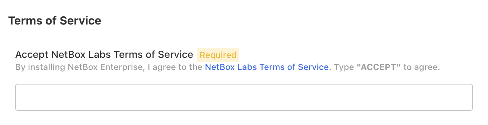{ style="max-width: 75%" }

## Finish the Deployment

Once you have accepted the terms of service, the installer will run some additional checks to make sure your host can run NetBox Enterprise.

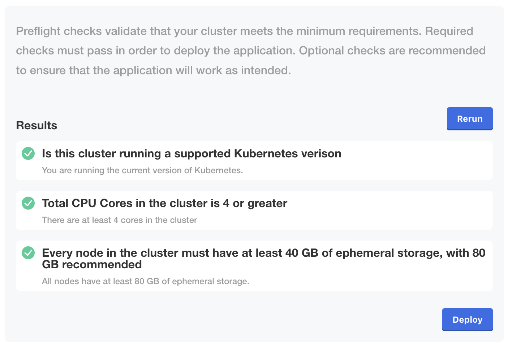{ style="max-width: 75%" }

**Click `Deploy` to launch the first deployment.**

You will then be redirected to the admin console Dashboard.
The initial deployment will take longer than subsequent ones, as it brings up all subsystems for the first time and runs migrations to initialize the database.

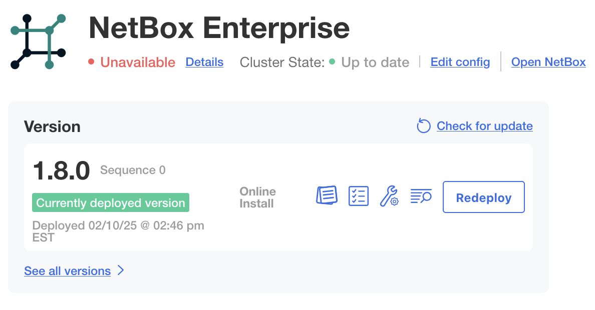{ style="max-width: 75%" }

The `Unavailable` status will change to `Ready` once the deployment is complete and NetBox has fully initialized:

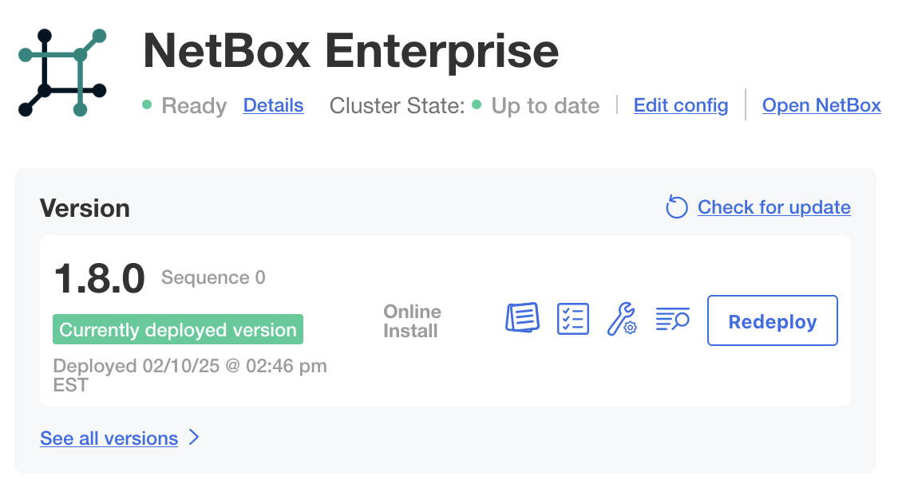{ style="max-width: 75%" }

## Verify the Deployment

Once you see `Ready`, NetBox Enterprise is fully deployed, and available on ports `80` and `443`.

- 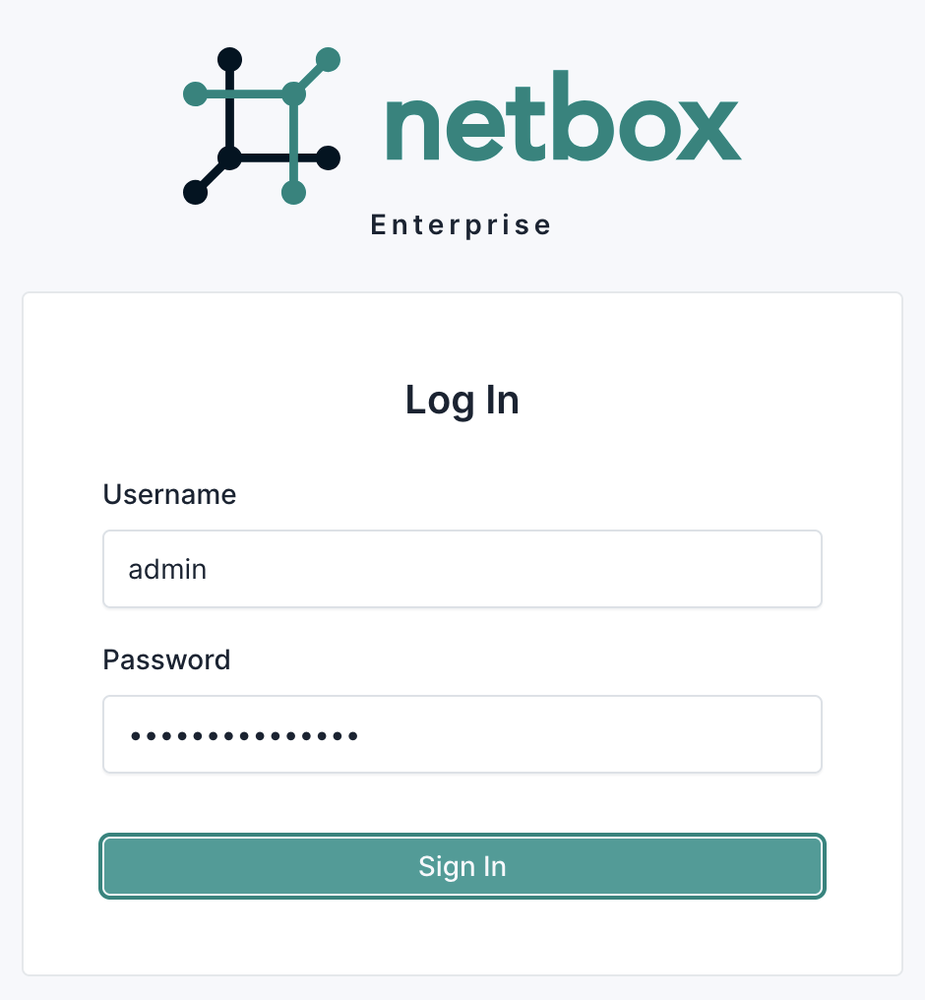{ style="max-width: 75%" }
- 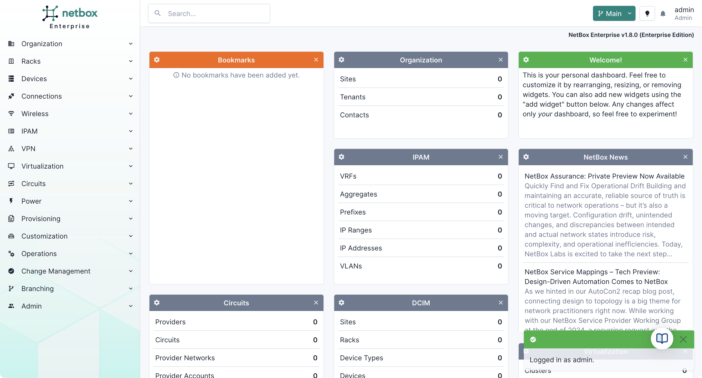