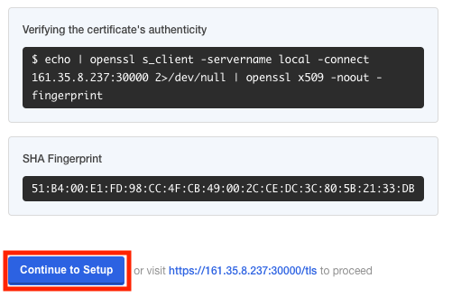
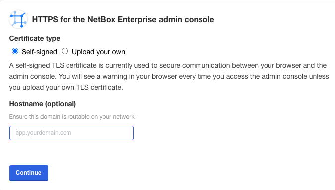
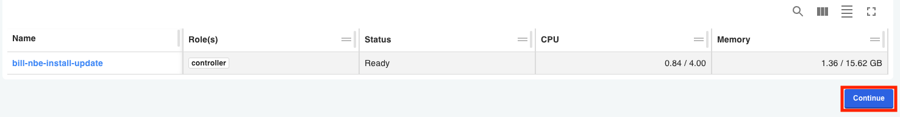
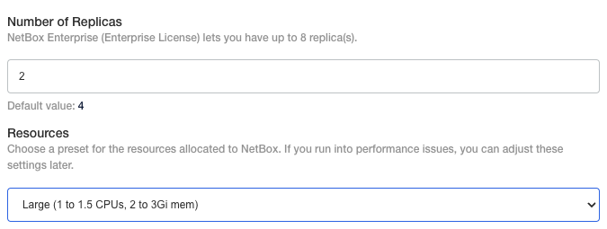
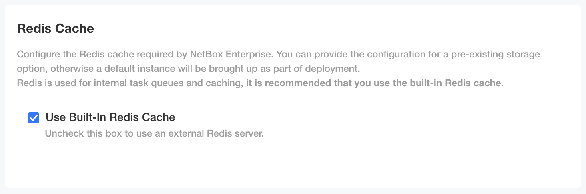
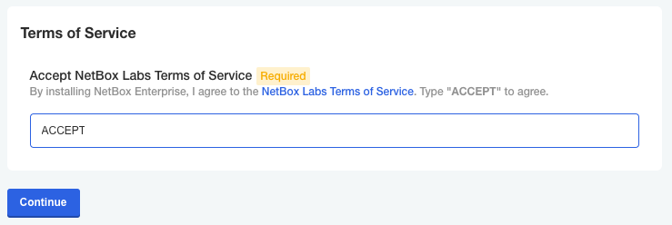

# NetBox Enterprise Embedded Cluster Installation

You should be able to follow these instructions for installing the Embedded Cluster in most environments.

!!! Note
    The hostname and IP address of the host cannot be changed after installation, and must be finalized before proceeding.

## Deploying the cluster

The following steps are required for an Embedded Cluster (EC) installation of NetBox Enterprise.

1. Download the deployment package and license file to your host (the `Authorization` token should be provided by NetBox Labs):

  ```
  curl -f "https://app.enterprise.netboxlabs.com/embedded/netbox-enterprise/stable" -H "Authorization: <provided by NetBox Labs>" -o netbox-enterprise-stable.tgz
  ```
  Confirm the file size is ~300MB

2. Uncompress the package and launch the installation:

   ```
   tar -xvzf netbox-enterprise-stable.tgz
   sudo ./netbox-enterprise install --license license.yaml
   ```

   You’ll be requested to create a password for the NetBox Enterprise admin console. A Kubernetes cluster will then be deployed, ready to host all the NetBox application components. The deployment of the cluster is complete with this message:

   ```{.bash .no-copy} 
   Visit the Admin Console to configure and install netbox-enterprise: http://my.netbox-enterprise.host:30000
   ```

## Deploying NetBox

Access the NetBox Enterprise admin console and configure NetBox.

Open the provided URL in a browser. A prompt will require the password created in Step 2:

{ width="50%" }

Once signed in you will be greeted by the following warning:

> **Bypass browser TLS warning:**
> We use a self-signed SSL/TLS Certificate to secure the communication 
> between your local machine and the Admin Console during setup. 
> You'll see a warning about this in your browser, but you can be confident 
> that this is secure.

Click `Continue to Setup`. you can add your certificate later, instruction on how to do can be found [here](https://docs.netboxlabs.com/netbox-enterprise/nbe-tls-ingress/)



On the next screen, click `Advanced`, then click `Proceed`. 

On the following page you can add your hostname if it was provisioned prior to the start of the installation. Then click `continue`.



Again, click `Advanced`, then click `Proceed`, and you will be prompted to login to the console once more.

On the next page you be given the option to add additional nodes to the cluster. **DO NOT ADD ADDTIONAL NODES**, as it is not currently supported. 
!!! warning "Be Advised"
    Adding addtional nodes to the cluster is not supported. 

Click `Continue` to move on to the final insallation wizard


A wizard will guide the configuration of NetBox for the environment:

Provisions a Superuser and password:


Next, set the number of replicas and choose a preset for the resources allocated to NetBox


!!! warning "Be Advised"
    Do not enable Restore Mode when initally setting up NetBox or the installation will fail.

Configuration information includes:

- Built-in or external PostgreSQL:
  

- Built-in or external S3-Compatible object store:
  

- Built-in or external Redis object store:
  

- Advanced settings to configure plugins and SSO remote authentication, and IPv4/IPv6 compatibility:
  

Finally, accept the terms of service by writing "ACCEPT" (case-insensitive) and you can proceed to the deployment.



## Finish the Deployment

Once you have accepted the terms of service and continued on to the main admin console, deployment will start.
The first deployment will take some time, as it brings up all subsystems and runs migrations to initialize the database.


The `Unavailable` status will change to `Ready` once the deployment is complete and NetBox has fully initialized:


## Verify the Deployment

Once you see `Ready`, NetBox Enterprise is fully deployed, and available on ports `80` and `443`.

- 
- 